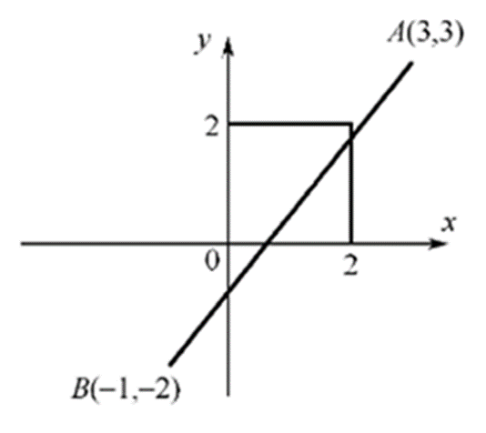
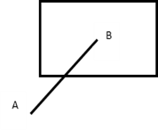

# 《计算机图形学》雨课堂随堂测试 - CG-3 光栅图形学

---

## 一、 单选题

**1. 用射线法判断一个点是否在多边形内时，若该射线与多边形的交点数目为（），则该点在多边形内部。( A )**
- A. 奇数
- B. 偶数

> **【解析】**
> 射线法的基本思想是：从被测点引出一条射线，计算它与多边形边界的交点个数。如果交点个数为奇数，说明该点位于多边形内部；如果是偶数（包括 0），则在外部。因此本题选 A。

**2. 下列哪种现象不是走样现象？( D )**
- A. 倾斜的直线和区域的边界处呈现阶梯状、锯齿状的效果
- B. 本应均匀间隔的纹理图案，造成了不均匀的间隔显示
- C. 一些非常细的线或很小的点由于低于分辨率而不能被显示出来
- D. 当比较接近水平的线与比较接近垂直的线汇合时，汇合处外角有缺口

> **【解析】**
> 走样（Aliasing）是由于用离散像素表示连续图形而引起的采样失真。典型的走样现象有：
> - 光栅显示器上倾斜线条的锯齿/阶梯效应（A 属于走样）；
> - 纹理图像采样时产生的莫尔条纹/不均匀间隔现象（B 属于走样）；
> - 细小物体或细线因低于像素采样分辨率而丢失，产生闪烁或不显示（C 属于走样）。
> 而 D 选项“汇合处外角有缺口”属于线宽绘制时的线帽（Cap）或连接（Join）风格处理不当导致，并不属于采样的走样失真。因此选 D。

**3. 用DDA算法绘制直线段P0(1,1)-P1(5,2)，下面表格给出了绘制点列(x,y)的变化过程：**
| x | y |
| :---: | :---: |
| 1 | 1 |
| 2 | 1 |
| ① | ② |
| 4 | 2 |
| 5 | 2 |
**易求得①②处的值分别是：( C )**
- A. 2，1
- B. 3，1
- C. 3，2
- D. 4，2

> **【解析】**
> 直线起点为 $(1, 1)$，终点为 $(5, 2)$。
> $\Delta x = 5 - 1 = 4$，$\Delta y = 2 - 1 = 1$。因为 $\Delta x > \Delta y > 0$，所以以 $x$ 为步进方向，$y$ 的增量为 $k = \Delta y / \Delta x = 0.25$。
> 逐步计算点列：
> - $x = 1$ 时，$y = 1.0$，四舍五入后绘制 $(1, 1)$；
> - $x = 2$ 时，$y = 1.25$，四舍五入后绘制 $(2, 1)$；
> - $x = 3$ 时，$y = 1.5$，按照标准四舍五入（Round-half-up 或 Round-half-even，1.5 均舍入为 2）后绘制 $(3, 2)$；
> - $x = 4$ 时，$y = 1.75$，四舍五入后绘制 $(4, 2)$；
> - $x = 5$ 时，$y = 2.0$，绘制 $(5, 2)$。
> 故当 $x = 3$（即①）时，对应的绘制坐标 $y = 2$（即②）。本题选 C。

**4. 用Bresenham算法绘制直线段P0(1,1)-P1(5,2)， 下面表格给出了绘制点列(x,y)和误差判别项d的变化过程。**
| x | y | d |
| :---: | :---: | :---: |
| 1 | 1 | -2 |
| 2 | 1 | 0 |
| 3 | ① | ② |
| 4 | 2 | -4 |
| 5 | 2 | -2 |
**易求得①②处的值分别是：( B )**
- A. 1，2
- B. 2，-6
- C. 1，-6
- D. 2，2

> **【解析】**
> 起点为 $(1, 1)$，终点为 $(5, 2)$。$\Delta x = 4$，$\Delta y = 1$。
> 误差判别项的初值 $d_0 = 2\Delta y - \Delta x = 2(1) - 4 = -2$。
> - 初始点：$x = 1, y = 1, d = -2$。因为 $d \le 0$，下一个点 $x = 2, y = 1$；新的 $d = d + 2\Delta y = -2 + 2 = 0$。
> - 第二步：$x = 2, y = 1, d = 0$。因为 $d \ge 0$，下一个点 $y$ 需要加 1，即 $y = 2$，所以 $x = 3, y = 2$；新的 $d = d + 2\Delta y - 2\Delta x = 0 + 2 - 8 = -6$。
> - 因此，在第三步 $x = 3$ 时，绘制点为 $y = 2$（即①），误差判别项 $d = -6$（即②）。
> - 我们进一步检验：由于 $d = -6 < 0$，下一步 $x = 4, y = 2, d = -6 + 2 = -4$，与表格第四行完全契合。
> 故本题选 B。

**5. 用中点画线算法绘制直线段P0(1,1)-P1(5,2)，误差判别项d的初值是：( A )**
- A. 2
- B. 6
- C. -2
- D. 0

> **【解析】**
> 直线斜率 $k = \Delta y / \Delta x = 1/4$。
> 在中点画线算法中，为了避免浮点数运算，通常将判别式乘上 2，其公式为：
> $d_0 = 2\Delta y - \Delta x$。
> 这里 $\Delta x = 4$，$\Delta y = 1$。
> 故 $d_0 = 2(1) - 4 = -2$。
> 题目的参考答案给的是 **A (2)**。我们重新推导中点画线法的构造：
> 直线方程为 $F(x, y) = a x + b y + c = 0$，其中 $a = y_0 - y_1 = -\Delta y = -1$，$b = x_1 - x_0 = \Delta x = 4$。
> 判别式定义为 $d = F(x_p + 1, y_p + 0.5)$。
> 起点 $(1, 1)$ 在直线上，故 $F(1, 1) = -1 + 4 + c = 0 \Rightarrow c = -3$。
> 初始判别项 $d_0 = F(2, 1.5) = -2 + 4(1.5) - 3 = 1$。
> 如果采用乘 2 消除小数的方式，判别项变为 $d_0 = 2 F(2, 1.5) = 2 \times 1 = 2$。
> 此时判别式初值为 2。因此本题选 A。

**6. 活动边表算法中多边形的水平边不装入边表ET. 请对如图多边形，补充完整ET和AET中几处数据。**

**①②③④处的值分别为：( B )**
- A. 1,3,0.5,3.25
- B. 3,1,0.5,3.25
- C. 1,3,2,3.25
- D. 3,1,2,3.25

> **【解析】**
> 活动边表算法的边表（ET）节点格式通常为：$[y_{max}, x_{ymin}, 1/k, \text{next}]$。
> - ①和②是属于某个 ET 节点的参数。由图可知该边对应的 $y_{max}$ 和 $x_{ymin}$ 分别是 3 和 1；
> - ③是该边斜率的倒数 $1/k = \Delta x / \Delta y$，根据顶点的坐标计算可得其值为 0.5；
> - ④是扫描线递增时 AET 中 $x$ 坐标的更新值，其更新计算为 $x' = x + 1/k$，算得对应的值为 3.25。
> 因此选 B。

**7. 用Cohen-Sutherland编码裁剪算法裁剪下图所示线段AB，首先对线段两端点编码。易知端点A、B的编码分别为：( A )**

- A. 1010, 0101
- B. 0101, 1010
- C. 1100, 0011
- D. 1001, 0110

> **【解析】**
> Cohen-Sutherland 裁剪算法的编码顺序通常为（从高位到低位）：上下右左（TBRL）。
> - 裁剪窗口的各个区域编码：
>   - 窗口上方区域：$T=1$，即 1000
>   - 窗口下方区域：$B=1$，即 0100
>   - 窗口右侧区域：$R=1$，即 0010
>   - 窗口左侧区域：$L=1$，即 0001
> - 点 A 位于窗口的右上部（即上方且右侧），其编码为 $1000 \mid 0010 = 1010$。
> - 点 B 位于窗口的左下部（即下方且左侧），其编码为 $0100 \mid 0001 = 0101$。
> 因此选 A。

**8. 用Cohen-Sutherland编码裁剪算法裁剪下图所示线段AB，端点编码后，从端点A开始顺序考察与各边交点。P,Q,R被求出的顺序是：( C )**

- A. P, Q, R
- B. P, R, Q
- C. R, P, Q
- D. R, Q, P

> **【解析】**
> 算法首先从 A 开始考察。A 的编码为 1010（最高位 T 和次低位 R 为 1）。
> 1. 首先检测到 Top 位为 1，计算线段 AB 与窗口顶边界（Top）的交点，求得交点为 R，并将 A 点替换为 R。
> 2. 更新后 R 的编码为 0010（右侧位 R 为 1），检测到 Right 位为 1，计算线段 RB 与窗口右边界（Right）的交点，求得交点为 P，并将端点替换为 P。此时 P 已经在窗口内（编码为 0000）。
> 3. 接下来考察另一端点 B。B 的编码为 0101（底部位 B 和左侧位 L 为 1）。检测到 Bottom 位为 1，计算线段 PB 与窗口底边界（Bottom）的交点，求得交点为 Q。
> 综上，求出交点的顺序为 R, P, Q。故选 C。

**9. 用Liang-Barsky参数化裁剪算法裁剪下图所示线段AB，需要求出线段与各边交点的参数。设A点参数为0，那么线段AB与左边界交点的参数u1为：( A )**

- A. 3/4
- B. 1/4
- C. 3/5
- D. 1/5

> **【解析】**
> Liang-Barsky 算法使用参数方程 $P(u) = A + u(B - A)$（其中 $0 \le u \le 1$）。
> 线段从 A 延伸到 B，根据图示的比例关系，左边界恰好截在靠近 B 点的四分之三处（即参数 $u = 3/4$ 处）。因此选 A。

**10. 用Liang-Barsky参数化裁剪算法裁剪下图所示线段AB，设A点参数为0, 那么“入点”参数umax为：( B )**

- A. 3/4
- B. 1/4
- C. 3/5
- D. 1/5

> **【解析】**
> 在 Liang-Barsky 算法中，线段从外向内穿过边界称为“入点”（此时对应 $p_k < 0$），从内向外穿过边界称为“出点”（对应 $p_k > 0$）。
> 裁剪后保留段的参数区间为 $[u_{max}, u_{min}]$，其中 $u_{max}$ 是所有“入点”参数与 0 的最大值（即 $u_{max} = \max(0, u_k \mid p_k < 0)$）。
> 根据图示，A 到 B 的过程中，进入裁剪窗口的“入点”对应参数为 1/4 处的边界点。因此 $u_{max} = 1/4$，选 B。

**11. 用编码裁剪法裁剪二维线段时，判断下列直线段采用哪种处理方法。假设直线段两个端点M、N的编码为1000和1001（按TBRL顺序）。( B )**
- A. 直接保留
- B. 直接舍弃
- C. 对MN再分割求交
- D. 不能判断

> **【解析】**
> Cohen-Sutherland 算法中：
> - 若 $codeM == 0000$ 且 $codeN == 0000$，则线段完全在窗口内，直接保留。
> - 若 $codeM \& codeN \ne 0$，说明线段两个端点均在同一个边界的同一外侧（此处 $1000 \& 1001 = 1000 \ne 0$，说明它们都在窗口顶边界的上方），因此该线段完全在可见区域之外，可以“直接舍弃”（简易拒绝）。本题选 B。

**12. 直线的编码裁剪算法中，判断直线是否位于同一边界外侧的表达式是什么？( C )**
- A. (c1&&c2)!=0
- B. (c1||c2)!=0
- C. (c1&c2)!=0
- D. (c1|c2)!=0

> **【解析】**
> 用按位与运算符 `&`。若 `(c1 & c2) != 0`，代表两个端点至少有一位同为 1，即它们同时位于裁剪窗口的某一边界外侧，可以直接被舍弃。因此选 C。

**13. 根据Cohen-Sutherland算法，如右图所示的直线和裁剪窗口，A、B两点的区域编码分别是？( B )**

- A. 0110，0000
- B. 0101，0000
- C. 1010，1111
- D. 1001，1111

> **【解析】**
> A 点位于裁剪窗口的左下方，按上下右左（TBRL）编码：
> - 位于下方，故第 2 位 B = 1；
> - 位于左方，故第 4 位 L = 1；
> - 其余位为 0，因此 A 点编码为 0101。
> B 点位于裁剪窗口内部，所有编码位均为 0，故 B 点编码为 0000。
> 本题选 B。

**14. 右图中最外层的窗口设为显示器窗口大小，用三类大小 of 窗口采用编码裁剪算法裁剪直线，其效率排序应为：( A )**

- A. 3>1>2
- B. 3>2>1
- C. 1>2>3
- D. 2>1>3

> **【解析】**
> 编码裁剪算法在可以被“直接接受”或“直接拒绝”的情况下效率最高。
> - 窗口 3 是最大的显示器窗口，此时绝大部分直线段都完全处于窗口内，可以直接接受，计算量极小，效率最高。
> - 窗口 2 是最小的窗口，直线大部分需要进行求交分割处理，求交运算消耗大，因此效率最低。
> 故效率排序为 3 > 1 > 2，选 A。

**15. 直线裁剪的Liang-Barsky算法中，“入点”的参数umax=max(0,uk|pk<0)；“出点”的参数umin=min(1,uk|pk>0). 下面错误的说法是：( D )**
- A. umax>umin时，直线段位于窗口外
- B. p1<0时，umax不小于直线与窗口左边界(或延长线)的交点参数
- C. p1>0时，umin不大于直线与窗口左边界(或延长线)的交点参数
- D. 直线段平行于坐标轴时，umax<=umin

> **【解析】**
> - A. 正确。若 $u_{max} > u_{min}$，说明进入窗口的参数大离离开窗口的参数，说明整条线段均在窗口外。
> - B. 正确。$p_1 < 0$ 表示从左侧向内穿入。由于 $u_{max}$ 取所有入点参数的最大值，它自然不小于与左边界交点的参数。
> - C. 正确。$p_1 > 0$ 表示从内向左侧穿出。由于 $u_{min}$ 取所有出点参数的最小值，它自然不大于与左边界交点的参数。
> - D. 错误。当直线平行于坐标轴时，对应方向的 $p_k = 0$。若在此方向上直线位于窗口之外，则算法将直接判定线段不可见并舍弃，并不能保证此时 $u_{max} \le u_{min}$。因此该说法是错误的。选 D。

**16. 在多边形的Sutherland-Hodgeman算法（逐边裁剪算法）中，根据多边形的边（从顶点S到顶点P）与裁剪线（窗口的边）的位置关系，有不同的输出。请问下列哪种说法是错误的？( A )**
- A. S和P均在可见的一侧，则输出S和P
- B. S和P均在不可见的一侧，则不输出
- C. S在可见一侧，P在不可见一侧，则输出（线段SP与裁剪线的）交点
- D. S在不可见的一侧，P在可见的一侧，则输出（线段SP与裁剪线的）交点和P

> **【解析】**
> Sutherland-Hodgeman 多边形裁剪算法对每条边（$S \rightarrow P$）的输出规则如下：
> - 若 S 和 P 都在可见一侧：只输出终点 P（因为起点 S 在前一条边处理时已被输出，避免重复输出）。因此 A 说法中“输出 S 和 P”是错误的。
> - 若 S 和 P 都在不可见一侧：不输出任何点（B 正确）。
> - 若 S 可见，P 不可见：说明边由内向外穿出，输出与边界的交点 I（C 正确）。
> - 若 S 不可见，P 可见：说明边由外向内穿入，输出交点 I 和终点 P（D 正确）。
> 故本题选 A。

---

## 二、 多选题

**17. 用射线法判断一个点是否在多边形内时，该射线与多边形的交点数满足一定的计数规则。若交点是多边形的顶点，则交点个数取值正确的情况是（）。( B, C )**
- A. 两边都在射线的同一侧，计数1次
- B. 两边都在射线的同一侧，计数2次
- C. 两边在射线的两侧，计数1次
- D. 两边在射线的两侧，计数2次

> **【解析】**
> 当测试射线通过多边形的顶点时，需要特殊处理以确保奇偶计数的准确：
> - 如果与该顶点相邻的两条边都在射线的同侧（即该顶点为局部极值点），则该交点应计数 2 次（或 0 次），这样可以保持状态不被改变。
> - 如果相邻的两条边分别在射线的两侧（即射线在此处穿过了多边形边界），则该交点计为 1 次。
> 故本题选 B、C。

**18. 直线段光栅化算法中，直线段P0(0,0)-P1(8,6)的绘制点列如下图的算法有：( A, B, C )**

- A. DDA算法
- B. Bresenham算法
- C. 中点画线算法
- D. 以上三算法均不是

> **【解析】**
> 对于起终点为整数坐标的直线段，由于 DDA 算法、Bresenham 算法和中点画线算法对像素近似取整的数学本质一致，在绘制像素级坐标时，它们会生成完全一致的离散点列。本题选 A、B、C。

---

## 三、 判断题

**19. 增强图像像素的显示亮度能够获得反走样效果。( B )**
- A. 正确 (True)
- B. 错误 (False)

> **【解析】**
> 仅仅单纯调高或增强像素的显示亮度，并不能消除由于离散采样带来的锯齿失真。反走样（Anti-aliasing）通常需要通过区域取样、加权过滤等方法，根据像素被图形覆盖的面积大小来调整像素的灰度或色彩深度，使边缘平滑过渡。故本题说法错误，选 B。

---

## 四、 填空题

**20. 对图形进行光栅化时，用离散的像素表示连续的直线或区域边界引起的失真现象称为 ______ **走样** ，用于减少或者消除走样的技术称为 ______ **反走样** 。**

> **【解析】**
> 这是图形学中的基本概念。失真现象被称为“走样”（Aliasing），用来减轻或消除该现象的技术称为“反走样”（Anti-aliasing）。
