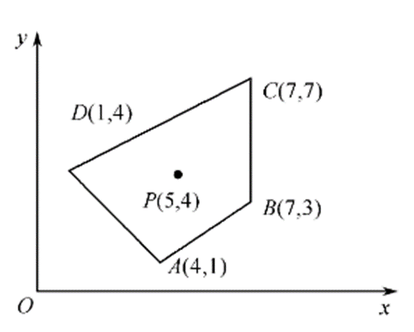
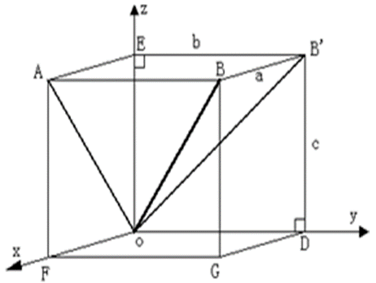

# 《计算机图形学》雨课堂随堂测试 - CG-4 二维与三维几何变换

---

## 一、 单选题

**1. 点P的齐次坐标为 (6, -2, 2)，其对应的普通坐标是：( D )**
- A. (6,-2,1)
- B. (3,-1,1)
- C. (6,-2)
- D. (3,-1)

> **【解析】**
> 在齐次坐标表示中，一个 $n$ 维向量由一个 $n+1$ 维向量表示。对于齐次坐标 $(X, Y, W)$（其中 $W \ne 0$），其对应的二维笛卡尔（普通）坐标为 $(x, y) = (X/W, Y/W)$。
> 本题中 $P(6, -2, 2)$，则对应普通坐标为 $(6/2, -2/2) = (3, -1)$。因此选 D。

**2. 将下图所示四边形ABCD绕点P(5,4)逆时针旋转45度，涉及到三个变换矩阵，则三个矩阵复合的顺序是？( C )**


- A. $T(-5, -4)R(45^\circ)T(5, 4)$
- B. $R(45^\circ)T(-5, -4)T(5, 4)$
- C. $T(5, 4)R(45^\circ)T(-5, -4)$
- D. $T(5, 4)T(-5, -4)R(45^\circ)$

> **【解析】**
> 绕任一非原点 $P(x_p, y_p)$ 进行旋转，需经历以下步骤：
> 1. 平移图形，使点 $P$ 与坐标原点重合，平移矩阵为 $T(-x_p, -y_p) = T(-5, -4)$；
> 2. 以原点为中心旋转指定角度，旋转矩阵为 $R(45^\circ)$；
> 3. 反向平移，使原点移回点 $P$ 的位置，平移矩阵为 $T(x_p, y_p) = T(5, 4)$。
> 当使用列向量表示点坐标时，变换矩阵与坐标相乘是从右向左生效的：$P' = T(5, 4) \cdot R(45^\circ) \cdot T(-5, -4) \cdot P$。
> 复合后的变换矩阵即为 $T(5, 4)R(45^\circ)T(-5, -4)$。因此本题选 C。

**3. 将下图所示四边形ABCD绕点P(5,4)逆时针旋转45度的代码是：( A )**

- A. 
  ```cpp
  glLoadIdentity();
  glTranslatef(5, 4, 0);
  glRotatef(45, 0.0f, 0.0f, 1.0f);
  glTranslatef(-5, -4, 0);
  DrawQuadrangle();
  ```
- B. 
  ```cpp
  glLoadIdentity();
  glTranslatef(-5, -4, 0);
  glRotatef(45, 0.0f, 0.0f, 1.0f);
  glTranslatef(5, 4, 0);
  DrawQuadrangle();
  ```

> **【解析】**
> 在 OpenGL 中，当前的绘图变换矩阵是按照代码中变换命令调用的“相反顺序”（即右乘原则）对绘制顶点进行复合作用的。
> 要实现的数学变换矩阵为：$T(5, 4) \cdot R(45^\circ) \cdot T(-5, -4)$。
> 根据反向原则，在代码中应依次先调用 `glTranslatef(5, 4, 0)`，再调用 `glRotatef(45, ...)`，最后调用 `glTranslatef(-5, -4, 0)`。
> 这样 OpenGL 最终生成的矩阵就是 $T(5, 4) \cdot R(45^\circ) \cdot T(-5, -4)$。因此 A 选项正确。

**4. 如下图所示，欲使OB绕X轴旋转至XOZ坐标平面内，旋转角度应为多少？( C )**

- A. ∠AOB
- B. ∠EOB
- C. ∠EOB′
- D. ∠AOB′

> **【解析】**
> 绕 X 轴旋转时，所有点的 X 坐标保持不变，而 Y、Z 坐标发生旋转。
> 欲使线段 $OB$ 旋转到 $XOZ$ 平面，也就是要使其在 $YOZ$ 平面上的投影像绕坐标原点旋转至 Z 轴（$OE$）。
> 设 $OB$ 在 $YOZ$ 平面上的投影为 $OB'$，那么需要旋转的角度即为 $OB'$ 与 Z 轴（$OE$）的夹角，即 $\angle EOB'$。因此选 C。

**5. 在三维旋转变换中，关于x轴旋转90°时变换特点描述正确的是什么？( A )**
- A. y'=-z
- B. y'=z
- C. y坐标不变
- D. x、y、z坐标都不变

> **【解析】**
> 绕 X 轴逆时针旋转角度 $\theta$ 的三维变换公式为：
> $x' = x$
> $y' = y\cos\theta - z\sin\theta$
> $z' = y\sin\theta + z\cos\theta$
> 当 $\theta = 90^\circ$ 时，$\cos 90^\circ = 0$，$\sin 90^\circ = 1$。
> 代入公式得：$y' = y(0) - z(1) = -z$，$z' = y(1) + z(0) = y$。
> 故 $y' = -z$。选 A。

**6. 空间四面体ABCD几何变换关于点S(-2, 2, 2)整体放大2倍的变换矩阵为：( B )**
- A. $$\begin{bmatrix} 1 & 0 & 0 & -2 \\ 0 & 1 & 0 & 2 \\ 0 & 0 & 1 & 2 \\ 0 & 0 & 0 & 1 \end{bmatrix} \begin{bmatrix} 1 & 0 & 0 & 0 \\ 0 & 1 & 0 & 0 \\ 0 & 0 & 1 & 0 \\ 0 & 0 & 0 & 2 \end{bmatrix} \begin{bmatrix} 1 & 0 & 0 & 2 \\ 0 & 1 & 0 & -2 \\ 0 & 0 & 1 & -2 \\ 0 & 0 & 0 & 1 \end{bmatrix}$$
- B. $$\begin{bmatrix} 1 & 0 & 0 & -2 \\ 0 & 1 & 0 & 2 \\ 0 & 0 & 1 & 2 \\ 0 & 0 & 0 & 1 \end{bmatrix} \begin{bmatrix} 1 & 0 & 0 & 0 \\ 0 & 1 & 0 & 0 \\ 0 & 0 & 1 & 0 \\ 0 & 0 & 0 & 1/2 \end{bmatrix} \begin{bmatrix} 1 & 0 & 0 & 2 \\ 0 & 1 & 0 & -2 \\ 0 & 0 & 1 & -2 \\ 0 & 0 & 0 & 1 \end{bmatrix}$$
- C. $$\begin{bmatrix} 1 & 0 & 0 & 2 \\ 0 & 1 & 0 & -2 \\ 0 & 0 & 1 & -2 \\ 0 & 0 & 0 & 1 \end{bmatrix} \begin{bmatrix} 1 & 0 & 0 & 0 \\ 0 & 1 & 0 & 0 \\ 0 & 0 & 1 & 0 \\ 0 & 0 & 0 & 2 \end{bmatrix} \begin{bmatrix} 1 & 0 & 0 & -2 \\ 0 & 1 & 0 & 2 \\ 0 & 0 & 1 & 2 \\ 0 & 0 & 0 & 1 \end{bmatrix}$$
- D. $$\begin{bmatrix} 1 & 0 & 0 & 2 \\ 0 & 1 & 0 & -2 \\ 0 & 0 & 1 & -2 \\ 0 & 0 & 0 & 1 \end{bmatrix} \begin{bmatrix} 2 & 0 & 0 & 0 \\ 0 & 2 & 0 & 0 \\ 0 & 0 & 2 & 0 \\ 0 & 0 & 0 & 1 \end{bmatrix} \begin{bmatrix} 1 & 0 & 0 & -2 \\ 0 & 1 & 0 & 2 \\ 0 & 0 & 1 & 2 \\ 0 & 0 & 0 & 1 \end{bmatrix}$$

> **【解析】**
> 关于任一点 $S(x_s, y_s, z_s) = S(-2, 2, 2)$ 的整体比例变换，其变换顺序为：
> 1. 先将 $S$ 移到原点，变换矩阵为右侧的平移矩阵 $T(2, -2, -2)$：
>    $$\begin{bmatrix} 1 & 0 & 0 & 2 \\ 0 & 1 & 0 & -2 \\ 0 & 0 & 1 & -2 \\ 0 & 0 & 0 & 1 \end{bmatrix}$$
> 2. 在原点进行整体缩放。在 4x4 齐次坐标变换矩阵中，右下角的元素 $s$ 对应的是整体缩放。对于点 $[x, y, z, 1]^T$，乘上右下角为 $1/2$ 的矩阵后变为 $[x, y, z, 1/2]^T$，对应普通笛卡尔坐标的整体放大 2 倍（将各分量除以齐次分量 $W=1/2$）。故中间的缩放矩阵为：
>    $$\begin{bmatrix} 1 & 0 & 0 & 0 \\ 0 & 1 & 0 & 0 \\ 0 & 0 & 1 & 0 \\ 0 & 0 & 0 & 1/2 \end{bmatrix}$$
> 3. 最后移回原点，变换矩阵为左侧的平移矩阵 $T(-2, 2, 2)$：
>    $$\begin{bmatrix} 1 & 0 & 0 & -2 \\ 0 & 1 & 0 & 2 \\ 0 & 0 & 1 & 2 \\ 0 & 0 & 0 & 1 \end{bmatrix}$$
> 根据矩阵复合顺序（右乘原则），整个复合变换矩阵为 $T(-2, 2, 2) \cdot S_{\text{整体}}(2) \cdot T(2, -2, -2)$，即 B 选项的形式。

**7. 下面哪项不是齐次坐标的特点？( D )**
- A. 用n+1维向量表示一个n维向量
- B. 将图形的变换统一为图形的坐标矩阵与某一变换矩阵相乘的形式
- C. 易于表示无穷远点
- D. 一个n维向量的齐次坐标表示是唯一的

> **【解析】**
> 齐次坐标中，$n$ 维空间中的点 $(x_1, x_2, \dots, x_n)$ 可以表示为 $(hx_1, hx_2, \dots, hx_n, h)$（其中 $h \ne 0$）。
> 由于 $h$ 可以取任意非零实数，同一个普通坐标点有无数个对应的齐次坐标表示，因此齐次坐标的表示是不唯一的。D 选项描述错误。本题选 D。

**8. 经过三维几何变换，使得图1中的图形成为如图2所示的图形，其几何变换是什么？( B )**

- A. 先沿x轴方向平移1个单位，再绕y轴逆时针旋转45度
- B. 先绕y轴逆时针旋转45度，再沿x轴方向平移1个单位
- C. 先沿x轴方向平移1个单位，再绕y轴顺时针旋转45度
- D. 先绕y轴顺时针旋转45度，再沿x轴方向平移1个单位

> **【解析】**
> 观察图形变换前后的状态：
> - 在图 1 中，立方体位于原点，各边缘平行于坐标轴。
> - 在图 2 中，立方体发生旋转并发生平移。注意到，立方体是“绕自身的 y 轴”逆时针旋转了 45 度（其底面中轴线倾斜），且立方体的中心整体偏离了原点，向 X 轴正方向平移了 1 个单位。
> - 若先平移后旋转（如 A 选项），则旋转是绕原点 Y 轴进行的，立方体旋转后其中心将不再位于 X 轴上，而是处于斜向轨道。这与图 2 不符。
> - 正确的顺序是：先绕自身 Y 轴逆时针旋转 45 度，然后再沿 X 轴方向平移 1 个单位。因此本题选 B。

**9. 空间四面体ABCD关于x轴进行对称变换的变换矩阵为：( C )**
- A. $$\begin{bmatrix} -1 & 0 & 0 & 0 \\ 0 & 1 & 0 & 0 \\ 0 & 0 & 1 & 0 \\ 0 & 0 & 0 & 1 \end{bmatrix}$$
- B. $$\begin{bmatrix} 1 & 0 & 0 & 0 \\ 0 & -1 & 0 & 0 \\ 0 & 0 & 1 & 0 \\ 0 & 0 & 0 & 1 \end{bmatrix}$$
- C. $$\begin{bmatrix} 1 & 0 & 0 & 0 \\ 0 & -1 & 0 & 0 \\ 0 & 0 & -1 & 0 \\ 0 & 0 & 0 & 1 \end{bmatrix}$$
- D. $$\begin{bmatrix} -1 & 0 & 0 & 0 \\ 0 & -1 & 0 & 0 \\ 0 & 0 & -1 & 0 \\ 0 & 0 & 0 & 1 \end{bmatrix}$$

> **【解析】**
> 三维空间中关于 X 轴进行反射（对称）变换时：
> - X 轴坐标保持不变，即 $x' = x$；
> - Y 轴和 Z 轴的坐标变反，即 $y' = -y$，$z' = -z$。
> 对应的主对角线上的元素分别为 $1, -1, -1, 1$。这与 C 选项相符。

---

## 二、 填空题

**10. 基本几何变换都是相对于 ______ **坐标原点** 和坐标轴进行的几何变换。**
*(注：填 **坐标原点** 或 **原点**)*

> **【解析】**
> 基本的二维和三维几何变换（如平移、旋转、放缩、错切等）在定义时均是相对于**坐标原点**和各自的坐标轴来进行矩阵描述的。如果是相对于任意其他参考点，必须先做平移使该点与原点重合，再进行基础变换，最后平移回原位。
