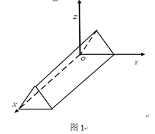
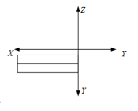
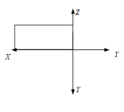

# 《计算机图形学》雨课堂随堂测试 - CG-5 投影与三维视口变换

---

## 一、 单选题

**1. 在二维变换中，根据窗口和视区的关系，下列说法正确是什么？( B )**
- A. 窗口不变，视区变大，则图形缩小
- B. 窗口不变，视区变大，则图形放大
- C. 视区不变，窗口变大，则图形放大
- D. 视区不变，窗口缩小，则图形缩小

> **【解析】**
> - **窗口（Window）** 定义了在用户（世界）坐标系中需要显示的区域范围；
> - **视区（Viewport）** 定义了在屏幕（设备）坐标系中图形实际显示的目标区域。
> 从窗口到视区的坐标缩放因子为：$S_x = \frac{x_{vmax} - x_{vmin}}{x_{wmax} - x_{wmin}}$，$S_y = \frac{y_{vmax} - y_{vmin}}{y_{wmax} - y_{wmin}}$。
> - 当窗口大小不变（分母固定）而视区变大（分子增大）时，缩放比例因子变大，最终在屏幕上显示的图形会被放大。因此本题选 B。

**2. 斜二测投影时，和投影面垂直的任何直线段，其投影的长度为原来的（）。( C )**
- A. 2倍
- B. 不变
- C. 1/2
- D. 1/4

> **【解析】**
> 在平行投影的斜投影中，与投影面垂直的线段投影后的长度与原长度的比值称为变形系数（或投影收缩率）$r$。
> - 在斜等测投影中，规定对垂直于投影面的线段不进行收缩，即变形系数 $r = 1$。
> - 在斜二测投影中，为了符合人眼视觉习惯，规定垂直于投影面的线段投影长度收缩为原长度的一半，即变形系数 $r = 1/2$。因此选 C。

**3. 在透视投影中，主灭点的最多个数是多少？( C )**
- A. 1个
- B. 2个
- C. 3个
- D. 多个

> **【解析】**
> 主灭点（Principal Vanishing Point）是指三维空间中与三个坐标轴（X 轴、Y 轴、Z 轴）平行的平行线投影后在投影面上产生的汇交点。
> 因为三维笛卡尔坐标系中只有三个互相垂直的主轴，所以透视投影中主灭点最多只有 3 个（对应一角、两角和三角透视）。本题选 C。

**4. 图1所示物体的俯视图是：( B )**

- A. 
- B. 
- C. 
- D. 

> **【解析】**
> 俯视图（Top View）是从物体的正上方沿垂直方向向下投影所得到的平面图形。
> 观察图 1 物体的三维造型：
> - 顶部有一个水平的小长方形；
> - 前方有一条倾斜向下的斜坡，在俯视投影中，斜面会被投影为一个长方形；
> - 右侧底座部分比主体稍微宽出，形成一个台阶。
> 结合这几部分的相对位置和可见边缘线，其正上方投影图正好与 B 选项相契合。因此选 B。

**5. 对三维物体各点坐标进行变换，矩阵T中各元素在变换中的具体作用不同，不正确的是：( D )**
$$T = \begin{bmatrix} a & b & c & l \\ d & e & f & m \\ h & i & j & n \\ p & q & r & s \end{bmatrix}$$
- A. 左上角9个数a~j, 对应旋转、比例、对称、错切变换
- B. 第四列前3个数l~m, 对应平移变换
- C. 第四行前3个数p~q, 对应透视变换
- D. 右下角数s, 表示整体比例变换s倍

> **【解析】**
> 在 4x4 的三维齐次变换矩阵 $T$ 中：
> - 左上角 3x3 子矩阵（$a$ 到 $j$）对应基本的线性变换（旋转、比例、对称、错切）（A 正确）；
> - 第四列的前三个元素（$l, m, n$）分别对应沿 X、Y、Z 方向的平移变换量（B 正确，虽然题干中缩写写成 l~m，但概念上是指前 3 个平移项）；
> - 第四行前三个元素（$p, q, r$）对应 X、Y、Z 三个方向的透视投影变换参数（C 正确）；
> - 右下角元素 $s$ 对应整体比例缩放。若右下角值为 $s$，点 $[x, y, z, 1]^T$ 经变换后其齐次分量为 $s$，除以齐次分量还原为普通坐标后，坐标变为 $[x/s, y/s, z/s]^T$。这意味着将物体整体缩放了 $1/s$ 倍，而非 $s$ 倍。因此 D 选项说法错误，符合题意。

**6. 若空间点D(1,1,1)在xoy面的正投影点是P，在xoy面的斜二测投影点是Q，则线段PQ的长度是：( B )**
- A. 1
- B. 0.5
- C. 2
- D. 不确定

> **【解析】**
> - $D(1, 1, 1)$ 在 $xoy$ 面（即 $z = 0$ 平面）上的正投影点为 $P(1, 1, 0)$。
> - 在 $xoy$ 面上的斜投影中，点 $(x, y, z)$ 的投影坐标 $(x_p, y_p)$ 计算公式为：
>   $x_p = x + z \cdot r \cos\alpha$，
>   $y_p = y + z \cdot r \sin\alpha$。
>   因此，斜二测投影点为 $Q(1 + 1 \cdot r \cos\alpha, 1 + 1 \cdot r \sin\alpha, 0)$。
> - 线段 $PQ$ 即为正投影点与斜投影点在投影面上的距离：
>   $|PQ| = \sqrt{(x_q - x_p)^2 + (y_q - y_p)^2} = \sqrt{(r \cos\alpha)^2 + (r \sin\alpha)^2} = r \sqrt{\cos^2\alpha + \sin^2\alpha} = r$。
> - 斜二测投影的轴向变形系数固定为 $r = 0.5$。
> 故无论投影角 $\alpha$ 取何值，线段 $PQ$ 的长度恒等于 $r = 0.5$。因此选 B。

**7. 下列有关平面几何投影的叙述语句中，正确的论述是：( A )**
- A. 在平面几何投影中，若投影中心移到距离投影面无穷远处，则成为平行投影
- B. 透视投影与平行投影相比，视觉效果更有真实感，而且能真实地反映物体精确的尺寸和形状
- C. 透视投影变换中，一组平行线投影在与之平行的投影面上，可以产生灭点
- D. 对三维空间中的物体进行透视投影变换，可能产生三个以上主灭点

> **【解析】**
> - A. 正确。当投影中心移到无穷远处时，投影线退化为互相平行的直线，透视投影即转化为平行投影。
> - B. 错误。透视投影有“近大远小”的失真，无法真实反映物体的实际精确尺寸，因而不适合直接用于工程测量绘图。
> - C. 错误。若一组平行线平行于投影面，则在透视投影后它们依然是平行的，不会产生交点（即不会产生灭点）。
> - D. 错误。三维空间中最多只有 3 个主坐标轴，因此最多只能产生 3 个主灭点。
> 综上所述，选 A。

---

## 二、 判断题

**8. 透视投影可以分解成透视和正投影的复合。( A )**
- A. 正确 (True)
- B. 错误 (False)

> **【解析】**
> 透视投影变换的数学实现过程通常是：先通过一个非线性的透视变换，将视平截头体（视棱台）畸变转换成平行投影的规则视景体（长方体），然后再施加一次平行（正）投影。因此透视投影可以看作是透视变换与正投影的复合。本题说法正确，选 A。

**9. 空间相互平行的直线，在透视投影之后可以不平行。( A )**
- A. 正确 (True)
- B. 错误 (False)

> **【解析】**
> 空间相互平行的直线，如果它们不平行于投影面，那么在透视投影后，它们的投影线会相交于某一点（即灭点），不再保持平行。本题说法正确，选 A。

**10. 视区定义在世界坐标系中，窗口定义在设备坐标系中。( B )**
- A. 正确 (True)
- B. 错误 (False)

> **【解析】**
> 概念颠倒：**窗口（Window）** 定义在用户（世界）坐标系中，代表要在屏幕上画出来的虚拟场景的范围；**视区（Viewport）** 定义在屏幕（物理设备）坐标系中，代表图形画在屏幕的哪一个区域。因此本题说法错误，选 B。
