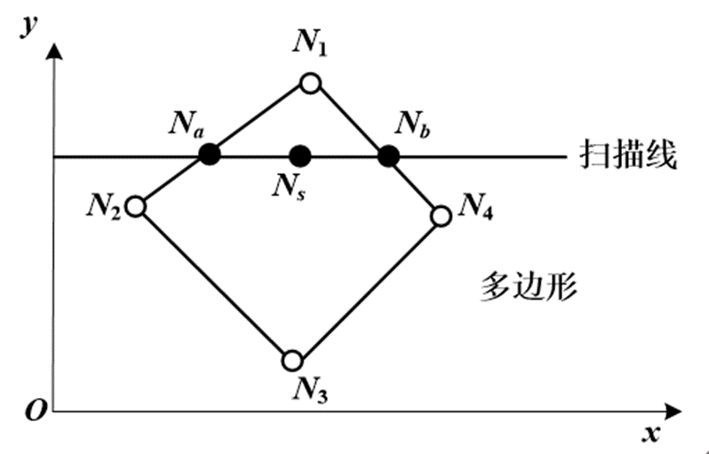

# 《计算机图形学》雨课堂随堂测试 - CG-6&7 三维造型、消隐与真实感图形学

---

## 一、 单选题

**1. 一个有效的实体应该具有的性质包括？( D )**
①刚性②具有封闭的边界③内部连通④占据有限的空间⑤集合运算后仍是有效的实体
- A. ①②③⑤
- B. ①②③
- C. ②③④⑤
- D. ①②③④⑤

> **【解析】**
> 一个在计算机中有效表示的三维实体必须在拓扑上和代数上满足以下性质：
> 1. **刚性（Rigidity）**：物体的形状不随空间位置和姿态的变化而改变；
> 2. **具有封闭的边界（Boundary Closure）**：实体的边界必须是封闭的，能够将空间明确划分为内部和外部；
> 3. **内部连通性（Internal Connectivity）**：实体的内部点集在拓扑上必须是连通的；
> 4. **占据有限的空间（Finiteness）**：实体的体积必须是有限的，不能无限延伸；
> 5. **集合运算闭合性（Closure under Boolean Operations）**：实体经过正则集合运算（交、并、差）后，得到的仍是一个有效的实体。
> 因此，以上五项都是有效实体应具备的性质，本题选 D。

**2. 在简单光照明模型中，由物体表面上点反射到视点的光强是哪几项之和？( C )**
①环境光 ②漫反射光 ③镜面反射光 ④物体间的反射光
- A. ①②
- B. ①③
- C. ①②③
- D. ①②③④

> **【解析】**
> 简单光照明模型（通常指 Phong 局部反射模型）计算物体表面某点反射到视点的光强时，主要考虑了三项的叠加：
> - **环境光（Ambient Light）** ①：模拟场景中经多次散射产生的均匀光照；
> - **漫反射光（Diffuse Reflection）** ②：模拟光源照到粗糙表面向各个方向均匀散射的光；
> - **镜面反射光（Specular Reflection）** ③：模拟光源照到光滑表面在特定方向产生的反射高光。
> 简单模型不考虑物体与物体之间的相互反射与遮挡（物体间的反射光 ④，这属于全局光照模型的范畴）。因此本题选 C。

**3. 当观察光照下的光滑物体表面时，在某个方向上看到高光或强光，这个现象称为什么？( B )**
- A. 漫反射
- B. 镜面反射
- C. 环境光
- D. 折射

> **【解析】**
> 光滑的物体表面（如金属、油漆面等）在受到光照时，会将入射光线主要反射到符合反射定律的一个窄锥角方向区域内。从该方向观察时，由于反射光线集中，会看到明亮的高光区，这种物理反射现象称为**镜面反射**。因此选 B。

**4. 粗糙的物体表面往往将反射光向各个方向散射，这种光线散射的现象称为：( A )**
- A. 漫反射
- B. 折射
- C. 衍射
- D. 透射

> **【解析】**
> 当光线照射到粗糙无光泽的物体表面（如粉笔、磨砂面）时，由于微观表面的不平整，光线会被无规则地向各个方向散射。这种反射光在各个方向均等散射的现象称为**漫反射**。选 A。

**5. 对象空间有k个物体，图像空间的屏幕分辨率为m*n，则图像空间消隐算法的复杂度是：( A )**
- A. O(m*n*k)
- B. O(k*k)
- C. O(m*n)
- D. O(m*n*m*n)

> **【解析】**
> 图像空间消隐算法（如 Z-Buffer 算法）的消隐判定是在像素级别进行的：
> - 算法需要对屏幕上的每一个像素（共 $m \times n$ 个像素）进行判定；
> - 在最坏情况下，每个像素位置都需要将场景中的 $k$ 个多边形进行光栅化并比较它们的深度值。
> 因此，该算法的总体计算复杂度为 $O(m \times n \times k)$。本题选 A。

**6. Whitted光照模型中包括哪些光强度？( D )**
①环境光②漫反射光③镜面反射光④环境镜面反射光⑤环境透射光
- A. ①②③
- B. ①④⑤
- C. ②③④⑤
- D. ①②③④⑤

> **【解析】**
> Whitted 光照模型作为经典的光线跟踪全局光照模型，将某点的总光强 $I$ 表示为局部光照与全局环境反射光的叠加：
> $I = I_a + I_d + I_s + I_{rs} + I_{rt}$
> 其中包括：
> - $I_a$：环境光（环境照度）①
> - $I_d$：局部漫反射光强 ②
> - $I_s$：局部镜面反射光强 ③
> - $I_{rs}$：由反射方向跟踪光线传来的其他物体表面的镜面反射光（环境镜面反射光） ④
> - $I_{rt}$：由折射方向跟踪光线传来的环境规则透射光（环境透射光） ⑤
> 因此，五项全部包括，本题选 D。

**7. （ ）明暗处理采用了法矢量双线性插值的方法先求出多边形内部各点法矢量再求颜色， （ ）明暗处理采用了亮度双线性插值的方法求出多边形内部各点颜色。( C )**
- A. Gouraud，Phong
- B. Phong，Flat
- C. Phong，Gouraud
- D. Flat，Gouraud

> **【解析】**
> - **Phong 明暗处理（Phong Shading / 法向插值明暗处理）**：先对多边形顶点的法矢量在多边形内部进行双线性插值，得到内部各像素点处的近似法矢量，然后再利用光照模型计算每个像素的颜色。它能较好地呈现镜面高光。
> - **Gouraud 明暗处理（Gouraud Shading / 亮度插值明暗处理）**：先利用顶点处的法矢量计算出顶点的颜色亮度值，然后再对顶点的颜色值在多边形内部进行双线性插值，直接求出内部各点的颜色。
> 故第一空填 Phong，第二空填 Gouraud。本题选 C。

**8. 关于 Ray Tracing 算法，描述错误的是：( C )**
- A. 采用逆向跟踪技术完成整个场景的绘制
- B. 采用Whitted整体光照模型计算对应像素点的光强度
- C. 无法实现场景中交相辉映的景物、透明等显示
- D. 当光线与离视点最近的场景物体表面交点为理想漫射面时跟踪结束

> **【解析】**
> - A. 正确。光线跟踪采用逆向跟踪，即从视点出发穿过每个像素向场景投射光线，求取其与场景的交点。
> - B. 正确。经典光线跟踪使用 Whitted 全局光照模型来计算反射和折射的光强。
> - C. 错误。光线跟踪算法最大的优势就在于它能够非常自然且逼真地模拟镜面反射（产生交相辉映的景物）、折射（透明玻璃效果）以及阴影。
> - D. 正确。若交点为理想漫反射面，则镜面反射系数和折射系数均为零，此时无需再递归生成反射和折射光线，跟踪到此结束。
> 故本题选 C。

**9. 在光线跟踪（Ray Tracing）算法中，在哪种情况下不再跟踪光线？( C )**
①光线未碰到任何物体；②光线的光强度已经很弱；③光线的深度已经很深；④光线遇到背景；⑤光线遇到某一物体
- A. ①②
- B. ①②③
- C. ①②③④
- D. ①②③④⑤

> **【解析】**
> 递归光线跟踪需要设置明确的终止条件以避免陷入死循环或无谓的计算：
> - 当光线没有与场景中任何物体相交（即飞向了无穷远或碰到了背景）时，终止跟踪（①、④符合）；
> - 当光线经过多次衰减，其对当前像素颜色的贡献量（光强度乘积）已经低于某个设定阈值时，终止跟踪（②符合）；
> - 当光线递归跟踪的次数（深度）已经达到了最大设定深度值时，终止跟踪（③符合）。
> - 并且，当光线遇到某个物体（⑤）时，恰恰需要根据物体的材质属性产生新的反射或折射光线继续跟踪，而不是终止跟踪。
> 因此不再跟踪的情况为 ①②③④，本题选 C。

**10. Phong光照明模型之漫反射光强 $I_d = I_p K_d (L \cdot N)$ 中 $K_d$ 是：( C )**
- A. 环境光反射系数
- B. 光源光强的漫反射分量
- C. P点材质的漫反射系数
- D. P点材质 of 镜面反射系数

> **【解析】**
> 在漫反射公式中：
> - $I_p$ 是光源的入射光强；
> - $L$ 是入射光方向向量；
> - $N$ 是表面法向量；
> - $K_d$ 是该表面材质的漫反射系数（Reflection Coefficient for Diffuse Reflection），取值在 0 到 1 之间，决定了材质对漫反射光的反射能力。
> 因此选 C。

**11. Phong光照明模型之镜面反射光强 $I_s = I_p K_s \cos^n(\alpha)$ 中，$\alpha$ 是：( D )**
- A. L与N的夹角
- B. N与H的夹角
- C. H与R的夹角
- D. R与V的夹角

> **【解析】**
> Phong 镜面反射模型中，高光强度的强弱与视线方向同理想反射光线方向的偏角有关。
> 公式中 $\cos(\alpha) = R \cdot V$，其中：
> - $R$ 是光线 $L$ 在表面上的镜面反射方向向量；
> - $V$ 是从相交点指向观察者（视点）的视线方向向量；
> - $\alpha$ 是反射光向量 $R$ 与视线向量 $V$ 之间的夹角。
> 因此选 D。

**12. Phong多边形着色方法中，点a处的法向量插值公式Na是：( A )**

- A. $$N_a = \frac{y_2 - y_a}{y_2 - y_1} N_1 + \frac{y_a - y_1}{y_2 - y_1} N_2$$
- B. $$N_a = \frac{y_2 - y_s}{y_1 - y_2} N_1 + \frac{y_s - y_1}{y_1 - y_2} N_2$$
- C. $$N_a = \frac{x_2 - x_a}{x_1 - x_2} N_1 + \frac{x_a - x_1}{x_1 - x_2} N_2$$
- D. 以上都不是

> **【解析】**
> 如图所示，在扫描线从下往上进行跨越时：
> 点 $a$ 处于顶点 1（$y$ 坐标为 $y_1$，法向为 $N_1$）与顶点 2（$y$ 坐标为 $y_2$，法向为 $N_2$）的连线上。
> 按照沿边在垂直方向的线性插值规则：
> 点 $a$ 的法线 $N_a$ 应该是由顶点 1 和 2 的法线根据其与点 $a$ 的垂直距离进行加权平均得到的：
> $N_a = \frac{y_2 - y_a}{y_2 - y_1} N_1 + \frac{y_a - y_1}{y_2 - y_1} N_2$。
> 当 $y_a = y_1$ 时，$N_a = N_1$；当 $y_a = y_2$ 时，$N_a = N_2$，符合插值的物理性质。因此 A 选项正确。

---

## 二、 判断题

**13. 实体的扫描表示法用一个物体和该物体的一条移动轨迹来描述一个新的物体。( A )**
- A. 正确 (True)
- B. 错误 (False)

> **【解析】**
> 扫描表示法（Sweep Representation，又称扫掠表示）是实体造型的一种方法。它定义一个几何基元（如 2D 轮廓或 3D 实体），并定义一条空间运动轨迹，基元沿轨迹扫描而过的空间区域即构成了新的实体（如拉伸体、旋转体、放样体等）。本题说法正确，选 A。

**14. 光线跟踪算法采用逆向跟踪技术完成整个场景的绘制。( A )**
- A. 正确 (True)
- B. 错误 (False)

> **【解析】**
> 在计算机图形学中，正向光线跟踪由于绝大部分光线无法进入人眼而效率极低。因此，光线跟踪绘制算法均采用逆向光线跟踪技术（Backward Ray Tracing），即从视点出发穿过像素射入场景，逆向追踪光线的传播路径。本题说法正确，选 A。

**15. 光线跟踪算法递归中采用Whitted整体光照模型计算交点的光强度，环境镜面反射光或环境规则透视光有时为零。( A )**
- A. 正确 (True)
- B. 错误 (False)

> **【解析】**
> 在 Whitted 整体反射公式中，环境镜面反射项和透射项的权重由物体的材质镜面反射系数 $K_s$ 和透射系数 $K_t$ 决定。如果相交的物体表面是完全粗糙（不反光）的，其镜面反射光贡献为零；或者是完全不透明的，其折射（透射）光贡献为零。本题说法正确，选 A。

**16. Z-Buffer算法不仅需要帧缓冲区存放像素的亮度值，还需要一个Z缓冲区存放每个像素的深度值。( A )**
- A. 正确 (True)
- B. 错误 (False)

> **【解析】**
> Z-Buffer（深度缓存）算法是最经典和简单的图像空间消隐算法：
> 1. 需要一个帧缓冲区（Frame Buffer）记录屏幕上每个像素的最终颜色（亮度）值；
> 2. 还需要一个深度缓冲区（Depth/Z-Buffer）记录当前每个像素位置所绘制的多边形的最小 Z（深度）值，用以判断新渲染的多边形顶点是否比先前绘制的离相机更近。
> 本题说法正确，选 A。

**17. 画家算法的基本思想是先将屏幕赋值为背景色，然后把物体各个面按其到视点距离远近排序，再按由远到近的顺序绘制。( A )**
- A. 正确 (True)
- B. 错误 (False)

> **【解析】**
> 画家算法（Painter's Algorithm）是一种简单的空间消隐思想：它模仿画家画画的过程，先将场景中的所有多边形按距离视点的远近（深度 $Z$ 值）进行降序排序，然后按照“由远及近”的顺序将它们依次绘制到屏幕上。后画的（离视点近的）主导并覆盖先前画的（离视点远的）图像，从而实现消隐。本题说法正确，选 A。

---

## 三、 填空题

**18. 由简单实体间通过集合运算组合成新的实体的方法称为 ______ **构造实体几何法** 。**
*(注：填 **构造实体几何法** 或 **CSG法**)*

> **【解析】**
> 由球体、立方体、圆柱体等简单的三维几何基元，通过布尔集合运算（并、交、差）来组合构造出复杂的复杂实体的方法，被称为**构造实体几何法（Constructive Solid Geometry，简称 CSG 法）**。

**19. ______ **颜色纹理** 是指光滑表面的花纹图案， ______ **几何纹理** 是指粗糙表面的不规则凹凸细节。**
*(注：填空1填 **颜色纹理**，填空2填 **几何纹理** 或 **凹凸纹理**)*

> **【解析】**
> 纹理映射分为两类：
> - **颜色纹理（Color Texture）**：将二维图像（花纹图案）映射到平滑表面，用于改变物体表面的反射率和漫反射颜色；
> - **几何纹理（Geometric Texture，又称凹凸纹理 Bump Texture）**：通过扰动法向量，在不改变实体真实网格几何的前提下，模拟表面凹凸不平的粗糙光影细节。
