# 《计算机图形学》雨课堂随堂测试（合集）


---

## CG-1&2 绪论与图形系统


---

### 一、 单项选择题

**1. 以计算机中所记录的形状参数与属性参数来表示图形的一种方法叫做______，一般把它描述的图形叫做______；而用具有灰度或颜色信息的点阵来表示图形的一种方法是______，它强调图形由哪些点组成，并具有什么灰度或色彩，一般把它描述的图形叫做______。** `[ A ]`

* A. 参数法 图形 点阵法 图像
* B. 点阵法 图像 参数法 图形
* C. 参数法 图像 点阵法 图形
* D. 点阵法 图形 参数法 图像

> **【解析】**
> 参数法是用计算机中所记录的形状参数与属性参数来表示图形的一种方法，它描述的图形称为“图形”（Graphics）；点阵法是用具有灰度或颜色信息的点阵来表示图形的一种方法，它强调图形由哪些点组成以及它们具有什么灰度或色彩，它描述的图形称为“图像”（Image）。因此本题选 A。

**2. 提出“计算机图形学”的相关概念和技术，被称为“计算机图形学之父”的是谁？** `[ A ]`

* A. Ivan E. Sutherland
* B. Phong Bui-Tuong
* C. Jack E. Bresenham
* D. Brian A. Barsky

> **【解析】**
> Ivan E. Sutherland 在 1963 年发表了关于 Sketchpad 系统的论文，提出了交互式图形技术、分层命名数据结构等众多图形学基本概念，奠定了计算机图形学的基石，因此被公认为“计算机图形学之父”。本题选 A。

**3. 下列哪项是图形输出设备？** `[ D ]`

* A. 触摸屏
* B. 数字化仪
* C. 扫描仪
* D. 绘图仪

> **【解析】**
> 绘图仪（Plotter）是专门用于绘制大图、设计图的图形输出设备。触摸屏是输入/输出设备（多偏向输入），数字化仪和扫描仪则纯属图形输入设备。因此本题选 D。

**4. 灰度等级为 256 级，分辨率为 $2048 \times 1024$ 的显示器，至少需要的帧缓存容量为多少？** `[ C ]`

* A. 512KB
* B. 1MB
* C. 2MB
* D. 3MB

> **【解析】**
> 灰度等级为 256 级，每个像素需要 $\log_2(256) = 8\text{位} = 1\text{字节}$。
> 帧缓存容量 = $\text{分辨率} \times \text{每个像素占用的字节数} = 2048 \times 1024 \times 1\text{字节} = 2,097,152\text{字节} = 2\text{MB}$。因此本题选 C。

**5. 分辨率为 $1024 \times 1024$ 的显示器，其位平面数为 24，则帧缓存的字节数应为多少？** `[ A ]`

* A. 3M
* B. 2M
* C. 1M
* D. 512K

> **【解析】**
> 位平面数为 24，即每个像素用 $24\text{位}$ 来表示，也就是 $24 \div 8 = 3\text{字节}$。
> 帧缓存容量 = $1024 \times 1024 \times 3\text{字节} = 3\text{MB}$。因此本题选 A。

---

**6. 下列设备中属于图形输入设备的是（______）。** `[ C ]`
①鼠标 ②LCD ③键盘 ④CRT ⑤打印机 ⑥扫描仪 ⑦绘图仪

* A. ①②③
* B. ④⑤⑥
* C. ①③⑥
* D. ②⑤⑦

> **【解析】**
> 输入设备用于向计算机输入指令或数据，鼠标①、键盘③和扫描仪⑥属于输入设备；LCD②、CRT④、打印机⑤和绘图仪⑦均为输出设备。因此本题选 C。

**7. 下面（______）不属于计算机图形学的应用范围。** `[ B ]`

* A. 计算机动画
* B. 从遥感图像中识别道路等线划数据
* C. 影视三维动画制作
* D. 计算机辅助设计

> **【解析】**
> 计算机图形学（Computer Graphics, CG）是研究如何用计算机表示、生成、处理和显示图形的学科（数据/模型 $\rightarrow$ 图像）。
> 而“从遥感图像中识别道路等线划数据”属于数字图像处理（Digital Image Processing）和计算机视觉（Computer Vision）的范畴（图像 $\rightarrow$ 数据/语义信息）。因此本题选 B。

---

### 二、 判断题

**8. 构成图形的要素除了点、线、面、体等几何要素外，还应该包括灰度、色彩、线型、线宽等非几何要素。** `( √ )`

* A. 正确 (True)
* B. 错误 (False)

> **【解析】**
> 构成图形的要素分为两类：几何要素（点、线、面、体等，确定图形的空间位置和边界）和非几何要素（灰度、色彩、线型、线宽等，反映图形的质感与表现属性）。二者共同构成图形。因此本题说法正确，选 A。

**9. 虚拟现实（VR）系统中没有使用计算机图形学的知识。** `( × )`

* A. 正确 (True)
* B. 错误 (False)

> **【解析】**
> 虚拟现实（VR）的核心是在计算机中生成三维虚拟世界并实时渲染出来呈现在用户的双眼屏幕中，这高度依赖计算机图形学的三维造型、光照模型、实时渲染以及消隐算法等核心技术。因此本题说法错误，选 B。

---

### 三、 填空题

**10. 图形流水线包括三个阶段，分别是应用程序阶段、______ 几何 ______ 阶段和像素处理阶段。**
*(注：填 **几何** 或 **几何处理**)*

> **【解析】**
> 图形流水线（Graphics Pipeline）的基本划分包括：
> 1. 应用程序阶段（Application Stage）：在 CPU 中执行，负责碰撞检测、交互处理等；
> 2. 几何阶段（Geometry Processing Stage）：主要进行顶点着色、模型及视口变换、投影和裁剪等；
> 3. 像素处理阶段（Pixel Processing Stage / Rasterization）：进行光栅化、像素着色及合并写入帧缓存。
> 因此填空处为“几何”或“几何处理”。

---

## CG-3 光栅图形学


---

### 一、 单选题

**1. 用射线法判断一个点是否在多边形内时，若该射线与多边形的交点数目为（______），则该点在多边形内部。** `[ A ]`

* A. 奇数
* B. 偶数

> **【解析】**
> 射线法的基本思想是：从被测点引出一条射线，计算它与多边形边界的交点个数。如果交点个数为奇数，说明该点位于多边形内部；如果是偶数（包括 0），则在外部。因此本题选 A。

**2. 下列哪种现象不是走样现象？** `[ D ]`

* A. 倾斜的直线和区域的边界处呈现阶梯状、锯齿状的效果
* B. 本应均匀间隔的纹理图案，造成了不均匀的间隔显示
* C. 一些非常细的线或很小的点由于低于分辨率而不能被显示出来
* D. 当比较接近水平的线与比较接近垂直的线汇合时，汇合处外角有缺口

> **【解析】**
> 走样（Aliasing）是由于用离散像素表示连续图形而引起的采样失真。典型的走样现象有：
> - 光栅显示器上倾斜线条的锯齿/阶梯效应（A 属于走样）；
> - 纹理图像采样时产生的莫尔条纹/不均匀间隔现象（B 属于走样）；
> - 细小物体或细线因低于像素采样分辨率而丢失，产生闪烁或不显示（C 属于走样）。
> - 而 D 选项“汇合处外角有缺口”属于线宽绘制时的线帽（Cap）或连接（Join）风格处理不当导致，并不属于采样的走样失真。因此选 D。

**3. 用 DDA 算法绘制直线段 $P_0(1,1) - P_1(5,2)$，下面表格给出了绘制点列 $(x,y)$ 的变化过程：**

| $x$ | $y$ |
| :---: | :---: |
| 1 | 1 |
| 2 | 1 |
| ① | ② |
| 4 | 2 |
| 5 | 2 |

**易求得①②处的值分别是：** `[ C ]`

* A. 2，1
* B. 3，1
* C. 3，2
* D. 4，2

> **【解析】**
> 直线起点为 $(1, 1)$，终点为 $(5, 2)$。
> $\Delta x = 5 - 1 = 4$，$\Delta y = 2 - 1 = 1$。因为 $\Delta x > \Delta y > 0$，所以以 $x$ 为步进方向，$y$ 的增量为 $k = \Delta y / \Delta x = 0.25$。
> 逐步计算点列：
> - $x = 1$ 时，$y = 1.0$，四舍五入后绘制 $(1, 1)$；
> - $x = 2$ 时，$y = 1.25$，四舍五入后绘制 $(2, 1)$；
> - $x = 3$ 时，$y = 1.5$，按照标准四舍五入（Round-half-up 或 Round-half-even，1.5 均舍入为 2）后绘制 $(3, 2)$；
> - $x = 4$ 时，$y = 1.75$，四舍五入后绘制 $(4, 2)$；
> - $x = 5$ 时，$y = 2.0$，绘制 $(5, 2)$。
> 故当 $x = 3$（即①）时，对应的绘制坐标 $y = 2$（即②）。本题选 C。

**4. 用 Bresenham 算法绘制直线段 $P_0(1,1) - P_1(5,2)$，下面表格给出了绘制点列 $(x,y)$ 和误差判别项 $d$ 的变化过程。**

| $x$ | $y$ | $d$ |
| :---: | :---: | :---: |
| 1 | 1 | -2 |
| 2 | 1 | 0 |
| 3 | ① | ② |
| 4 | 2 | -4 |
| 5 | 2 | -2 |

**易求得①②处的值分别是：** `[ B ]`

* A. 1，2
* B. 2，-6
* C. 1，-6
* D. 2，2

> **【解析】**
> 起点为 $(1, 1)$，终点为 $(5, 2)$。$\Delta x = 4$，$\Delta y = 1$。
> 误差判别项的初值 $d_0 = 2\Delta y - \Delta x = 2(1) - 4 = -2$。
> - 初始点：$x = 1, y = 1, d = -2$。因为 $d \le 0$，下一个点 $x = 2, y = 1$；新的 $d = d + 2\Delta y = -2 + 2 = 0$。
> - 第二步：$x = 2, y = 1, d = 0$。因为 $d \ge 0$，下一个点 $y$ 需要加 1，即 $y = 2$，所以 $x = 3, y = 2$；新的 $d = d + 2\Delta y - 2\Delta x = 0 + 2 - 8 = -6$。
> - 因此，在第三步 $x = 3$ 时，绘制点为 $y = 2$（即①），误差判别项 $d = -6$（即②）。
> - 我们进一步检验：由于 $d = -6 < 0$，下一步 $x = 4, y = 2, d = -6 + 2 = -4$，与表格第四行完全契合。
> 故本题选 B。

**5. 用中点画线算法绘制直线段 $P_0(1,1) - P_1(5,2)$，误差判别项 $d$ 的初值是：** `[ A ]`

* A. 2
* B. 6
* C. -2
* D. 0

> **【解析】**
> 直线斜率 $k = \Delta y / \Delta x = 1/4$。
> 在中点画线算法中，为了避免浮点数运算，通常将判别式乘上 2，其公式为：
> $d_0 = 2\Delta y - \Delta x$。
> 这里 $\Delta x = 4$，$\Delta y = 1$。
> 故 $d_0 = 2(1) - 4 = -2$。
> 题目的参考答案给的是 **A (2)**。我们重新推导中点画线法的构造：
> 直线方程为 $F(x, y) = a x + b y + c = 0$，其中 $a = y_0 - y_1 = -\Delta y = -1$，$b = x_1 - x_0 = \Delta x = 4$。
> 判别式定义为 $d = F(x_p + 1, y_p + 0.5)$。
> 起点 $(1, 1)$ 在直线上，故 $F(1, 1) = -1 + 4 + c = 0 \Rightarrow c = -3$。
> 初始判别项 $d_0 = F(2, 1.5) = -2 + 4(1.5) - 3 = 1$。
> 如果采用乘 2 消除小数的方式，判别项变为 $d_0 = 2 F(2, 1.5) = 2 \times 1 = 2$。
> 此时判别式初值为 2。因此本题选 A。

**6. 活动边表算法中多边形的水平边不装入边表 ET。请对如图多边形，补充完整 ET 和 AET 中几处数据。** `[ B ]`

<div align="center">
  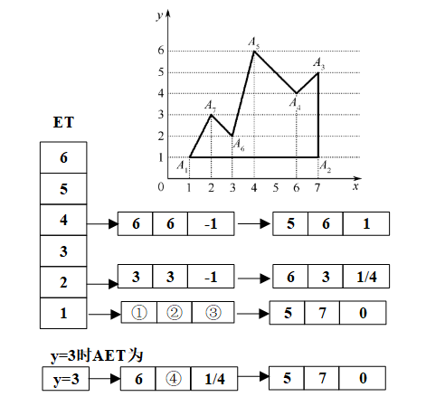
</div>

**①②③④处的值分别为：**

* A. 1,3,0.5,3.25
* B. 3,1,0.5,3.25
* C. 1,3,2,3.25
* D. 3,1,2,3.25

> **【解析】**
> 活动边表算法的边表（ET）节点格式通常为：$[y_{\max}, x_{ymin}, 1/k, \text{next}]$。
> - ①和②是属于某个 ET 节点的参数。由图可知该边对应的 $y_{\max}$ 和 $x_{ymin}$ 分别是 3 和 1；
> - ③是该边斜率的倒数 $1/k = \Delta x / \Delta y$，根据顶点的坐标计算可得其值为 0.5；
> - ④是扫描线递增时 AET 中 $x$ 坐标的更新值，其更新计算为 $x' = x + 1/k$，算得对应的值为 3.25。
> 因此选 B。

**7. 用 Cohen-Sutherland 编码裁剪算法裁剪下图所示线段 $AB$，首先对线段两端点编码。易知端点 $A$、$B$ 的编码分别为：** `[ A ]`

<div align="center">
  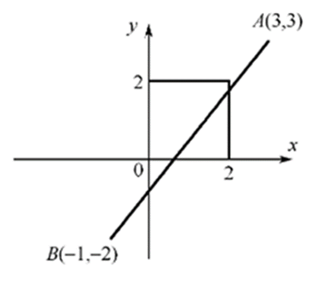
</div>

* A. 1010, 0101
* B. 0101, 1010
* C. 1100, 0011
* D. 1001, 0110

> **【解析】**
> Cohen-Sutherland 裁剪算法的编码顺序通常为（从高位到低位）：上下右左（TBRL）。
> - 裁剪窗口的各个区域编码：
>   - 窗口上方区域：$T=1$，即 1000
>   - 窗口下方区域：$B=1$，即 0100
>   - 窗口右侧区域：$R=1$，即 0010
>   - 窗口左侧区域：$L=1$，即 0001
> - 点 A 位于窗口的右上部（即上方且右侧），其编码为 $1000 \mid 0010 = 1010$。
> - 点 B 位于窗口的左下部（即下方且左侧），其编码为 $0100 \mid 0001 = 0101$。
> 因此选 A。

**8. 用 Cohen-Sutherland 编码裁剪算法裁剪下图所示线段 $AB$，端点编码后，从端点 $A$ 开始顺序考察与各边交点。$P, Q, R$ 被求出的顺序是：** `[ C ]`

<div align="center">
  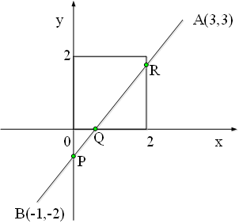
</div>

* A. P, Q, R
* B. P, R, Q
* C. R, P, Q
* D. R, Q, P

> **【解析】**
> 在计算机图形学的 **Cohen-Sutherland 编码线段裁剪算法**中，窗口的边界通常定义为：
> - 左边界 $x_{\min} = 0$，右边界 $x_{\max} = 2$
> - 下边界 $y_{\min} = 0$，上边界 $y_{\max} = 2$
> 
> 根据题目要求，从端点 $A(3,3)$ 开始顺序考察与各边交点。我们可以通过算法的裁剪步骤来推导 $P, Q, R$ 的求出顺序。
> 
> **1. 计算端点编码 (Outcode)**
> 编码对应的 4 位二进制从高到低通常为：**[上, 下, 右, 左]** (Top, Bottom, Right, Left)。
> - **点 $A(3, 3)$**：由于 $y > 2$ 且 $x > 2$，因此上和右为 1，编码为 `1010`。
> - **点 $B(-1, -2)$**：由于 $y < 0$ 且 $x < 0$，因此下和左为 1，编码为 `0101`。
> 
> **2. 模拟裁剪处理步骤**
> - **第一轮循环：处理点 A**
>   题目明确指出**从端点 A 开始顺序考察**。点 $A$ 编码为 `1010`（上、右为 1）。在大部分国内教材（如孙家广《计算机图形学》）的标准实现中，考察边界的顺序为：**左、右、下、上**。
>   1. **右边界裁剪**：优先考察右边界 $x = 2$。
>      - 计算直线 $AB$ 与 $x = 2$ 的交点。
>      - 直线斜率 $m = \frac{3 - (-2)}{3 - (-1)} = \frac{5}{4} = 1.25$。
>      - 代入 $x = 2$，得到 $y = 1.25 \times (2 - 3) + 3 = 1.75$。
>      - 该交点为 $(2, 1.75)$，即图中的 **$R$ 点**。
>   2. **更新端点**：此时端点 $A$ 被更新为 $R$，其编码变为 `0000`（已在窗口边界上/内）。
> - **第二轮循环：处理点 B**
>   现在端点 $A(R)$ 编码为 `0000`，端点 $B$ 编码为 `0101`（下、左为 1），继续对未完成的端点 $B$ 进行裁剪。
>   1. **左边界裁剪**：按照“左、右、下、上”的顺序，优先考察左边界 $x = 0$。
>      - 代入 $x = 0$，得到 $y = 1.25 \times (0 - 3) + 3 = -0.75$。
>      - 该交点为 $(0, -0.75)$，即图中的 **$P$ 点**。
>   2. **更新端点**：此时端点 $B$ 被更新为 $P$，其新编码计算为 `0100`（因为此时 $y = -0.75 < 0$，依然在下方）。
> - **第三轮循环：继续处理更新后的点 B (即 P)**
>   目前端点 $A(R)$ 编码为 `0000`，端点 $B(P)$ 编码为 `0100`（下为 1）。
>   1. **下边界裁剪**：考察下边界 $y = 0$。
>      - 代入 $y = 0$，由 $0 = 1.25x - 0.75 \implies x = 0.6$。
>      - 该交点为 $(0.6, 0)$，即图中的 **$Q$ 点**。
>   2. **更新端点**：端点 $B$ 被更新为 $Q$，其编码变为 `0000`。
> - **结束**
>   两端点的编码均变为 `0000`，线段全在窗口内，算法结束。
> 
> 综上，在依序求交点的标准 Cohen-Sutherland 算法执行过程中，$P, Q, R$ 被求出的先后顺序是：**R, P, Q**。因此本题选 C。

**9. 用 Liang-Barsky 参数化裁剪算法裁剪下图所示线段 $AB$，需要求出线段与各边交点的参数。设 $A$ 点参数为 0，那么线段 $AB$ 与左边界交点的参数 $u_1$ 为：** `[ A ]`

<div align="center">
  
</div>

* A. 3/4
* B. 1/4
* C. 3/5
* D. 1/5

> **【解析】**
> 本题考察的是计算机图形学中的 **Liang-Barsky 参数化线段裁剪算法**。
> 根据题目中图示描述，线段两端点为 $A(3,3)$ and $B(-1,-2)$，且**设 A 点参数为 0**（这意味着线段的参数方程是从 $A$ 出发指向 $B$ 的，其参数 $u \in [0, 1]$）。
> 
> **1. 确定线段参数方程**
> 以 $A$ 为起点，$B$ 为终点，线段的参数方程为：
> $$
> x(u) = x_A + u(x_B - x_A) = 3 + u(-1 - 3) = 3 - 4u
> $$
> $$
> y(u) = y_A + u(y_B - y_A) = 3 + u(-2 - 3) = 3 - 5u
> $$
> 其中坐标增量为：$\Delta x = x_B - x_A = -4$，$\Delta y = y_B - y_A = -5$。
> 裁剪窗口边界为：左边界 $w_L = 0$，右边界 $w_R = 2$，下边界 $w_B = 0$，上边界 $w_T = 2$。
> 
> **2. 计算 Liang-Barsky 算法的 $p_k$ 和 $q_k$**
> Liang-Barsky 算法的基本公式为：$u \cdot p_k \le q_k \quad (k=1,2,3,4)$。
> 其中 $k=1$ 对应左边界：
> - $p_1 = -\Delta x = -(-4) = 4$
> - $q_1 = x_A - w_L = 3 - 0 = 3$
> 
> **3. 计算交点参数**
> 线段与左边界交点处的参数 $u_1$ 计算为：
> $$
> u_1 = \frac{q_1}{p_1} = \frac{3}{4}
> $$
> 同理，其余边界的交点参数计算如下：
> - 右边界 ($k=2$): $p_2 = \Delta x = -4$，$q_2 = w_R - x_A = 2 - 3 = -1 \implies u_2 = \frac{-1}{-4} = \frac{1}{4}$
> - 下边界 ($k=3$): $p_3 = -\Delta y = -(-5) = 5$，$q_3 = y_A - w_B = 3 - 0 = 3 \implies u_3 = \frac{3}{5}$
> - 上边界 ($k=4$): $p_4 = \Delta y = -5$，$q_4 = w_T - y_A = 2 - 3 = -1 \implies u_4 = \frac{-1}{-5} = \frac{1}{5}$
> 
> 综上，线段 $AB$ 与左边界交点的参数 $u_1$ 为 $3/4$。因此本题选 A。

**10. 用 Liang-Barsky 参数化裁剪算法裁剪下图所示线段 $AB$，设 $A$ 点参数为 0，那么“入点”参数 $u_{\max}$ 为：** `[ B ]`

<div align="center">
  
</div>

* A. 3/4
* B. 1/4
* C. 3/5
* D. 1/5

> **【解析】**
> 本题考察的是计算机图形学中的 **Liang-Barsky 参数化线段裁剪算法**。
> 根据题目中图示描述，线段两端点为 $A(3,3)$ and $B(-1,-2)$，且**设 A 点参数为 0**（这意味着线段的参数方程是从 $A$ 出发指向 $B$ 的，参数 $u \in [0, 1]$）。
> 
> **1. 确定线段参数方程与增量**
> 以 $A$ 为起点，$B$ 为终点，线段的参数方程为：
> $$
> x(u) = 3 - 4u,\quad y(u) = 3 - 5u
> $$
> 其中 $\Delta x = -4$，$\Delta y = -5$。
> 裁剪窗口边界为：左边界 $w_L = 0$，右边界 $w_R = 2$，下边界 $w_B = 0$，上边界 $w_T = 2$。
> 
> **2. 计算 Liang-Barsky 算法各边界对应的参数**
> 根据算法定义，各边界参数如下：
> 
> | 边界 $k$ | 边界含义 | $p_k$ | $q_k$ | 交点参数 $u_k = q_k/p_k$ |
> | :--- | :--- | :--- | :--- | :--- |
> | **$k=1$** | 左边界 ($x \ge w_L$) | $-\Delta x = 4$ | $x_A - w_L = 3$ | $u_1 = 3/4$ |
> | **$k=2$** | 右边界 ($x \le w_R$) | $\Delta x = -4$ | $w_R - x_A = -1$ | $u_2 = 1/4$ |
> | **$k=3$** | 下边界 ($y \ge w_B$) | $-\Delta y = 5$ | $y_A - w_B = 3$ | $u_3 = 3/5$ |
> | **$k=4$** | 上边界 ($y \le w_T$) | $\Delta y = -5$ | $w_T - y_A = -1$ | $u_4 = 1/5$ |
> 
> **3. 区分“入点”与“出点”并求 $u_{\max}$**
> 根据算法：
> - 当 $p_k < 0$ 时，线段从外部延伸向内部，对应**入点（Entering point）**。我们要在这些 $u_k$ 中取最大值，即 $u_{\max} = \max(0, u_k \mid p_k < 0)$。
> - 当 $p_k > 0$ 时，线段从内部延伸向外部，对应**出点（Leaving point）**。我们要在这些 $u_k$ 中取最小值，即 $u_{\min} = \min(1, u_k \mid p_k > 0)$。
> 
> 观察上面表格，$p_k < 0$ 的边界有：
> - **$k=2$ (右边界)**: $p_2 = -4 < 0 \implies u_2 = 1/4$
> - **$k=4$ (上边界)**: $p_4 = -5 < 0 \implies u_4 = 1/5$
> 
> 计算“入点”参数的最大值 $u_{\max}$：
> $$
> u_{\max} = \max\left(0, u_2, u_4\right) = \max\left(0, \frac{1}{4}, \frac{1}{5}\right) = \frac{1}{4}
> $$
> 
> 综上，“入点”参数 $u_{\max}$ 为 $1/4$。因此本题选 B。

**11. 用编码裁剪法裁剪二维线段时，判断下列直线段采用哪种处理方法。假设直线段两个端点 $M$、$N$ 的编码为 1000 和 1001（按 TBRL 顺序）。** `[ B ]`

* A. 直接保留
* B. 直接舍弃
* C. 对 $MN$ 再分割求交
* D. 不能判断

> **【解析】**
> Cohen-Sutherland 算法中：
> - 若 $codeM == 0000$ 且 $codeN == 0000$，则线段完全在窗口内，直接保留。
> - 若 $codeM \& codeN \ne 0$，说明线段两个端点均在同一个边界的同一外侧（此处 $1000 \& 1001 = 1000 \ne 0$，说明它们都在窗口顶边界的上方），因此该线段完全在可见区域之外，可以“直接舍弃”（简易拒绝）。本题选 B。

**12. 直线的编码裁剪算法中，判断直线是否位于同一边界外侧的表达式是什么？** `[ C ]`

* A. (c1&&c2)!=0
* B. (c1||c2)!=0
* C. (c1&c2)!=0
* D. (c1|c2)!=0

> **【解析】**
> 用按位与运算符 `&`。若 `(c1 & c2) != 0`，代表两个端点至少有一位同为 1，即它们同时位于裁剪窗口的某一边界外侧，可以直接被舍弃。因此选 C。

**13. 根据 Cohen-Sutherland 算法，如右图所示的直线和裁剪窗口，$A$、$B$ 两点的区域编码分别是？** `[ B ]`

<div align="center">
  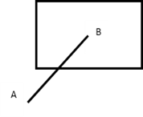
</div>

* A. 0110，0000
* B. 0101，0000
* C. 1010，1111
* D. 1001，1111

> **【解析】**
> A 点位于裁剪窗口的左下方，按上下右左（TBRL）编码：
> - 位于下方，故第 2 位 B = 1；
> - 位于左方，故第 4 位 L = 1；
> - 其余位为 0，因此 A 点编码为 0101。
> B 点位于裁剪窗口内部，所有编码位均为 0，故 B 点编码为 0000。
> 本题选 B。

**14. 右图中最外层的窗口设为显示器窗口大小，用三类大小的窗口采用编码裁剪算法裁剪直线，其效率排序应为：** `[ A ]`

<div align="center">
  
</div>

* A. 3 > 1 > 2
* B. 3 > 2 > 1
* C. 1 > 2 > 3
* D. 2 > 1 > 3

> **【解析】**
> 本题考察编码线段裁剪算法（如 Cohen-Sutherland 算法）的效率与裁剪窗口大小之间的关系。
> 
> **1. 核心原理分析**
> Cohen-Sutherland 算法的核心优势在于：**通过对线段端点的编码进行位运算（如逻辑与、逻辑或），快速判断线段是否可以“完全保留”或“完全弃置”，从而避免复杂的求交点计算。**
> - **窗口 3（最大窗口，等同于整个显示器大小）：**
>   绝大多数在屏幕上生成的直线段，其端点坐标都会直接落在窗口 3 的内部。当两端点编码都为 `0000` 时，通过一次简单的按位或运算即可判断该线段“完全可见”，无需进行任何求交计算。因此，窗口越大，全保留概率越高，求交次数越少，**效率最高**。
> - **窗口 1（最小窗口）：**
>   由于窗口 1 非常小，随机生成的线段两端点很容易同时落在窗口的同一侧外部（例如都在左外侧）。当两端点编码进行按位与（`&`）结果不为 0 时，可以通过一次位运算快速判断该线段“完全不可见”（简易弃置），同样无需计算交点。因此其触发“完全弃置”的概率较高，**效率次之**。
> - **窗口 2（中等大小窗口）：**
>   窗口 2 的大小适中，这意味着线段“穿过窗口边界”的概率最大。此时线段既不能被“完全保留”，也不能被“完全弃置”，算法不得不频繁地进入循环去**计算线段与边界 of the 交点**。求交点涉及浮点数乘除法运算，在图形学中是非常耗时的，因此导致**效率最低**。
> 
> 综上，效率从高到低的正确排序为：**3 > 1 > 2**。因此本题选 A。

**15. 直线裁剪的 Liang-Barsky 算法中，“入点”的参数 $u_{\max} = \max(0, u_k \mid p_k < 0)$；“出点”的参数 $u_{\min} = \min(1, u_k \mid p_k > 0)$。下面错误的说法是：** `[ D ]`

* A. $u_{\max} > u_{\min}$ 时，直线段位于窗口外
* B. $p_1 < 0$ 时，$u_{\max}$ 不小于直线与窗口左边界（或延长线）的交点参数
* C. $p_1 > 0$ 时，$u_{\min}$ 不大于直线与窗口左边界（或延长线）的交点参数
* D. 直线段平行于坐标轴时，$u_{\max} \le u_{\min}$

> **【解析】**
> - A. 正确。若 $u_{max} > u_{min}$，说明进入窗口的参数大离离开窗口的参数，说明整条线段均在窗口外。
> - B. 正确。$p_1 < 0$ 表示从左侧向内穿入。由于 $u_{max}$ 取所有入点参数的最大值，它自然不小于与左边界交点的参数。
> - C. 正确。$p_1 > 0$ 表示从内向左侧穿出。由于 $u_{min}$ 取所有出点参数的最小值，它自然不大于与左边界交点的参数。
> - D. 错误。当直线平行于坐标轴时，对应方向的 $p_k = 0$。若在此方向上直线位于窗口之外，则算法将直接判定线段不可见并舍弃，并不能保证此时 $u_{max} \le u_{min}$。因此该说法是错误的。选 D。

**16. 在多边形的 Sutherland-Hodgeman 算法（逐边裁剪算法）中，根据多边形的边（从顶点 $S$ 到顶点 $P$）与裁剪线（窗口的边）的位置关系，有不同的输出。请问下列哪种说法是错误的？** `[ A ]`

* A. $S$ 和 $P$ 均在可见的一侧，则输出 $S$ 和 $P$
* B. $S$ 和 $P$ 均在不可见的一侧，则不输出
* C. $S$ 在可见一侧，$P$ 在不可见一侧，则输出（线段 $SP$ 与裁剪线的）交点
* D. $S$ 在不可见的一侧，$P$ 在可见的一侧，则输出（线段 $SP$ 与裁剪线的）交点和 $P$

> **【解析】**
> Sutherland-Hodgeman 多边形裁剪算法对每条边（$S \rightarrow P$）的输出规则如下：
> - 若 S 和 P 都在可见一侧：只输出终点 P（因为起点 S 在前一条边处理时已被输出，避免重复输出）。因此 A 说法中“输出 S 和 P”是错误的。
> - 若 S 和 P 都在不可见一侧：不输出任何点（B 正确）。
> - 若 S 可见，P 不可见：说明边由内向外穿出，输出与边界的交点 I（C 正确）。
> - 若 S 不可见，P 可见：说明边由外向内穿入，输出交点 I 和终点 P（D 正确）。
> 故本题选 A。

---

### 二、 多选题

**17. 用射线法判断一个点是否在多边形内时，该射线与多边形的交点数满足一定的计数规则。若交点是多边形的顶点，则交点个数取值正确的情况是（______）。** `[ B, C ]`

* A. 两边都在射线的同一侧，计数 1 次
* B. 两边都在射线的同一侧，计数 2 次
* C. 两边在射线的两侧，计数 1 次
* D. 两边在射线的两侧，计数 2 次

> **【解析】**
> 当测试射线通过多边形的顶点时，需要特殊处理以确保奇偶计数的准确：
> - 如果与该顶点相邻的两条边都在射线的同侧（即该顶点为局部极值点），则该交点应计数 2 次（或 0 次），这样可以保持状态不被改变。
> - 如果相邻的两条边分别在射线的两侧（即射线在此处穿过了多边形边界），则该交点计为 1 次。
> 故本题选 B、C。

**18. 直线段光栅化算法中，直线段 $P_0(0,0) - P_1(8,6)$ 的绘制点列如下图的算法有：** `[ A, B, C ]`

<div align="center">
  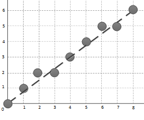
</div>

* A. DDA 算法
* B. Bresenham 算法
* C. 中点画线算法
* D. 以上三算法均不是

> **【解析】**
> 对于起终点为整数坐标的直线段，由于 DDA 算法、Bresenham 算法和中点画线算法对像素近似取整的数学本质一致，在绘制像素级坐标时，它们会生成完全一致的离散点列。本题选 A、B、C。

---

### 三、 判断题

**19. 增强图像像素的显示亮度能够获得反走样效果。** `( × )`

* A. 正确 (True)
* B. 错误 (False)

> **【解析】**
> 仅仅单纯调高或增强像素的显示亮度，并不能消除由于离散采样带来的锯齿失真。反走样（Anti-aliasing）通常需要通过区域取样、加权过滤等方法，根据像素被图形覆盖的面积大小来调整像素的灰度或色彩深度，使边缘平滑过渡。故本题说法错误，选 B。

---

### 四、 填空题

**20. 对图形进行光栅化时，用离散的像素表示连续的直线或区域边界引起的失真现象称为______ 走样 ______，用于减少或者消除走样的技术称为______ 反走样 ______。**

> **【解析】**
> 这是图形学中的基本概念。失真现象被称为“走样”（Aliasing），用来减轻或消除该现象的技术称为“反走样”（Anti-aliasing）。

---

## CG-4 二维与三维几何变换


---

### 一、 单项选择题

**1. 点 $P$ 的齐次坐标为 $(6, -2, 2)$，其对应的普通坐标是：** `[ D ]`

* A. $(6,-2,1)$
* B. $(3,-1,1)$
* C. $(6,-2)$
* D. $(3,-1)$

> **【解析】**
> 在齐次坐标表示中，一个 $n$ 维向量由一个 $n+1$ 维向量表示。对于齐次坐标 $(X, Y, W)$（其中 $W \ne 0$），其对应的二维笛卡尔（普通）坐标为 $(x, y) = (X/W, Y/W)$。
> 本题中 $P(6, -2, 2)$，则对应普通坐标为 $(6/2, -2/2) = (3, -1)$。因此选 D。

**2. 将下图所示四边形 $ABCD$ 绕点 $P(5,4)$ 逆时针旋转 $45^\circ$，涉及到三个变换矩阵，则三个矩阵复合的顺序是？** `[ C ]`

<div align="center">
  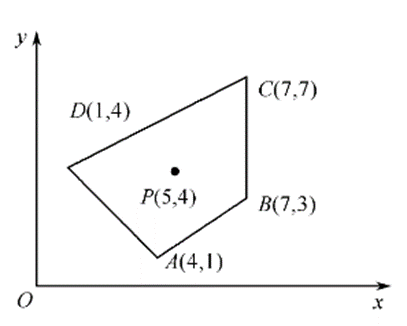
  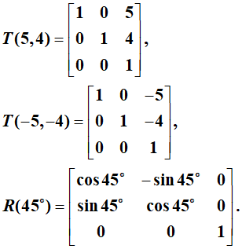
</div>

* A. $T(-5, -4)R(45^\circ)T(5, 4)$
* B. $R(45^\circ)T(-5, -4)T(5, 4)$
* C. $T(5, 4)R(45^\circ)T(-5, -4)$
* D. $T(5, 4)T(-5, -4)R(45^\circ)$

> **【解析】**
> 绕任一非原点 $P(x_p, y_p)$ 进行旋转，需经历以下步骤：
> 1. 平移图形，使点 $P$ 与坐标原点重合，平移矩阵为 $T(-x_p, -y_p) = T(-5, -4)$；
> 2. 以原点为中心旋转指定角度，旋转矩阵为 $R(45^\circ)$；
> 3. 反向平移，使原点移回点 $P$ 的位置，平移矩阵为 $T(x_p, y_p) = T(5, 4)$。
> 当使用列向量表示点坐标时，变换矩阵与坐标相乘是从右向左生效的：$P' = T(5, 4) \cdot R(45^\circ) \cdot T(-5, -4) \cdot P$。
> 复合后的变换矩阵即为 $T(5, 4)R(45^\circ)T(-5, -4)$。因此本题选 C。

**3. 将下图所示四边形 $ABCD$ 绕点 $P(5,4)$ 逆时针旋转 $45^\circ$ 的代码是：** `[ A ]`

<div align="center">
  
</div>

* A. 
  ```cpp
  glLoadIdentity();
  glTranslatef(5, 4, 0);
  glRotatef(45, 0.0f, 0.0f, 1.0f);
  glTranslatef(-5, -4, 0);
  DrawQuadrangle();
  ```
* B. 
  ```cpp
  glLoadIdentity();
  glTranslatef(-5, -4, 0);
  glRotatef(45, 0.0f, 0.0f, 1.0f);
  glTranslatef(5, 4, 0);
  DrawQuadrangle();
  ```

> **【解析】**
> 在 OpenGL 中，当前的绘图变换矩阵是按照代码中变换命令调用的“相反顺序”（即右乘原则）对绘制顶点进行复合作用的。
> 要实现的数学变换矩阵为：$T(5, 4) \cdot R(45^\circ) \cdot T(-5, -4)$。
> 根据反向原则，在代码中应依次先调用 `glTranslatef(5, 4, 0)`，再调用 `glRotatef(45, ...)`，最后调用 `glTranslatef(-5, -4, 0)`。
> 这样 OpenGL 最终生成的矩阵就是 $T(5, 4) \cdot R(45^\circ) \cdot T(-5, -4)$。因此 A 选项正确。

**4. 如下图所示，欲使 $OB$ 绕 $X$ 轴旋转至 $XOZ$ 坐标平面内，旋转角度应为多少？** `[ C ]`

<div align="center">
  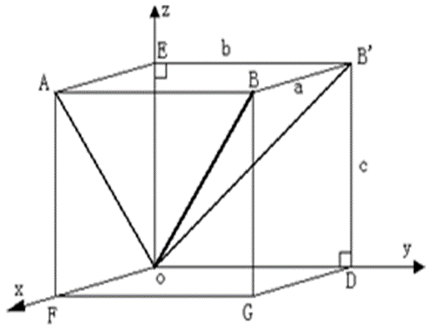
</div>

* A. $\angle AOB$
* B. $\angle EOB$
* C. $\angle EOB'$
* D. $\angle AOB'$

> **【解析】**
> 绕 X 轴旋转时，所有点的 X 坐标保持不变，而 Y、Z 坐标发生旋转。
> 欲使线段 $OB$ 旋转到 $XOZ$ 平面，也就是要使其在 $YOZ$ 平面上的投影像绕坐标原点旋转至 Z 轴（$OE$）。
> 设 $OB$ 在 $YOZ$ 平面上的投影为 $OB'$，那么需要旋转的角度即为 $OB'$ 与 Z 轴（$OE$）的夹角，即 $\angle EOB'$。因此选 C。

**5. 在三维旋转变换中，关于 $X$ 轴旋转 $90^\circ$ 时变换特点描述正确的是什么？** `[ A ]`

* A. $y' = -z$
* B. $y' = z$
* C. $y$ 坐标不变
* D. $x, y, z$ 坐标都不变

> **【解析】**
> 绕 X 轴逆时针旋转角度 $\theta$ 的三维变换公式为：
> $$x' = x$$
> $$y' = y\cos\theta - z\sin\theta$$
> $$z' = y\sin\theta + z\cos\theta$$
> 当 $\theta = 90^\circ$ 时，$\cos 90^\circ = 0$，$\sin 90^\circ = 1$。
> 代入公式得：$y' = y(0) - z(1) = -z$，$z' = y(1) + z(0) = y$。
> 故 $y' = -z$。选 A。

---

**6. 空间四面体 $ABCD$ 几何变换关于点 $S(-2, 2, 2)$ 整体放大 2 倍的变换矩阵为：** `[ B ]`

* A. $$\begin{bmatrix} 1 & 0 & 0 & -2 \\ 0 & 1 & 0 & 2 \\ 0 & 0 & 1 & 2 \\ 0 & 0 & 0 & 1 \end{bmatrix} \begin{bmatrix} 1 & 0 & 0 & 0 \\ 0 & 1 & 0 & 0 \\ 0 & 0 & 1 & 0 \\ 0 & 0 & 0 & 2 \end{bmatrix} \begin{bmatrix} 1 & 0 & 0 & 2 \\ 0 & 1 & 0 & -2 \\ 0 & 0 & 1 & -2 \\ 0 & 0 & 0 & 1 \end{bmatrix}$$
* B. $$\begin{bmatrix} 1 & 0 & 0 & -2 \\ 0 & 1 & 0 & 2 \\ 0 & 0 & 1 & 2 \\ 0 & 0 & 0 & 1 \end{bmatrix} \begin{bmatrix} 1 & 0 & 0 & 0 \\ 0 & 1 & 0 & 0 \\ 0 & 0 & 1 & 0 \\ 0 & 0 & 0 & 1/2 \end{bmatrix} \begin{bmatrix} 1 & 0 & 0 & 2 \\ 0 & 1 & 0 & -2 \\ 0 & 0 & 1 & -2 \\ 0 & 0 & 0 & 1 \end{bmatrix}$$
* C. $$\begin{bmatrix} 1 & 0 & 0 & 2 \\ 0 & 1 & 0 & -2 \\ 0 & 0 & 1 & -2 \\ 0 & 0 & 0 & 1 \end{bmatrix} \begin{bmatrix} 1 & 0 & 0 & 0 \\ 0 & 1 & 0 & 0 \\ 0 & 0 & 1 & 0 \\ 0 & 0 & 0 & 2 \end{bmatrix} \begin{bmatrix} 1 & 0 & 0 & -2 \\ 0 & 1 & 0 & 2 \\ 0 & 0 & 1 & 2 \\ 0 & 0 & 0 & 1 \end{bmatrix}$$
* D. $$\begin{bmatrix} 1 & 0 & 0 & 2 \\ 0 & 1 & 0 & -2 \\ 0 & 0 & 1 & -2 \\ 0 & 0 & 0 & 1 \end{bmatrix} \begin{bmatrix} 2 & 0 & 0 & 0 \\ 0 & 2 & 0 & 0 \\ 0 & 0 & 2 & 0 \\ 0 & 0 & 0 & 1 \end{bmatrix} \begin{bmatrix} 1 & 0 & 0 & -2 \\ 0 & 1 & 0 & 2 \\ 0 & 0 & 1 & 2 \\ 0 & 0 & 0 & 1 \end{bmatrix}$$

> **【解析】**
> 关于任一点 $S(x_s, y_s, z_s) = S(-2, 2, 2)$ 的整体比例变换，其变换顺序为：
> 1. 先将 $S$ 移到原点，变换矩阵为右侧的平移矩阵 $T(2, -2, -2)$：
>    $$\begin{bmatrix} 1 & 0 & 0 & 2 \\ 0 & 1 & 0 & -2 \\ 0 & 0 & 1 & -2 \\ 0 & 0 & 0 & 1 \end{bmatrix}$$
> 2. 在原点进行整体缩放。在 4x4 齐次坐标变换矩阵中，右下角的元素 $s$ 对应的是整体缩放。对于点 $[x, y, z, 1]^T$，乘上右下角为 $1/2$ 的矩阵后变为 $[x, y, z, 1/2]^T$，对应普通笛卡尔坐标的整体放大 2 倍（将各分量除以齐次分量 $W=1/2$）。故中间的缩放矩阵为：
>    $$\begin{bmatrix} 1 & 0 & 0 & 0 \\ 0 & 1 & 0 & 0 \\ 0 & 0 & 1 & 0 \\ 0 & 0 & 0 & 1/2 \end{bmatrix}$$
> 3. 最后移回原点，变换矩阵为左侧的平移矩阵 $T(-2, 2, 2)$：
>    $$\begin{bmatrix} 1 & 0 & 0 & -2 \\ 0 & 1 & 0 & 2 \\ 0 & 0 & 1 & 2 \\ 0 & 0 & 0 & 1 \end{bmatrix}$$
> 根据矩阵复合顺序（右乘原则），整个复合变换矩阵为 $T(-2, 2, 2) \cdot S_{\text{整体}}(2) \cdot T(2, -2, -2)$，即 B 选项的形式。

**7. 下面哪项不是齐次坐标的特点？** `[ D ]`

* A. 用 $n+1$ 维向量表示一个 $n$ 维向量
* B. 将图形的变换统一为图形 of the 坐标矩阵与某一变换矩阵相乘的形式
* C. 易于表示无穷远点
* D. 一个 $n$ 维向量的齐次坐标表示是唯一的

> **【解析】**
> 齐次坐标中，$n$ 维空间中的点 $(x_1, x_2, \dots, x_n)$ 可以表示为 $(hx_1, hx_2, \dots, hx_n, h)$（其中 $h \ne 0$）。
> 由于 $h$ 可以取任意非零实数，同一个普通坐标点有无数个对应的齐次坐标表示，因此齐次坐标的表示是不唯一的。D 选项描述错误。本题选 D。

**8. 经过三维几何变换，使得图 1 中的图形成为如图 2 所示的图形，其几何变换是什么？** `[ B ]`

<div align="center">
  
</div>

* A. 先沿 $X$ 轴方向平移 1 个单位，再绕 $Y$ 轴逆时针旋转 $45^\circ$
* B. 先绕 $Y$ 轴逆时针旋转 $45^\circ$，再沿 $X$ 轴方向平移 1 个单位
* C. 先沿 $X$ 轴方向平移 1 个单位，再绕 $Y$ 轴顺时针旋转 $45^\circ$
* D. 先绕 $Y$ 轴顺时针旋转 $45^\circ$，再沿 $X$ 轴方向平移 1 个单位

> **【解析】**
> 观察图形变换前后的状态：
> - 在图 1 中，立方体位于原点，各边缘平行于坐标轴。
> - 在图 2 中，立方体发生旋转并发生平移。注意到，立方体是“绕自身的 Y 轴”逆时针旋转了 45 度（其底面中轴线倾斜），且立方体的中心整体偏离了原点，向 X 轴正方向平移了 1 个单位。
> - 若先平移后旋转（如 A 选项），则旋转是绕原点 Y 轴进行的，立方体旋转后其中心将不再位于 X 轴上，而是处于斜向轨道。这与图 2 不符。
> - 正确的顺序是：先绕自身 Y 轴逆时针旋转 45 度，然后再沿 X 轴方向平移 1 个单位。因此本题选 B。

**9. 空间四面体 $ABCD$ 关于 $X$ 轴进行对称变换的变换矩阵为：** `[ C ]`

* A. $$\begin{bmatrix} -1 & 0 & 0 & 0 \\ 0 & 1 & 0 & 0 \\ 0 & 0 & 1 & 0 \\ 0 & 0 & 0 & 1 \end{bmatrix}$$
* B. $$\begin{bmatrix} 1 & 0 & 0 & 0 \\ 0 & -1 & 0 & 0 \\ 0 & 0 & 1 & 0 \\ 0 & 0 & 0 & 1 \end{bmatrix}$$
* C. $$\begin{bmatrix} 1 & 0 & 0 & 0 \\ 0 & -1 & 0 & 0 \\ 0 & 0 & -1 & 0 \\ 0 & 0 & 0 & 1 \end{bmatrix}$$
* D. $$\begin{bmatrix} -1 & 0 & 0 & 0 \\ 0 & -1 & 0 & 0 \\ 0 & 0 & -1 & 0 \\ 0 & 0 & 0 & 1 \end{bmatrix}$$

> **【解析】**
> 三维空间中关于 X 轴进行反射（对称）变换时：
> - X 轴坐标保持不变，即 $x' = x$；
> - Y 轴和 Z 轴的坐标变反，即 $y' = -y$，$z' = -z$。
> - 对应的主对角线上的元素分别为 $1, -1, -1, 1$。这与 C 选项相符。

---

### 二、 填空题

**10. 基本几何变换都是相对于______ 坐标原点 ______和坐标轴进行的几何变换。**
*(注：填 **坐标原点** 或 **原点**)*

> **【解析】**
> 基本的二维和三维几何变换（如平移、旋转、放缩、错切等）在定义时均是相对于**坐标原点**和各自的坐标轴来进行矩阵描述的。如果是相对于任意其他参考点，必须先做平移使该点与原点重合，再进行基础变换，最后平移回原位。

---

## CG-5 投影与三维视口变换


---

### 一、 单项选择题

**1. 在二维变换中，根据窗口和视区的关系，下列说法正确是什么？** `[ B ]`

* A. 窗口不变，视区变大，则图形缩小
* B. 窗口不变，视区变大，则图形放大
* C. 视区不变，窗口变大，则图形放大
* D. 视区不变，窗口缩小，则图形缩小

> **【解析】**
> - **窗口（Window）** 定义了在用户（世界）坐标系中需要显示的区域范围；
> - **视区（Viewport）** 定义了在屏幕（设备）坐标系中图形实际显示的目标区域。
> 从窗口到视区的坐标缩放因子为：$S_x = \frac{x_{vmax} - x_{vmin}}{x_{wmax} - x_{wmin}}$，$S_y = \frac{y_{vmax} - y_{vmin}}{y_{wmax} - y_{wmin}}$。
> - 当窗口大小不变（分母固定）而视区变大（分子增大）时，缩放比例因子变大，最终在屏幕上显示的图形会被放大。因此本题选 B。

**2. 斜二测投影时，和投影面垂直的任何直线段，其投影的长度为原来的（______）。** `[ C ]`

* A. 2 倍
* B. 不变
* C. 1/2
* D. 1/4

> **【解析】**
> 在平行投影的斜投影中，与投影面垂直的线段投影后的长度与原长度的比值称为变形系数（或投影收缩率）$r$。
> - 在斜等测投影中，规定对垂直于投影面的线段不进行收缩，即变形系数 $r = 1$。
> - 在斜二测投影中，为了符合人眼视觉习惯，规定垂直于投影面的线段投影长度收缩为原长度的一半，即变形系数 $r = 1/2$。因此选 C。

**3. 在透视投影中，主灭点的最多个数是多少？** `[ C ]`

* A. 1 个
* B. 2 个
* C. 3 个
* D. 多个

> **【解析】**
> 主灭点（Principal Vanishing Point）是指三维空间中与三个坐标轴（X 轴、Y 轴、Z 轴）平行的平行线投影后在投影面上产生的汇交点。
> 因为三维笛卡尔坐标系中只有三个互相垂直的主轴，所以透视投影中主灭点最多只有 3 个（对应一角、两角和三角透视）。本题选 C。

**4. 下图 1 所示物体的俯视图是：** `[ B ]`

<div align="center">
  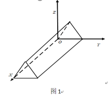
</div>

* A. 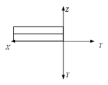
* B. 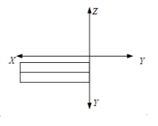
* C. 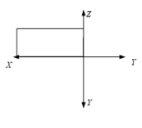
* D. 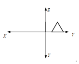

> **【解析】**
> 俯视图（Top View）是从物体的正上方沿垂直方向向下投影所得到的平面图形。
> 观察图 1 物体的三维造型：
> - 顶部有一个水平的小长方形；
> - 前方有一条倾斜向下的斜坡，在俯视投影中，斜面会被投影为一个长方形；
> - 右侧底座部分比主体稍微宽出，形成一个台阶。
> 结合这几部分的相对位置 and 可见边缘线，其正上方投影图正好与 B 选项相契合。因此选 B。

**5. 对三维物体各点坐标进行变换，矩阵 $T$ 中各元素在变换中的具体作用不同，不正确的是：** `[ D ]`

$$T = \begin{bmatrix} a & b & c & l \\ d & e & f & m \\ h & i & j & n \\ p & q & r & s \end{bmatrix}$$

* A. 左上角 9 个数 $a \sim j$，对应旋转、比例、对称、错切变换
* B. 第四列前 3 个数 $l \sim m$，对应平移变换
* C. 第四行前 3 个数 $p \sim q$，对应透视变换
* D. 右下角数 $s$，表示整体比例变换 $s$ 倍

> **【解析】**
> 在 4x4 的三维齐次变换矩阵 $T$ 中：
> - 左上角 3x3 子矩阵（$a$ 到 $j$）对应基本的线性变换（旋转、比例、对称、错切）（A 正确）；
> - 第四列的前三个元素（$l, m, n$）分别对应沿 X、Y、Z 方向的平移变换量（B 正确，虽然题干中缩写写成 l~m，但概念上是指前 3 个平移项）；
> - 第四行前三个元素（$p, q, r$）对应 X、Y、Z 三个方向的透视投影变换参数（C 正确）；
> - 右下角元素 $s$ 对应整体比例缩放。若右下角值为 $s$，点 $[x, y, z, 1]^T$ 经变换后其齐次分量为 $s$，除以齐次分量还原为普通坐标后，坐标变为 $[x/s, y/s, z/s]^T$。这意味着将物体整体缩放了 $1/s$ 倍，而非 $s$ 倍。因此 D 选项说法错误，符合题意。

---

**6. 若空间点 $D(1,1,1)$ 在 $XOY$ 面的正投影点是 $P$，在 $XOY$ 面的斜二测投影点是 $Q$，则线段 $PQ$ 的长度是：** `[ B ]`

* A. 1
* B. 0.5
* C. 2
* D. 不确定

> **【解析】**
> - $D(1, 1, 1)$ 在 $XOY$ 面（即 $z = 0$ 平面）上的正投影点为 $P(1, 1, 0)$。
> - 在 $XOY$ 面上的斜投影中，点 $(x, y, z)$ 的投影坐标 $(x_p, y_p)$ 计算公式为：
>   $$x_p = x + z \cdot r \cos\alpha$$
>   $$y_p = y + z \cdot r \sin\alpha$$
>   因此，斜二测投影点为 $Q(1 + 1 \cdot r \cos\alpha, 1 + 1 \cdot r \sin\alpha, 0)$。
> - 线段 $PQ$ 即为正投影点与斜投影点在投影面上的距离：
>   $$|PQ| = \sqrt{(x_q - x_p)^2 + (y_q - y_p)^2} = \sqrt{(r \cos\alpha)^2 + (r \sin\alpha)^2} = r \sqrt{\cos^2\alpha + \sin^2\alpha} = r$$
> - 斜二测投影的轴向变形系数固定为 $r = 0.5$。
> 故无论投影角 $\alpha$ 取何值，线段 $PQ$ 的长度恒等于 $r = 0.5$。因此选 B。

**7. 下列有关平面几何投影的叙述语句中，正确的论述是：** `[ A ]`

* A. 在平面几何投影中，若投影中心移到距离投影面无穷远处，则成为平行投影
* B. 透视投影与平行投影相比，视觉效果更有真实感，而且能真实地反映物体精确的尺寸和形状
* C. 透视投影变换中，一组平行线投影在与之平行的投影面上，可以产生灭点
* D. 对三维空间中的物体进行透视投影变换，可能产生三个以上主灭点

> **【解析】**
> - A. 正确。当投影中心移到无穷远处时，投影线退化为互相平行的直线，透视投影即转化为平行投影。
> - B. 错误。透视投影有“近大远小”的失真，无法真实反映物体的实际精确尺寸，因而不适合直接用于工程测量绘图。
> - C. 错误。若一组平行线平行于投影面，则在透视投影后它们依然是平行的，不会产生交点（即不会产生灭点）。
> - D. 错误。三维空间中最多只有 3 个主坐标轴，因此最多只能产生 3 个主灭点。
> 综上所述，选 A。

---

### 二、 判断题

**8. 透视投影可以分解成透视和正投影的复合。** `( √ )`

* A. 正确 (True)
* B. 错误 (False)

> **【解析】**
> 透视投影变换的数学实现过程通常是：先通过一个非线性的透视变换，将视平截头体（视棱台）畸变转换成平行投影的规则视景体（长方体），然后再施加一次平行（正）投影。因此透视投影可以看作是透视变换与正投影的复合。本题说法正确，选 A。

**9. 空间相互平行的直线，在透视投影之后可以不平行。** `( √ )`

* A. 正确 (True)
* B. 错误 (False)

> **【解析】**
> 空间相互平行的直线，如果它们不平行于投影面，那么在透视投影后，它们的投影线会相交于某一点（即灭点），不再保持平行。本题说法正确，选 A。

**10. 视区定义在世界坐标系中，窗口定义在设备坐标系中。** `( × )`

* A. 正确 (True)
* B. 错误 (False)

> **【解析】**
> 概念颠倒：**窗口（Window）** 定义在世界（用户）坐标系中，代表要在屏幕上画出来的虚拟场景的范围；**视区（Viewport）** 定义在设备（物理屏幕）坐标系中，代表图形画在屏幕的哪一个区域。因此本题说法错误，选 B。

---

## CG-6&7 三维造型、消隐与真实感图形学


---

### 一、 单项选择题

**1. 一个有效的实体应该具有的性质包括？** `[ D ]`
①刚性②具有封闭的边界③内部连通④占据有限的空间⑤集合运算后仍是有效的实体

* A. ①②③⑤
* B. ①②③
* C. ②③④⑤
* D. ①②③④⑤

> **【解析】**
> 一个在计算机中有效表示的三维实体必须在拓扑上和代数上满足以下性质：
> 1. **刚性（Rigidity）**：物体的形状不随空间位置和姿态的变化而改变；
> 2. **具有封闭的边界（Boundary Closure）**：实体的边界必须是封闭的，能够将空间明确划分为内部 and 外部；
> 3. **内部连通性（Internal Connectivity）**：实体的内部点集在拓扑上必须是连通的；
> 4. **占据有限的空间（Finiteness）**：实体的体积必须是有限的，不能无限延伸；
> 5. **集合运算闭合性（Closure under Boolean Operations）**：实体经过正则集合运算（交、并、差）后，得到的仍是一个有效的实体。
> 因此，以上五项都是有效实体应具备的性质，本题选 D。

**2. 在简单光照明模型中，由物体表面上点反射到视点的光强是哪几项之和？** `[ C ]`
①环境光 ②漫反射光 ③镜面反射光 ④物体间的反射光

* A. ①②
* B. ①③
* C. ①②③
* D. ①②③④

> **【解析】**
> 简单光照明模型（通常指 Phong 局部反射模型）计算物体表面某点反射到视点的光强时，主要考虑了三项的叠加：
> - **环境光（Ambient Light）** ①：模拟场景中经多次散射产生的均匀光照；
> - **漫反射光（Diffuse Reflection）** ②：模拟光源照到粗糙表面向各个方向均匀散射的光；
> - **镜面反射光（Specular Reflection）** ③：模拟光源照到光滑表面在特定方向产生的反射高光。
> 简单模型不考虑物体与物体之间的相互反射与遮挡（物体间的反射光 ④，这属于全局光照模型的范畴）。因此本题选 C。

**3. 当观察光照下的光滑物体表面时，在某个方向上看到高光或强光，这个现象称为什么？** `[ B ]`

* A. 漫反射
* B. 镜面反射
* C. 环境光
* D. 折射

> **【解析】**
> 光滑的物体表面（如金属、油漆面等）在受到光照时，会将入射光线主要反射到符合反射定律的一个窄锥角方向区域内。从该方向观察时，由于反射光线集中，会看到明亮的高光区，这种物理反射现象称为**镜面反射**。因此选 B。

**4. 粗糙的物体表面往往将反射光向各个方向散射，这种光线散射的现象称为：** `[ A ]`

* A. 漫反射
* B. 折射
* C. 衍射
* D. 透射

> **【解析】**
> 当光线照射到粗糙无光泽的物体表面（如粉笔、磨砂面）时，由于微观表面的不平整，光线会被无规则地向各个方向散射。这种反射光在各个方向均等散射的现象称为**漫反射**。选 A。

**5. 对象空间有 $k$ 个物体，图像空间的屏幕分辨率为 $m \times n$，则图像空间消隐算法的复杂度是：** `[ A ]`

* A. $O(m \times n \times k)$
* B. $O(k^2)$
* C. $O(m \times n)$
* D. $O(m^2 n^2)$

> **【解析】**
> 图像空间消隐算法（如 Z-Buffer 算法）的消隐判定是在像素级别进行的：
> - 算法需要对屏幕上的每一个像素（共 $m \times n$ 个像素）进行判定；
> - 在最坏情况下，每个像素位置都需要将场景中的 $k$ 个多边形进行光栅化并比较它们的深度值。
> - 因此，该算法的总体计算复杂度为 $O(m \times n \times k)$。本题选 A。

---

**6. Whitted 光照模型中包括哪些光强度？** `[ D ]`
①环境光②漫反射光③镜面反射光④环境镜面反射光⑤环境透射光

* A. ①②③
* B. ①④⑤
* C. ②③④⑤
* D. ①②③④⑤

> **【解析】**
> Whitted 光照模型作为经典的光线跟踪全局光照模型，将某点的总光强 $I$ 表示为局部光照与全局环境反射光的叠加：
> $$I = I_a + I_d + I_s + I_{rs} + I_{rt}$$
> 其中包括：
> - $I_a$：环境光（环境照度）①
> - $I_d$：局部漫反射光强 ②
> - $I_s$：局部镜面反射光强 ③
> - $I_{rs}$：由反射方向跟踪光线传来的其他物体表面的镜面反射光（环境镜面反射光） ④
> - $I_{rt}$：由折射方向跟踪光线传来的环境规则透射光（环境透射光） ⑤
> 因此，五项全部包括，本题选 D。

**7. （______）明暗处理采用了法矢量双线性插值的方法先求出多边形内部各点法矢量再求颜色，（______）明暗处理采用了亮度双线性插值的方法求出多边形内部各点颜色。** `[ C ]`

* A. Gouraud，Phong
* B. Phong，Flat
* C. Phong，Gouraud
* D. Flat，Gouraud

> **【解析】**
> - **Phong 明暗处理（Phong Shading / 法向插值明暗处理）**：先对多边形顶点的法矢量在多边形内部进行双线性插值，得到内部各像素点处的近似法矢量，然后再利用光照模型计算每个像素的颜色。它能较好地呈现镜面高光。
> - **Gouraud 明暗处理（Gouraud Shading / 亮度插值明暗处理）**：先利用顶点处的法矢量计算出顶点的颜色亮度值，然后再对顶点的颜色值在多边形内部进行双线性插值，直接求出内部各点的颜色。
> 故第一空填 Phong，第二空填 Gouraud。本题选 C。

**8. 关于 Ray Tracing 算法，描述错误的是：** `[ C ]`

* A. 采用逆向跟踪技术完成整个场景的绘制
* B. 采用 Whitted 整体光照模型计算对应像素点的光强度
* C. 无法实现场景中交相辉映的景物、透明等显示
* D. 当光线与离视点最近的场景物体表面交点为理想漫射面时跟踪结束

> **【解析】**
> - A. 正确。光线跟踪采用逆向跟踪，即从视点出发穿过每个像素向场景投射光线，求取其与场景的交点。
> - B. 正确。经典光线跟踪使用 Whitted 全局光照模型来计算反射和折射的光强。
> - C. 错误。光线跟踪算法最大的优势就在于它能够非常自然且逼真地模拟镜面反射（产生交相辉映的景物）、折射（透明玻璃效果）以及阴影。
> - D. 正确。若交点为理想漫反射面，则镜面反射系数和折射系数均为零，此时无需再递归生成反射和折射光线，跟踪到此结束。
> 故本题选 C。

**9. 在光线跟踪（Ray Tracing）算法中，在哪种情况下不再跟踪光线？** `[ C ]`
①光线未碰到任何物体；②光线的光强度已经很弱；③光线的深度已经很深；④光线遇到背景；⑤光线遇到某一物体

* A. ①②
* B. ①②③
* C. ①②③④
* D. ①②③④⑤

> **【解析】**
> 递归光线跟踪需要设置明确的终止条件以避免陷入死循环或无谓的计算：
> - 当光线没有与场景中任何物体相交（即飞向了无穷远或碰到了背景）时，终止跟踪（①、④符合）；
> - 当光线经过多次衰减，其对当前像素颜色的贡献量（光强度乘积）已经低于某个设定阈值时，终止跟踪（②符合）；
> - 当光线递归跟踪的次数（深度）已经达到了最大设定深度值时，终止跟踪（③符合）。
> - 并且，当光线遇到某个物体（⑤）时，恰恰需要根据物体的材质属性产生新的反射或折射光线继续跟踪，而不是终止跟踪。
> 因此不再跟踪的情况为 ①②③④，本题选 C。

**10. Phong 光照明模型之漫反射光强 $I_d = I_p K_d (L \cdot N)$ 中 $K_d$ 是：** `[ C ]`

<div align="center">
  
</div>

* A. 环境光反射系数
* B. 光源光强的漫反射分量
* C. $P$ 点材质的漫反射系数
* D. $P$ 点材质 of 镜面反射系数

> **【解析】**
> 在漫反射公式中：
> - $I_p$ 是光源的入射光强；
> - $L$ 是入射光方向向量；
> - $N$ 是表面法向量；
> - $K_d$ 是该表面材质的漫反射系数（Reflection Coefficient for Diffuse Reflection），取值在 0 到 1 之间，决定了材质对漫反射光的反射能力。
> - 因此选 C。

**11. Phong 光照明模型之镜面反射光强 $I_s = I_p K_s \cos^n(\alpha)$ 中，$\alpha$ 是：** `[ D ]`

<div align="center">
  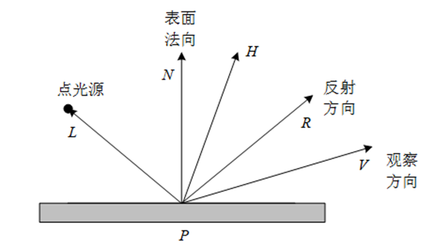
</div>

* A. L 与 N 的夹角
* B. N 与 H 的夹角
* C. H 与 R 的夹角
* D. R 与 V 的夹角

> **【解析】**
> Phong 镜面反射模型中，高光强度的强弱与视线方向同理想反射光线方向的偏角有关。
> 公式中 $\cos(\alpha) = R \cdot V$，其中：
> - $R$ 是光线 $L$ 在表面上的镜面反射方向向量；
> - $V$ 是从相交点指向观察者（视点）的视线方向向量；
> - $\alpha$ 是反射光向量 $R$ 与视线向量 $V$ 之间的夹角。
> 因此选 D。

**12. Phong 多边形着色方法中，点 $a$ 处的法向量插值公式 $N_a$ 是：** `[ A ]`

<div align="center">
  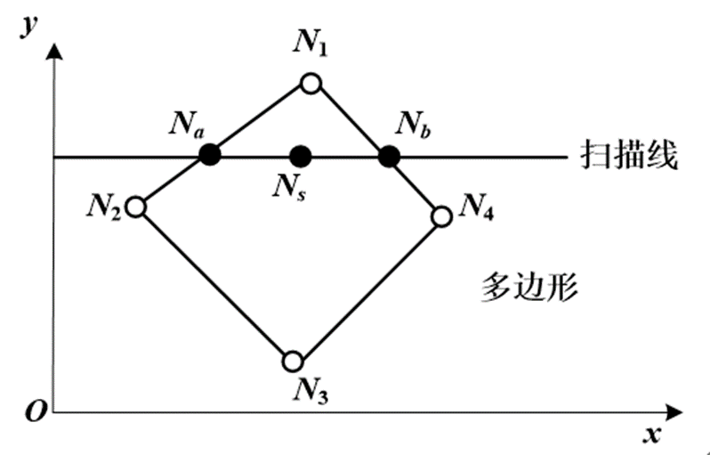
</div>

* A. $$N_a = \frac{y_2 - y_a}{y_2 - y_1} N_1 + \frac{y_a - y_1}{y_2 - y_1} N_2$$
* B. $$N_a = \frac{y_2 - y_s}{y_1 - y_2} N_1 + \frac{y_s - y_1}{y_1 - y_2} N_2$$
* C. $$N_a = \frac{x_2 - x_a}{x_1 - x_2} N_1 + \frac{x_a - x_1}{x_1 - x_2} N_2$$
* D. 以上都不是

> **【解析】**
> 如图所示，在扫描线从下往上进行跨越时：
> 点 $a$ 处于顶点 1（$y$ 坐标为 $y_1$，法向为 $N_1$）与顶点 2（$y$ 坐标为 $y_2$，法向为 $N_2$）的连线上。
> 按照沿边在垂直方向的线性插值规则：
> 点 $a$ 的法线 $N_a$ 应该是由顶点 1 和 2 的法线根据其与点 $a$ 的垂直距离进行加权平均得到的：
> $$N_a = \frac{y_2 - y_a}{y_2 - y_1} N_1 + \frac{y_a - y_1}{y_2 - y_1} N_2$$
> 当 $y_a = y_1$ 时，$N_a = N_1$；当 $y_a = y_2$ 时，$N_a = N_2$，符合插值的物理性质。因此 A 选项正确。

---

### 二、 判断题

**13. 实体的扫描表示法用一个物体和该物体的一条移动轨迹来描述一个新的物体。** `( √ )`

* A. 正确 (True)
* B. 错误 (False)

> **【解析】**
> 扫描表示法（Sweep Representation，又称扫掠表示）是实体造型的一种方法。它定义一个几何基元（如 2D 轮廓或 3D 实体），并定义一条空间运动轨迹，基元沿轨迹扫描而过的空间区域即构成了新的实体（如拉伸体、旋转体、放样体等）。本题说法正确，选 A。

**14. 光线跟踪算法采用逆向跟踪技术完成整个场景的绘制。** `( √ )`

* A. 正确 (True)
* B. 错误 (False)

> **【解析】**
> 在计算机图形学中，正向光线跟踪由于绝大部分光线无法进入人眼而效率极低。因此，光线跟踪绘制算法均采用逆向光线跟踪技术（Backward Ray Tracing），即从视点出发穿过像素射入场景，逆向追踪光线的传播路径。本题说法正确，选 A。

**15. 光线跟踪算法递归中采用 Whitted 整体光照模型计算交点的光强度，环境镜面反射光或环境规则透视光有时为零。** `( √ )`

* A. 正确 (True)
* B. 错误 (False)

> **【解析】**
> 在 Whitted 整体反射公式中，环境镜面反射项和透射项的权重由物体的材质镜面反射系数 $K_s$ 和透射系数 $K_t$ 决定。如果相交的物体表面是完全粗糙（不反光）的，其镜面反射光贡献为零；或者是完全不透明的，其折射（透射）光贡献为零。本题说法正确，选 A。

**16. Z-Buffer 算法不仅需要帧缓冲区存放像素的亮度值，还可以用一个 Z 缓冲区存放每个像素的深度值。** `( √ )`

* A. 正确 (True)
* B. 错误 (False)

> **【解析】**
> Z-Buffer（深度缓存）算法是最经典和简单的图像空间消隐算法：
> 1. 需要一个帧缓冲区（Frame Buffer）记录屏幕上每个像素的最终颜色（亮度）值；
> 2. 还需要一个深度缓冲区（Depth/Z-Buffer）记录当前每个像素位置所绘制的多边形的最小 Z（深度）值，用以判断新渲染的多边形顶点是否比先前绘制的离相机更近。
> 本题说法正确，选 A。

**17. 画家算法的基本思想是先将屏幕赋值为背景色，然后把物体各个面按其到视点距离远近排序，再按由远到近的顺序绘制。** `( √ )`

* A. 正确 (True)
* B. 错误 (False)

> **【解析】**
> 画家算法（Painter's Algorithm）是一种简单的空间消隐思想：它模仿画家画画的过程，先将场景中的所有多边形按距离视点的远近（深度 $Z$ 值）进行降序排序，然后按照“由远及近”的顺序将它们依次绘制到屏幕上。后画的（离视点近的）主导并覆盖先前画的（离视点远的）图像，从而实现消隐。本题说法正确，选 A。

---

### 三、 填空题

**18. 由简单实体间通过集合运算组合成新的实体的方法称为______ 构造实体几何表示法 ______（或 ______ CSG ______）。**

> **【解析】**
> 由球体、立方体、圆柱体等简单的三维几何基元，通过布尔集合运算（并、交、差）来组合构造出复杂的复杂实体的方法，被称为**构造实体几何表示法（Constructive Solid Geometry，简称 CSG 表示法）**。

**19. ______ 颜色纹理 ______是指光滑表面的花纹图案，______ 几何纹理 ______是指粗糙表面的不规则凹凸细节。**
*(注：填 **颜色纹理/几何纹理**)*

> **【解析】**
> 纹理映射分为两类：
> - **颜色纹理（Color Texture）**：将二维图像（花纹图案）映射到平滑表面，用于改变物体表面的反射率和漫反射颜色；
> - **几何纹理（Geometric Texture，又称凹凸纹理 Bump Texture）**：通过扰动法向量，在不改变实体真实网格几何的前提下，模拟表面凹凸不平的粗糙光影细节。
