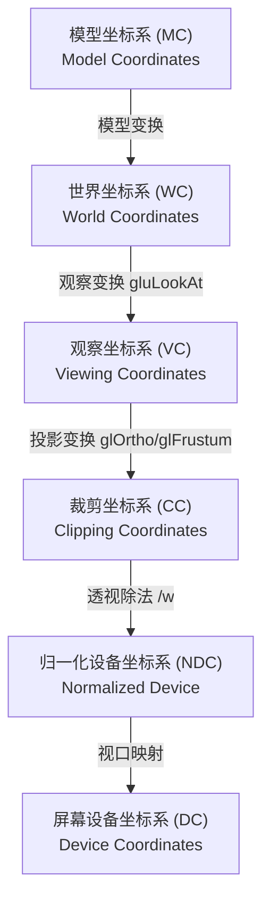
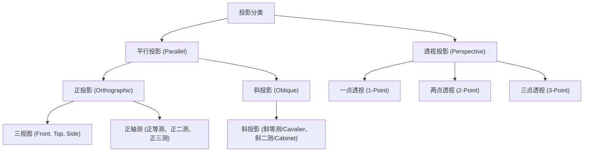

# 计算机图形学期末复习提纲与考点详析 (2026_review_Sonder9999)

---

# 考试基本信息

## 一、 考试范围与重点章节

* **第 1 章**：绪论（基础概念与学科关联）
* **第 2 章**：图形系统（帧缓存计算与流水线阶段）
* **第 3 章**：二维基本图形光栅化与裁剪 (**重点**，包含中点法、Bresenham、多边形扫描转换、Liang-Barsky、多边形裁剪)
* **第 4 章**：图形几何变换 (**重点**，包含齐次坐标、复合变换、OpenGL 变换应用)
* **第 5 章**：三维观察 (**重点**，包含投影分类、透视投影、灭点、三视图)
* **第 6 章**：三维造型（实体造型、细分与 CSG 方法）
* **第 7 章**：真实感图形技术 (**重点**，包含 Z-Buffer 消隐、光照模型、三种着色算法、光线跟踪)

---

## 二、 题型分布与分值

* **单选题 (30分)**：$15 \times 2'$，包括程序代码选择 5 题
* **判断题 (10分)**：$10 \times 1'$
* **简答题 (30分)**：$5 \times 6'$
* **综合计算题 (30分)**：$3 \times 10'$，典型题型包括：
  - **画线算法**：中点画线算法、Bresenham 画线算法的基本思想、判别式递推及画点位置计算。
  - **多边形填充**：改进的活动边表（AET）算法，手动补充或构建 ET 表与 AET 表。
  - **裁剪算法**：Liang-Barsky 算法裁剪直线段的参数计算与执行过程。

---

# 第 1 章 绪论

* **计算机图形学的定义**：

  - 计算机图形学（Computer Graphics, 简称 CG）是研究如何利用计算机将**数学模型**或**几何数据**转换为**图形/图像**并在显示设备上显示的学科。
* **主要研究内容**：

  - **建模 (Modeling)**：如何在计算机中表示和存储三维物体的几何形状（如多边形网格、曲面、实体表示）。
  - **渲染 (Rendering)**：如何根据光照、材质、视角计算物体的颜色和阴影，生成具有真实感的图像。
  - **动画 (Animation)**：如何模拟物体随时间变化的位置、形状和外观。
  - **人机交互 (Interaction)**：用户与图形系统进行实时交互的软硬件技术。
* **与相关学科之间的关联与区别**：

  | 学科名称                     | 输入内容          | 输出内容                | 典型任务与研究方向             |
  | :--------------------------- | :---------------- | :---------------------- | :----------------------------- |
  | **计算机图形学 (CG)**  | 几何模型/描述数据 | 图像                    | 场景渲染、游戏开发、动画制作   |
  | **数字图像处理 (DIP)** | 图像              | 图像                    | 图像增强、去噪、滤波、图像分割 |
  | **计算机视觉 (CV)**    | 图像/视频         | 物理场景的描述/三维模型 | 目标检测、人脸识别、三维重建   |
  | **计算几何 (CGGeo)**   | 几何问题描述      | 几何算法/数据结构       | 碰撞检测、网格剖分、凸包计算   |
  | **模式识别 (PR)**      | 图像/特征数据     | 类别标签/决策判断       | 字符识别、分类器设计、数据分析 |
* **学科流向示意图**：

  ```mermaid
  graph TD
      Model["几何模型 (数学描述)"] -->|计算机图形学 CG| Image["图像 (像素阵列)"]
      Image -->|计算机视觉 CV / 模式识别 PR| Model
      Image -->|图像处理 DIP| Image2["处理后的图像"]
  ```
* **计算机图形学的核心目标**：

  - **逼真度 (Realism)**：生成与真实世界难以区分的图像。
  - **交互性 (Interactivity)**：系统对用户操作的实时响应能力（通常要求达到 $30\text{ fps}$ 以上）。
  - **计算效率 (Efficiency)**：在有限的时间与硬件资源内完成图形的生成与渲染。
* **计算机图形学的应用领域**：

  - **计算机辅助设计与制造 (CAD/CAM)**：飞机、汽车、建筑物的结构设计。
  - **科学计算可视化**：将复杂的数据（医学 MRI、气象风向、物理仿真）以直观图形展现。
  - **虚拟现实 (VR) 与增强现实 (AR)**：构建沉浸式交互场景。
  - **数字娱乐与影视游戏**：电影特效、3D 游戏引擎开发。
  - **用户图形界面 (GUI)**：现代操作系统及应用的人机交互媒介。
* **计算机图形学的发展历程**：

  - **矢量/画笔式显示时代**：通过电子束在示波器上绘制线段，刷新率受限，不支持面填充。
  - **光栅扫描显示时代**：引入帧缓存概念，逐像素扫描，支持复杂色彩与实体填充。
  - **GPU 与硬件加速时代**：专用图形芯片的出现，使得大规模并行矩阵计算与实时光追成为现实。

---

# 第 2 章 图形系统

* **计算机图形系统的组成分类**：

  - **图形硬件系统**：包括输入设备、输出设备、图形处理器（GPU）、系统内存以及帧缓存（Frame Buffer）。
  - **图形软件系统**：包括图形应用软件（如 AutoCAD、Blender）和图形支撑软件/API（如 OpenGL、DirectX、Vulkan）。
* **常见的图形输入、输出设备**：

  - **输入设备**：键盘、二维鼠标、图形输入板/数位板（Tablet）、三维扫描仪、数据手套。
  - **输出设备**：液晶显示器（LCD）、有机发光二极管显示器（OLED）、投影仪、阴极射线管显示器（CRT，历史）、绘图仪。
* **光栅扫描显示系统的组成**：

  - 核心组件包括：**系统 CPU**、**系统内存**、**图形处理器 (GPU)**、**帧缓存 (Frame Buffer)**、**视频控制器 (Video Controller)** 以及 **显示监视器**。
  - 视频控制器以固定的刷新频率（如 $60\text{Hz}$）循环读取帧缓存中的像素值，通过数模转换（DAC）送往显示器显示。
* **帧缓存的概念和大小的计算**：

  - **帧缓存 (Frame Buffer)**：用于存储屏幕上所有像素颜色或灰度值的专用内存区域。
  - **计算公式**：

    $$
    V \ge M \times N \times \lceil \log_2 K \rceil
    $$

    其中，$M \times N$ 为屏幕分辨率（列数 $\times$ 行数），$K$ 为显示颜色的种类数（或灰度级数），$\lceil \log_2 K \rceil$ 为每个像素占用的位数（Bit Depth，位深）。
  - **注意单位换算**：

    - $1\text{ Byte} = 8\text{ bits}$；
    - $1\text{ KB} = 1024\text{ Bytes}$；
    - $1\text{ MB} = 1024\text{ KB} = 1024 \times 1024\text{ Bytes}$。

  > [!IMPORTANT]
  > **典型例题**：若显示器的分辨率为 $1024 \times 768$，能显示 $256$ 级灰度。求所需的最小帧缓存容量。
  >
  > - **解答步骤**：
  >   1. 灰度级 $K = 256$，则位深为 $\log_2 256 = 8\text{ bits}$（即 $1\text{ Byte}$）。
  >   2. 帧缓存总容量：
  >
  >      $$
  >      V = 1024 \times 768 \times 8\text{ bits} = 786,432\text{ Bytes}
  >      $$
  >   3. 换算为 KB/MB：
  >
  >      $$
  >      V = \frac{786,432}{1024} = 768\text{ KB} = 0.75\text{ MB}
  >      $$
  >
* **常见的图形应用软件和图形支撑软件**：

  - **支撑软件 (Graphics Library API)**：OpenGL、WebGL、Direct3D、Vulkan、Metal。
  - **应用软件**：AutoCAD（工程设计）、Blender/3ds Max/Maya（3D建模与动画）、Photoshop（图像编辑）。
* **图形流水线 (Graphics Pipeline) 的三个阶段及其作用**：

  ```mermaid
  graph LR
      AppStage["应用程序阶段<br>(Application)"] --> GeoStage["几何阶段<br>(Geometry)"]
      GeoStage --> RasterStage["光栅化与像素处理阶段<br>(Rasterization / Pixel Processing)"]
  ```

  - **应用程序阶段 (Application Stage)**：
    - *运行设备*：CPU。
    - *主要作用*：场景物理模拟、碰撞检测、视锥体粗选剔除、用户输入响应、加速判定算法执行，向几何阶段发送需要绘制的几何图元。
  - **几何阶段 (Geometry Stage)**：
    - *运行设备*：GPU 顶点着色器（Vertex Shader）等。
    - *主要作用*：进行顶点坐标变换（包括模型变换、观察变换、投影变换）、顶点光照计算与明暗处理、裁剪剔除视锥体外的非可见物体、最终的屏幕视口映射。
  - **光栅化与像素处理阶段 (Rasterization / Pixel Processing Stage)**：
    - *运行设备*：GPU 片段着色器（Fragment/Pixel Shader）等。
    - *主要作用*：将连续的三角形网格图元离散化为离散的片元/像素，在片元之间进行属性的线性插值（如纹理坐标、法向），执行纹理采样、光照模型逐像素计算，进行深度测试（Z-Buffer 消隐）、模板测试和 Alpha 混合，最终将颜色结果写入帧缓存供显示。

---

# 第 3 章 二维基本图形光栅化与裁剪

## 一、 直线段与圆弧光栅化算法

### 1. DDA (数值微分) 画线法

- **基本思想**：利用微分方程 $y_{i+1} = y_i + k \cdot \Delta x$，通过逐步累加斜率 $k$ 来计算下一个像素的坐标，并对结果取整。
- **步长计算与更新规则**：

  - 当斜率 $|k| \le 1$ 时，以 $x$ 为主步进方向，$\Delta x = 1$：

    $$
    \begin{cases}
    x_{i+1} = x_i + 1 \\
    y_{i+1} = y_i + k
    \end{cases}
    $$
  - 当斜率 $|k| > 1$ 时，以 $y$ 为主步进方向，$\Delta y = 1$：

    $$
    \begin{cases}
    y_{i+1} = y_i + 1 \\
    x_{i+1} = x_i + \frac{1}{k}
    \end{cases}
    $$
- **缺点**：每次迭代都包含浮点数加法与四舍五入取整操作，硬件实现效率低。

---

### 2. Bresenham 画线算法

- **基本思想**：将线段离散化问题转化为寻找距离理想直线最近的网格点。通过逐步递推误差判定值，最终消除浮点数与乘除法运算，仅用整数加减和移位即可完成渲染。
- **推导过程的三个演进阶段**（以第一象限内、斜率 $0 \le k \le 1$ 的直线为例，设起点为 $(x_0, y_0)$，终点为 $(x_1, y_1)$，$\Delta x = x_1 - x_0$，$\Delta y = y_1 - y_0$，斜率 $k = \frac{\Delta y}{\Delta x}$）：

#### (1) Bresenham 原始算法（包含小数与 0.5 比较）

- **核心逻辑**：
  设当前步已画点为 $P_i(x_i, y_i)$，下一步 $x_{i+1} = x_i + 1$ 时，理想直线上的精确纵坐标为 $y = k(x_i + 1 - x_0) + y_0$。
  我们需要在此处决策将像素点绘制在 $y_i$ 还是 $y_i + 1$。
  - 计算理想点与上下两个候选像素的垂直距离 $d_1$ 和 $d_2$：

    $$
    d_1 = y - y_i = k(x_i + 1 - x_0) + y_0 - y_i
    $$

    $$
    d_2 = (y_i + 1) - y = y_i + 1 - \left[ k(x_i + 1 - x_0) + y_0 \right]
    $$
  - 构造两者之差：

    $$
    d_1 - d_2 = 2y - 2y_i - 1 = 2(y - y_i) - 1
    $$
  - **决策判定**：

    - 若 $d_1 - d_2 < 0 \implies y - y_i < 0.5$，即理想点更靠近下方的 $y_i$，选择 $y_{i+1} = y_i$；
    - 若 $d_1 - d_2 \ge 0 \implies y - y_i \ge 0.5$，即理想点更靠近上方的 $y_i+1$，选择 $y_{i+1} = y_i + 1$。
- **局限性**：在每一步计算中，需要对每一个像素点计算理想的浮点坐标 $y$，并与 $0.5$ 比较，这包含了浮点数加法与乘法，性能开销较大。

#### (2) 改进算法 1：消除与 0.5 的比较（引入误差 e）

- **核心逻辑**：
  与其每次计算绝对的 $y$，不如使用递推的误差项 $e$。
  设误差 $e$ 表示理想直线 $y$ 坐标与当前选定像素 $y_i$ 之间的相对偏差。从起点出发时，$e_0 = 0$。
  每次 $x$ 步进 $1$，误差累加斜率 $k$（即 $e_{\text{temp}} = e_i + k$）：

  - 若 $e_i + k < 0.5$，选择 $y_{i+1} = y_i$，下一轮累积误差更新为：

    $$
    e_{i+1} = e_i + k
    $$
  - 若 $e_i + k \ge 0.5$，说明相对偏差超过了一半像素，选择 $y_{i+1} = y_i + 1$。由于像素坐标向上移动了 $1$，在此处需要做误差修正，使得误差项继续相对于新的像素线保持正确关系：

    $$
    e_{i+1} = e_i + k - 1
    $$
- **消除 0.5**：
  为避免与常数 $0.5$ 比较，令 $e'_i = e_i - 0.5$，将比较基准转换到 $0$：

  - 初始值：

    $$
    e'_0 = -0.5
    $$
  - 每次更新 $e'_{\text{temp}} = e'_i + k$ 并与 $0$ 进行大小判断：

    - 若 $e'_i + k < 0$，选 $y_{i+1} = y_i$，更新 $e'_{i+1} = e'_i + k$。
    - 若 $e'_i + k \ge 0$，选 $y_{i+1} = y_i + 1$，更新 $e'_{i+1} = e'_i + k - 1$。
- **局限性**：虽然通过转换使得判断条件变成了与 $0$ 比较，但由于斜率 $k = \frac{\Delta y}{\Delta x}$ 仍然是浮点数，且初始值 $e'_0 = -0.5$ 也是浮点数，系统仍然需要依赖浮点运算。

#### (3) 改进算法 2：彻底摆脱浮点数（引入整型判别式 E）

- **核心逻辑**：
  为了完全消除除法和浮点数，将改进算法 1 中的不等式和更新公式两边同乘以常数 $2\Delta x$（因为 $\Delta x > 0$，这不会改变判定不等式的符号方向）。
  定义全新的整型误差决策变量 $E_i = 2\Delta x \cdot e'_i$。

  - **初始值**：

    $$
    E_0 = 2\Delta x \cdot e'_0 = 2\Delta x \cdot (-0.5) = -\Delta x
    $$
  - **每次步进的增量变化**：

    - 原本递增的斜率项 $k$ 变为：

      $$
      2\Delta x \cdot k = 2\Delta x \cdot \frac{\Delta y}{\Delta x} = 2\Delta y
      $$
    - 原本溢出时的减 $1$ 修正项变为：

      $$
      -2\Delta x
      $$
  - **最终纯整型递推公式 (Bresenham 标准形式)**：
    令误差递增中间值 $E_{\text{temp}} = E_i + 2\Delta y$。

    - 若 $E_i + 2\Delta y < 0$，下一个像素为 $(x_i + 1, y_i)$，更新：

      $$
      E_{i+1} = E_i + 2\Delta y
      $$
    - 若 $E_i + 2\Delta y \ge 0$，下一个像素为 $(x_i + 1, y_i + 1)$，更新：

      $$
      E_{i+1} = E_i + 2\Delta y - 2\Delta x
      $$
- **优势**：在这个最终算法中，初始值和增量全部被转换为整数（$\Delta x$ 和 $\Delta y$ 均为整数像素差值）。算法在主循环中**仅执行整数加减法与乘 2 运算（乘 2 在硬件层面通过左移 1 位 `<< 1` 极速完成）**，彻底排除了浮点数，执行效率极高。

> [!TIP]
> **经典实例演练：绘制从 $P_0(0,0)$ 到 $P_1(5,2)$ 的直线段**
>
> 已知起点为 $(0,0)$，终点为 $(5,2)$，则：
>
> - $\Delta x = 5$ 且 $\Delta y = 2$
> - 斜率 $k = \frac{2}{5} = 0.4$
> - 终点像素为 $(5,2)$，需要在每一方向步进中决定下一个像素坐标。
>
> 以下使用上述三种演进阶段的算法依次进行完整的计算递推过程展示：
>
> #### 1. Bresenham 原始算法（包含小数与 0.5 比较）
>
> - **初始化**：当前点 $(x_0, y_0) = (0, 0)$，误差偏移量初始值 $d = 0$。
> - **状态更新规则**：
>   - 每次步进计算临时值 $d_{\text{temp}} = d_i + k$。
>   - 若 $d_{\text{temp}} \ge 0.5 \implies y$ 递增 $1$，且做修正 $d_{i+1} = d_{\text{temp}} - 1$。
>   - 若 $d_{\text{temp}} < 0.5 \implies y$ 保持不变，且 $d_{i+1} = d_{\text{temp}}$。
>
> | 步数 ($x$) | 当前绘制点           | 误差项更新 ($d = d + 0.4$) |                判断$d \ge 0.5$？                | 下一步纵坐标$y$ |
> | :----------- | :------------------- | :--------------------------- | :-----------------------------------------------: | :---------------- |
> | $0$        | **$(0, 0)$** | $d = 0 + 0.4 = 0.4$        |                否 ($0.4 < 0.5$)                | $y = 0$         |
> | $1$        | **$(1, 0)$** | $d = 0.4 + 0.4 = 0.8$      | 是 ($0.8 \ge 0.5$)，更新 $d = 0.8 - 1 = -0.2$ | $y = 1$         |
> | $2$        | **$(2, 1)$** | $d = -0.2 + 0.4 = 0.2$     |                否 ($0.2 < 0.5$)                | $y = 1$         |
> | $3$        | **$(3, 1)$** | $d = 0.2 + 0.4 = 0.6$      | 是 ($0.6 \ge 0.5$)，更新 $d = 0.6 - 1 = -0.4$ | $y = 2$         |
> | $4$        | **$(4, 2)$** | $d = -0.4 + 0.4 = 0$       |                 否 ($0 < 0.5$)                 | $y = 2$         |
> | $5$        | **$(5, 2)$** | （已到达终点）               |                         -                         | -                 |
>
> ---
>
> #### 2. 改进算法 1：消除与 0.5 的比较（引入误差变量代换 $e$）
>
> - **初始化**：通过 $e = d - 0.5$，误差偏置量初始值 $e_0 = -0.5$。
> - **状态更新规则**：
>   - 每次步进计算临时值 $e_{\text{temp}} = e_i + k$。
>   - 若 $e_{\text{temp}} \ge 0 \implies y$ 递增 $1$，且做修正 $e_{i+1} = e_{\text{temp}} - 1$。
>   - 若 $e_{\text{temp}} < 0 \implies y$ 保持不变，且 $e_{i+1} = e_{\text{temp}}$。
>
> | 步数 ($x$) | 当前绘制点           | 误差项更新 ($e = e + 0.4$) |                判断$e \ge 0$？                | 下一步纵坐标$y$ |
> | :----------- | :------------------- | :--------------------------- | :---------------------------------------------: | :---------------- |
> | $0$        | **$(0, 0)$** | $e = -0.5 + 0.4 = -0.1$    |                否 ($-0.1 < 0$)                | $y = 0$         |
> | $1$        | **$(1, 0)$** | $e = -0.1 + 0.4 = 0.3$     | 是 ($0.3 \ge 0$)，更新 $e = 0.3 - 1 = -0.7$ | $y = 1$         |
> | $2$        | **$(2, 1)$** | $e = -0.7 + 0.4 = -0.3$    |                否 ($-0.3 < 0$)                | $y = 1$         |
> | $3$        | **$(3, 1)$** | $e = -0.3 + 0.4 = 0.1$     | 是 ($0.1 \ge 0$)，更新 $e = 0.1 - 1 = -0.9$ | $y = 2$         |
> | $4$        | **$(4, 2)$** | $e = -0.9 + 0.4 = -0.5$    |                否 ($-0.5 < 0$)                | $y = 2$         |
> | $5$        | **$(5, 2)$** | （已到达终点）               |                        -                        | -                 |
>
> ---
>
> #### 3. 改进算法 2：彻底摆脱浮点数（引入整型判别式 $E$）
>
> - **初始化**：通过 $E = e \cdot 2\Delta x$ 进行整体放大，已知 $2\Delta x = 10$ 且 $2\Delta y = 4$。
>   初始整型决策误差量 $E_0 = -\Delta x = -5$。
> - **状态更新规则**：
>   - 每次步进累加 $2\Delta y$ 即计算临时值 $E_{\text{temp}} = E_i + 4$。
>   - 若 $E_{\text{temp}} \ge 0 \implies y$ 递增 $1$，且做整型修正 $E_{i+1} = E_{\text{temp}} - 2\Delta x$（即减去 $10$）。
>   - 若 $E_{\text{temp}} < 0 \implies y$ 保持不变，且 $E_{i+1} = E_{\text{temp}}$。
>
> | 步数 ($x$) | 当前绘制点           | 误差项更新 ($E = E + 4$) |             判断$E \ge 0$？             | 下一步纵坐标$y$ |
> | :----------- | :------------------- | :------------------------- | :----------------------------------------: | :---------------- |
> | $0$        | **$(0, 0)$** | $E = -5 + 4 = -1$        |              否 ($-1 < 0$)              | $y = 0$         |
> | $1$        | **$(1, 0)$** | $E = -1 + 4 = 3$         | 是 ($3 \ge 0$)，更新 $E = 3 - 10 = -7$ | $y = 1$         |
> | $2$        | **$(2, 1)$** | $E = -7 + 4 = -3$        |              否 ($-3 < 0$)              | $y = 1$         |
> | $3$        | **$(3, 1)$** | $E = -3 + 4 = 1$         | 是 ($1 \ge 0$)，更新 $E = 1 - 10 = -9$ | $y = 2$         |
> | $4$        | **$(4, 2)$** | $E = -9 + 4 = -5$        |              否 ($-5 < 0$)              | $y = 2$         |
> | $5$        | **$(5, 2)$** | （已到达终点）             |                     -                     | -                 |
>
> **归纳总结**：
> 无论采用何种形式，其内部判定基准的数学逻辑完全等价，最终渲染产生的离散像素点序列也完全相同：
>
> $$
> (0,0) \to (1,0) \to (2,1) \to (3,1) \to (4,2) \to (5,2)
> $$

---

### 3. 中点画线法

- **基本思想**：构造直线的隐式方程 $F(x, y) = Ax + By + C = 0$（其中 $A = - \Delta y$, $B = \Delta x$, $C = \Delta x \cdot b$）。
- 每次步进 $x_{i+1} = x_i + 1$，计算中点 $M(x_i + 1, y_i + 0.5)$ 代入方程的值：

  $$
  d_i = F(x_i + 1, y_i + 0.5) = A(x_i + 1) + B(y_i + 0.5) + C
  $$

  - 若 $d_i < 0$，中点在直线下方，说明直线上方距离像素点更近，选右上方的像素点 $(x_i + 1, y_i + 1)$。
  - 若 $d_i \ge 0$，中点在直线上方，选右下方的像素点 $(x_i + 1, y_i)$。
- **递推公式 (整数优化形式)**：

  - 初始值：$d_0 = 2A + B$（即 $\Delta x - 2\Delta y$）。
  - 若 $d_i < 0$，选右上点 $(x_i+1, y_i+1)$，则下一轮判别式 $d_{i+1} = d_i + 2A + 2B$（即 $d_i + 2\Delta x - 2\Delta y$）。
  - 若 $d_i \ge 0$，选右下点 $(x_i+1, y_i)$，则下一轮判别式 $d_{i+1} = d_i + 2A$（即 $d_i - 2\Delta y$）。

> [!TIP]
> **经典实例演练：使用中点画线法绘制从 $P_0(0,0)$ 到 $P_1(5,2)$ 的直线段**
>
> 已知起点为 $(0,0)$，终点为 $(5,2)$，则：
>
> - $\Delta x = 5$ 且 $\Delta y = 2$
> - 斜率 $k = \frac{2}{5} = 0.4$
>
> 以下分别使用改进前（含小数）和改进后（纯整型）两种中点判别式递推展示计算过程：
>
> #### 1. 改进前（基于斜率 $k$ 的小数运算）
>
> - **初始化**：初始判别式 $d_0 = 0.5 - k = 0.5 - 0.4 = 0.1$。
> - **状态更新规则**：
>   - 若 $d_i \ge 0$（中点在直线上方），选择右下方的点，即 $y$ 保持不变，并更新：
>
>     $$
>     d_{i+1} = d_i - k = d_i - 0.4
>     $$
>   - 若 $d_i < 0$（中点在直线下方），选择右上方的点，即 $y$ 递增 $1$，并更新：
>
>     $$
>     d_{i+1} = d_i + 1 - k = d_i + 0.6
>     $$
>
> | 步数 ($x$) | 当前绘制点           | 当前判别式$d_i$ | 判断$d_i \ge 0$？ | 下一步纵坐标$y$ | 下一步判别式$d_{i+1}$ 更新 |
> | :----------- | :------------------- | :---------------- | :-----------------: | :---------------- | :--------------------------- |
> | $0$        | **$(0, 0)$** | $0.1$           |   是 ($\ge 0$)   | $y = 0$         | $d = 0.1 - 0.4 = -0.3$     |
> | $1$        | **$(1, 0)$** | $-0.3$          |    否 ($< 0$)    | $y = 1$         | $d = -0.3 + 0.6 = 0.3$     |
> | $2$        | **$(2, 1)$** | $0.3$           |   是 ($\ge 0$)   | $y = 1$         | $d = 0.3 - 0.4 = -0.1$     |
> | $3$        | **$(3, 1)$** | $-0.1$          |    否 ($< 0$)    | $y = 2$         | $d = -0.1 + 0.6 = 0.5$     |
> | $4$        | **$(4, 2)$** | $0.5$           |   是 ($\ge 0$)   | $y = 2$         | $d = 0.5 - 0.4 = 0.1$      |
> | $5$        | **$(5, 2)$** | -                 |   （已到达终点）   | -                 | -                            |
>
> ---
>
> #### 2. 改进后（纯整数运算，令 $D = 2d \cdot \Delta x$）
>
> - **参数计算**：已知 $2\Delta x = 10, 2\Delta y = 4$。
>   初始判别式为：
>
>   $$
>   D_0 = 2d_0 \cdot \Delta x = 2(0.5 - k)\Delta x = \Delta x - 2\Delta y = 5 - 4 = 1
>   $$
> - **状态更新规则**：
>
>   - 若 $D_i \ge 0$（中点在直线上方），选择右下方的点，即 $y$ 保持不变，并更新：
>
>     $$
>     D_{i+1} = D_i - 2\Delta y = D_i - 4
>     $$
>   - 若 $D_i < 0$（中点在直线下方），选择右上方的点，即 $y$ 递增 $1$，并更新：
>
>     $$
>     D_{i+1} = D_i + 2\Delta x - 2\Delta y = D_i + 6
>     $$
>
> | 步数 ($x$) | 当前绘制点           | 当前判别式$D_i$ | 判断$D_i \ge 0$？ | 下一步纵坐标$y$ | 下一步判别式$D_{i+1}$ 更新 |
> | :----------- | :------------------- | :---------------- | :-----------------: | :---------------- | :--------------------------- |
> | $0$        | **$(0, 0)$** | $1$             |   是 ($\ge 0$)   | $y = 0$         | $D = 1 - 4 = -3$           |
> | $1$        | **$(1, 0)$** | $-3$            |    否 ($< 0$)    | $y = 1$         | $D = -3 + 6 = 3$           |
> | $2$        | **$(2, 1)$** | $3$             |   是 ($\ge 0$)   | $y = 1$         | $D = 3 - 4 = -1$           |
> | $3$        | **$(3, 1)$** | $-1$            |    否 ($< 0$)    | $y = 2$         | $D = -1 + 6 = 5$           |
> | $4$        | **$(4, 2)$** | $5$             |   是 ($\ge 0$)   | $y = 2$         | $D = 5 - 4 = 1$            |
> | $5$        | **$(5, 2)$** | -                 |   （已到达终点）   | -                 | -                            |
>
> **归纳总结**：
> 对比可以清楚地看到，改进后的判别式 $D$ 的符号变化轨迹（$1 \to -3 \to 3 \to -1 \to 5$）与改进前的 $d$ （$0.1 \to -0.3 \to 0.3 \to -0.1 \to 0.5$）完全对应一致，最终绘制出的点列序列也完全相同，但整个主循环中没有出现任何浮点数。

---

### 4. 中点画圆法

- **基本思想**：利用圆的 8 对称性，只需计算八分之一圆弧（$0 \le x \le y$）。构造圆的隐式方程 $F(x, y) = x^2 + y^2 - R^2 = 0$。
- **判别式与递推公式**：
  - 从起点 $(0, R)$ 开始，步进 $x_{i+1} = x_i + 1$，评估中点 $M(x_i + 1, y_i - 0.5)$。
  - 初始值：

    $$
    d_0 = 1.25 - R \quad (\text{整数优化中常记为 } d_0 = 1 - R)
    $$
  - 递推规则：

    - 若 $d_i < 0$，选正右方点 $(x_i + 1, y_i)$，更新：

      $$
      d_{i+1} = d_i + 2x_i + 3
      $$
    - 若 $d_i \ge 0$，选斜下方点 $(x_i + 1, y_i - 1)$，更新：

      $$
      d_{i+1} = d_i + 2(x_i - y_i) + 5
      $$

> [!TIP]
> **经典实例演练：使用中点画圆法计算半径 $R=5$ 的 1/8 圆弧**
>
> 已知半径 $R=5$，初始起点为 $(0, 5)$。我们只计算 $x \le y$ 范围内的 1/8 圆弧像素序列。
>
> 以下分别对比优化前（含小数）和优化后（整型）两种中点判别式递推的详细计算过程：
>
> #### 1. 优化前（含小数运算）
>
> - **初始化**：初始判别式 $d_0 = 1.25 - R = 1.25 - 5 = -3.75$。
> - **状态更新规则**：
>   - 若 $d_i < 0$（中点在圆内），选择正右方点 $(x_i + 1, y_i)$，更新：
>
>     $$
>     d_{i+1} = d_i + 2x_i + 3
>     $$
>   - 若 $d_i \ge 0$（中点在圆外），选择斜下方点 $(x_i + 1, y_i - 1)$，更新：
>
>     $$
>     d_{i+1} = d_i + 2(x_i - y_i) + 5
>     $$
>
> | 步数  | 当前绘制点$(x, y)$ | 当前判别式$d_i$ | 判断$d_i \ge 0$？ | 下一步$d_{i+1}$ 更新计算         | 下一步绘制点 |
> | :---- | :------------------- | :---------------- | :-----------------: | :--------------------------------- | :----------- |
> | $0$ | **$(0, 5)$** | $-3.75$         |     否 ($<0$)     | $d = -3.75 + 2(0) + 3 = -0.75$   | $(1, 5)$   |
> | $1$ | **$(1, 5)$** | $-0.75$         |     否 ($<0$)     | $d = -0.75 + 2(1) + 3 = 4.25$    | $(2, 5)$   |
> | $2$ | **$(2, 5)$** | $4.25$          |   是 ($\ge 0$)   | $d = 4.25 + 2(2 - 5) + 5 = 3.25$ | $(3, 4)$   |
> | $3$ | **$(3, 4)$** | $3.25$          |   是 ($\ge 0$)   | $d = 3.25 + 2(3 - 4) + 5 = 6.25$ | $(4, 3)$   |
>
> ---
>
> #### 2. 优化后（纯整数运算）
>
> *优化原理*：在圆的光栅化中，由于每次的步进增量 $2x_i+3$ 或 $2(x_i-y_i)+5$ 均为整数，初始值中的 $0.25$ 在与 $0$ 判定大小的循环链中，不会改变判别式正负号的方向。因此可令新判别式 $d = d_{\text{old}} - 0.25$，得到纯整数初始值，完全摆脱浮点数运算。
>
> - **初始化**：初始判别式 $d_0 = 1 - R = 1 - 5 = -4$。
> - **状态更新规则**：与优化前一致，仅初始值不同。
>
> | 步数  | 当前绘制点$(x, y)$ | 当前判别式$d_i$ | 判断$d_i \ge 0$？ | 下一步$d_{i+1}$ 更新计算   | 下一步绘制点 |
> | :---- | :------------------- | :---------------- | :-----------------: | :--------------------------- | :----------- |
> | $0$ | **$(0, 5)$** | $-4$            |     否 ($<0$)     | $d = -4 + 2(0) + 3 = -1$   | $(1, 5)$   |
> | $1$ | **$(1, 5)$** | $-1$            |     否 ($<0$)     | $d = -1 + 2(1) + 3 = 4$    | $(2, 5)$   |
> | $2$ | **$(2, 5)$** | $4$             |   是 ($\ge 0$)   | $d = 4 + 2(2 - 5) + 5 = 3$ | $(3, 4)$   |
> | $3$ | **$(3, 4)$** | $3$             |   是 ($\ge 0$)   | $d = 3 + 2(3 - 4) + 5 = 6$ | $(4, 3)$   |
>
> **对比结论**：
>
> - 算完第 3 步后，下一步的待绘制坐标变成了 $(4, 3)$。此时由于 $x > y$（$4 > 3$），超出了 $x \le y$ 的循环控制条件，这 1/8 圆弧的计算至此宣告结束。
> - 优化前后判别式的正负号变化轨迹完全一致（负 $\to$ 负 $\to$ 正 $\to$ 正），计算出的点列也完全相同：
>
>   $$
>   (0,5) \to (1,5) \to (2,5) \to (3,4)
>   $$
>
>   算法在实际运行中，只需计算出这 4 个坐标点，再利用圆的八分对称性即可直接绘制出整个完整的圆。

---

## 二、 区域填充算法

### 1. 包含性测试 (In-Out Test)

* **射线法 (Ray-Casting Method)**：
  - 从测试点 $P$ 向任意方向发射一条射线，计算该射线与多边形边界的交点个数。
  - 若交点个数为**奇数**，则点 $P$ 位于多边形内部；若为**偶数**，则位于外部。
  - *特例处理*：当射线恰好穿过顶点或切于边时，需进行退化判定（通常规定“左开右闭”或仅计算单向相交）。
* **环绕数/弧长法 (Winding Number Method)**：
  - 计算测试点 $P$ 沿多边形边界绕行一周时，边界边绕点 $P$ 的净旋转角之和。若旋转角之和非零，则点在内部。

---

### 2. 多边形扫描转换算法 (扫描线算法)

* **核心目标**：逐行扫描像素，利用多边形内部的连贯性进行区间快速面填充。
* **边表 (Edge Table, ET) 的构建**：
  - 按照边的最小 $Y$ 值进行分类归档（桶排序）。
  - ET 表节点结构：

    $$
    \begin{array}{|c|c|c|c|}
    \hline
    y_{\max} & x_{\text{ymin}} & \Delta x & \text{next} \\
    \hline
    \end{array}
    $$

    其中，$y_{\max}$ 是边的最大 $Y$ 坐标，$x_{\text{ymin}}$ 是边在最小 $Y$ 坐标处对应的 $X$ 值，$\Delta x$ 是边的斜率倒数（即 $\frac{1}{k}$）。
  - *注意*：若边水平（$\Delta y = 0$），则无需加入 ET 表。为了防止顶点处重复相交，若某边与邻边在顶点处单调递增或递减，需将上端点的高度算作 $y_{\max}-1$ 进行区间缩短。
* **活动边表 (Active Edge Table, AET) 的创建与维护步骤**：
  - AET 表存储与当前扫描线相交的所有边，并按 $X$ 坐标从小到大排序。
  - **算法执行步骤**：
    1. 初始化扫描线 $y = y_{\min}$。
    2. 将 ET 表中对应当前 $y$ 的边链表移入 AET。
    3. 对 AET 中的边按照当前 $X$ 进行升序排序。
    4. 对排好序的 AET 链表，奇偶配对填充像素（即 $x_0$ 到 $x_1$, $x_2$ 到 $x_3$ 之间的像素）。
    5. 从 AET 中剔除当前扫描线已达到最大值的边（即 $y = y_{\max}$ 的节点）。
    6. 将 AET 中剩余边节点的 $X$ 递增更新：$x_{\text{new}} = x_{\text{old}} + \Delta x$。
    7. 递增扫描线 $y = y + 1$，循环第 2 步直至 AET 和 ET 均为空。

> [!TIP]
> **期末大题演练：多边形扫描转换与有效边表（ET/AET）计算**
>
> **【题目描述】**
> 已知多边形有 6 个顶点，其局部网格坐标为：$A(2, 1)$、$B(6, 1)$、$C(6, 5)$、$D(4, 3)$、$E(2, 5)$、$F(1, 4)$。
> 规定有效边节点的物理存储结构为：`[ y_max | x_ymin | 1/k | next ]`。
> 请构建该多边形的边表（ET），并写出扫描线在 $y=1$、$y=2$、$y=3$ 时的活动边表（AET）及其填充区间。
>
> **【多边形网格示意图】**
>
> <div align="center">
> <svg viewBox="0 0 400 350" width="100%" style="background-color: #ffffff; max-width: 500px; display: block; margin: auto;">
>   <defs>
>     <pattern id="grid" width="40" height="40" patternUnits="userSpaceOnUse">
>       <path d="M 40 0 L 0 0 0 40" fill="none" stroke="#f0f0f0" stroke-width="1"/>
>     </pattern>
>     <marker id="arrow" viewBox="0 0 10 10" refX="5" refY="5" markerWidth="6" markerHeight="6" orient="auto-start-reverse">
>       <path d="M 0 0 L 10 5 L 0 10 z" fill="#333" />
>     </marker>
>   </defs>
>   <rect width="100%" height="100%" fill="url(#grid)" />
>   <line x1="30" y1="300" x2="360" y2="300" stroke="#333" stroke-width="2" marker-end="url(#arrow)" />
>   <line x1="50" y1="320" x2="50" y2="30" stroke="#333" stroke-width="2" marker-end="url(#arrow)" />
>   <text x="355" y="315" font-family="sans-serif" font-size="14" fill="#333">x</text>
>   <text x="35" y="35" font-family="sans-serif" font-size="14" fill="#333">y</text>
>   <text x="35" y="315" font-family="sans-serif" font-size="12" fill="#666">0</text>
>   <line x1="90" y1="300" x2="90" y2="305" stroke="#333" /><text x="86" y="320" font-family="sans-serif" font-size="12" fill="#666">1</text>
>   <line x1="130" y1="300" x2="130" y2="305" stroke="#333" /><text x="126" y="320" font-family="sans-serif" font-size="12" fill="#666">2</text>
>   <line x1="170" y1="300" x2="170" y2="305" stroke="#333" /><text x="166" y="320" font-family="sans-serif" font-size="12" fill="#666">3</text>
>   <line x1="210" y1="300" x2="210" y2="305" stroke="#333" /><text x="206" y="320" font-family="sans-serif" font-size="12" fill="#666">4</text>
>   <line x1="250" y1="300" x2="250" y2="305" stroke="#333" /><text x="246" y="320" font-family="sans-serif" font-size="12" fill="#666">5</text>
>   <line x1="290" y1="300" x2="290" y2="305" stroke="#333" /><text x="286" y="320" font-family="sans-serif" font-size="12" fill="#666">6</text>
>   <line x1="45" y1="260" x2="50" y2="260" stroke="#333" /><text x="30" y="264" font-family="sans-serif" font-size="12" fill="#666">1</text>
>   <line x1="45" y1="220" x2="50" y2="220" stroke="#333" /><text x="30" y="224" font-family="sans-serif" font-size="12" fill="#666">2</text>
>   <line x1="45" y1="180" x2="50" y2="180" stroke="#333" /><text x="30" y="184" font-family="sans-serif" font-size="12" fill="#666">3</text>
>   <line x1="45" y1="140" x2="50" y2="140" stroke="#333" /><text x="30" y="144" font-family="sans-serif" font-size="12" fill="#666">4</text>
>   <line x1="45" y1="100" x2="50" y2="100" stroke="#333" /><text x="30" y="104" font-family="sans-serif" font-size="12" fill="#666">5</text>
>   <polygon points="130,260 290,260 290,100 210,180 130,100 90,140" fill="rgba(64, 158, 255, 0.2)" stroke="#409EFF" stroke-width="3" stroke-linejoin="round" />
>   <circle cx="130" cy="260" r="4" fill="#F56C6C" />
>   <circle cx="290" cy="260" r="4" fill="#F56C6C" />
>   <circle cx="290" cy="100" r="4" fill="#F56C6C" />
>   <circle cx="210" cy="180" r="4" fill="#F56C6C" />
>   <circle cx="130" cy="100" r="4" fill="#F56C6C" />
>   <circle cx="90" cy="140" r="4" fill="#F56C6C" />
>   <text x="120" y="280" font-family="sans-serif" font-size="12" font-weight="bold" fill="#333">A(2,1)</text>
>   <text x="295" y="280" font-family="sans-serif" font-size="12" font-weight="bold" fill="#333">B(6,1)</text>
>   <text x="295" y="95" font-family="sans-serif" font-size="12" font-weight="bold" fill="#333">C(6,5)</text>
>   <text x="210" y="200" font-family="sans-serif" font-size="12" font-weight="bold" fill="#333" text-anchor="middle">D(4,3)</text>
>   <text x="110" y="95" font-family="sans-serif" font-size="12" font-weight="bold" fill="#333">E(2,5)</text>
>   <text x="50" y="140" font-family="sans-serif" font-size="12" font-weight="bold" fill="#333">F(1,4)</text>
> </svg>
> </div>
>
> ---
>
> #### 1. 计算所有有效非水平边的参数
>
> 水平边 $AB$ （$y=1$ 时两端点高度一致）对扫描线无穿插变化贡献，直接舍弃。对其余 5 条有效边计算其边界特征值：
>
> - **$BC$ 边**：下端点 $y_{\min}=1$，上端点 $y_{\max}=5$，下端点对应 $x=6$。
>   斜率倒数：
>
>   $$
>   \frac{1}{k} = \frac{x_C - x_B}{y_C - y_B} = \frac{6 - 6}{5 - 1} = 0
>   $$
> - **$FA$ 边**：下端点 $y_{\min}=1$，上端点 $y_{\max}=4$，下端点对应 $x=2$。
>   斜率倒数：
>
>   $$
>   \frac{1}{k} = \frac{x_F - x_A}{y_F - y_A} = \frac{1 - 2}{4 - 1} = -\frac{1}{3}
>   $$
> - **$CD$ 边**：下端点 $y_{\min}=3$，上端点 $y_{\max}=5$，下端点对应 $x=4$。
>   斜率倒数：
>
>   $$
>   \frac{1}{k} = \frac{x_C - x_D}{y_C - y_D} = \frac{6 - 4}{5 - 3} = 1
>   $$
> - **$DE$ 边**：下端点 $y_{\min}=3$，上端点 $y_{\max}=5$，下端点对应 $x=4$。
>   斜率倒数：
>
>   $$
>   \frac{1}{k} = \frac{x_E - x_D}{y_E - y_D} = \frac{2 - 4}{5 - 3} = -1
>   $$
> - **$EF$ 边**：下端点 $y_{\min}=4$，上端点 $y_{\max}=5$，下端点对应 $x=1$。
>   斜率倒数：
>
>   $$
>   \frac{1}{k} = \frac{x_E - x_F}{y_E - y_F} = \frac{2 - 1}{5 - 4} = 1
>   $$
>
> ---
>
> #### 2. 构建边表 (Edge Table, ET)
>
> 将各条边按照其下端点的纵坐标 $y_{\min}$ 归档入对应的扫描桶中。在同一个桶链表中，按照端点 $x$ 坐标递增排序，若 $x$ 相同，则按 $\frac{1}{k}$ 递增排序：
>
> - **$y=1$ 桶**：挂入 $FA$ 边与 $BC$ 边。因为 $FA$ 的 $x=2$ 小于 $BC$ 的 $x=6$，因此链表顺序为：$FA \to BC$。
> - **$y=2$ 桶**：无新起点边，桶为空（`NULL`）。
> - **$y=3$ 桶**：挂入 $DE$ 边与 $CD$ 边。两者的 $x=4$ 相同，但 $DE$ 的 $\frac{1}{k}=-1$ 小于 $CD$ 的 $\frac{1}{k}=1$，因此链表顺序为：$DE \to CD$。
> - **$y=4$ 桶**：挂入 $EF$ 边。
>
> **构建完的静态 ET 表结果如下**：
>
> - **$y=1$ 桶**：$\to \text{`[4 | 2 | -1/3]`(FA)} \to \text{`[5 | 6 | 0]`(BC)}$
> - **$y=2$ 桶**：$\to \text{NULL}$
> - **$y=3$ 桶**：$\to \text{`[5 | 4 | -1]`(DE)} \to \text{`[5 | 4 | 1]`(CD)}$
> - **$y=4$ 桶**：$\to \text{`[5 | 1 | 1]`(EF)}$
>
> ---
>
> #### 3. 活动边表 (Active Edge Table, AET) 的递推更新
>
> 演示扫描线 $y = 1, 2, 3$ 时的活动边表动态更新与像素区间配对：
>
> **(1) 当扫描线 $y = 1$ 时**：
>
> - 将 $y=1$ 桶中的新边并入当前为空的 AET并排序。
> - **当前 AET 状态**：
>
>   $$
>   \text{AET} \to \text{`[4 | 2 | -1/3]`(FA)} \to \text{`[5 | 6 | 0]`(BC)}
>   $$
> - **交点配对与填充区间**：
>   两交点为 $x=2$ 与 $x=6$。对两交点之间的像素区间 **$[2, 6]$** 实施色彩填充。
>
> **(2) 当扫描线 $y = 2$ 时**：
>
> - 剔除失效边：当前 AET 中无最大高度 $y_{\max}=2$ 的边，不执行剔除。
> - 递增更新 $X$ 坐标（$x_{\text{new}} = x_{\text{old}} + \frac{1}{k}$）：
>
>   - $FA$ 边：$x = 2 + (-\frac{1}{3}) = \frac{5}{3} \approx 1.67$
>   - $BC$ 边：$x = 6 + 0 = 6$
> - 并入新边：$y=2$ 桶的 ET 为空，无新边并入。对 AET 重新排序。
> - **当前 AET 状态**：
>
>   $$
>   \text{AET} \to \text{`[4 | 5/3 | -1/3]`(FA)} \to \text{`[5 | 6 | 0]`(BC)}
>   $$
> - **交点配对与填充区间**：
>   两交点为 $x \approx 1.67$ 与 $x=6$。由于填充像素网格通常取整，该处奇偶配对区间为 $[1.67, 6]$，实际着色区间仍为 **$[2, 6]$**。
>
> **(3) 当扫描线 $y = 3$ 时**：
>
> - 剔除失效边：当前 AET 中无最大高度 $y_{\max}=3$ 的边，不执行剔除。
> - 递增更新 $X$ 坐标：
>
>   - $FA$ 边：$x = \frac{5}{3} + (-\frac{1}{3}) = \frac{4}{3} \approx 1.33$
>   - $BC$ 边：$x = 6 + 0 = 6$
> - 并入新边：有 $y=3$ 桶中的新边 $DE$ 和 $CD$ 并入，并对 AET 链表中所有边按最新 $x$ 重排（四个交点 $x$ 坐标值分别为：$\frac{4}{3}$、 $4$、 $4$、 $6$）：
> - **当前 AET 状态**：
>
>   $$
>   \text{AET} \to \text{`[4 | 4/3 | -1/3]`(FA)} \to \text{`[5 | 4 | -1]`(DE)} \to \text{`[5 | 4 | 1]`(CD)} \to \text{`[5 | 6 | 0]`(BC)}
>   $$
> - **交点配对与填充区间**：
>   两两奇偶配对可得到两个独立区间：$[\frac{4}{3}, 4]$ 与 $[4, 6]$。
>   像素化填充时，区间 1 填充 $[2, 4]$，区间 2 填充 $[4, 6]$，最终合并填充区间为 **$[2, 6]$**。

---

### 3. 种子填充算法

* **简单种子填充法 (递归法)**：
  - **基本思想**：从给定的种子像素 $(x, y)$ 开始，判断其颜色。若既非边界色（边界表示法）也未被着色成填充色，则将其涂为新色，并以此为基础向四个方向（4-邻接）或八个方向（8-邻接）递归调用自身。
  - **缺点**：由于采用逐像素递归的深度优先搜索，递归调用栈深度巨大，在填充大面积区域时**极易引发系统调用栈溢出**，性能低下。
* **扫描线种子填充法**：
  - **优化原理**：通过以“水平像素线段”为基础填充单元，大大减少压栈和出栈次数，**效率极高，适用于大面积区域填充**。
  - **核心步骤**：
    1. 给定初始种子点，向左右两个方向水平扩展，填充当前扫描线上所有未填充的连续像素，记录此区间的左右端点 $[x_{\text{left}}, x_{\text{right}}]$。
    2. 在相邻的上下两条扫描线（$y+1$ 和 $y-1$）的 $[x_{\text{left}}, x_{\text{right}}]$ 区间内，从左到右搜索未填充的像素。
    3. 找到该区间的每个子连通区段最右侧的像素，作为新种子点压入栈中。
    4. 弹出栈顶种子点，重复上述步骤，直到栈为空。

---

## 三、 字符表示与处理

* **点阵字符 (Bitmap Font)**：
  - 字符形状通过二进制位图表示（`1` 表示有墨色，`0` 表示背景）。
  - *特点*：显示速度极快，但缩放或旋转时会出现严重的锯齿与失真。
* **矢量字符 (Vector Font)**：
  - 字符轮廓用一组数学曲线（如 Bézier 曲线）或折线段描述。
  - *特点*：能够无损缩放、旋转，字体美观清晰，但渲染时需要实时进行多边形转换与像素填充，开销较大。

---

## 四、 走样与反走样 (Aliasing & Anti-aliasing)

* **走样现象**：在对连续的几何图形进行离散采样时，由于采样频率不满足奈奎斯特-香农（Shannon）采样定理而引发的信号畸变与高频分量混叠。
  - **具体表现**：
    1. **阶梯状/锯齿状边界 (Jaggies)**：直线或圆弧边缘呈现不平滑的锯齿。
    2. **细节失真 (Moiré Patterns)**：在细密网格或复杂纹理区域出现条纹状杂光混叠干扰。
    3. **细小物体在扫描线间闪烁丢失 (Temporal Aliasing)**：当物体移动时，微小图元交替落入或漏出采样点，导致画面闪烁不稳。
* **常见反走样技术**：
  - **提高分辨率 / 超采样 (Super-sampling, SSAA)**：在更高的虚拟分辨率下进行像素渲染，然后经过平滑滤波器下采样回显示设备的原分辨率。*局限*：显存开销与光栅化计算开销成倍暴增，硬件代价极高。
  - **简单区域采样 (Unweighted Area Sampling / Box Filter)**：像素颜色仅由覆盖该像素的多边形**相交面积比例**决定，不考虑覆盖区域距离像素中心的具体位置。
  - **加权区域采样 (Weighted Area Sampling)**：除了考虑覆盖面积比例，还根据覆盖区域到像素中心的距离进行加权计算。**通常采用圆锥形/高斯形等加权滤波器**，越靠近中心点的相交部分对像素亮度的贡献权重越大。

---

## 五、 裁剪算法

### 1. Cohen-Sutherland 编码裁剪算法 (直线的线段裁剪)

* **区域编码设计**：
  将裁剪窗口的四条边延长，将整个平面划分为 9 个区域。每个区域用一个 4 位二进制码（$C_T C_B C_R C_L$）表示：

  ```text
  1001 | 1000 | 1010
  -----|------|-----
  0001 | 0000 | 0010  (0000 为窗口内部)
  -----|------|-----
  0101 | 0100 | 0110
  ```
* **算法执行过程**：

  1. 计算直线段两端点 $P_1, P_2$ 的编码 $code_1, code_2$。
  2. **完全保留判定**：若 $code_1 = 0 \text{ 且 } code_2 = 0$，则线段完全在窗口内，接收。
  3. **完全舍弃判定**：若 $code_1 \;\&amp;\; code_2 \neq 0$（按位与非零），说明两点同在某条边界外侧，直接拒绝。
  4. **求交裁剪判定**：若上述两项均不满足，则选择一个位于窗口外的端点（编码非零），将其与窗口的边界（按 Top, Bottom, Right, Left 顺序）求交，原端点替换为交点，重新计算编码，返回第一步循环。

---

### 2. Liang-Barsky 裁剪算法 (参数化线段裁剪)

* **基本思想**：将线段写为参数方程形式 $x = x_1 + u\Delta x$, $y = y_1 + u\Delta y$（其中 $0 \le u \le 1$）。
* 将窗口范围 $x_{\text{wmin}} \le x_1 + u\Delta x \le x_{\text{wmax}}$ 转化为通用不等式：

  $$
  u \cdot p_k \le q_k, \quad k = 1, 2, 3, 4
  $$

  其中参数定义为：

  - $p_1 = -\Delta x, \quad q_1 = x_1 - x_{\text{wmin}}$（左边界）
  - $p_2 = \Delta x, \quad q_2 = x_{\text{wmax}} - x_1$（右边界）
  - $p_3 = -\Delta y, \quad q_3 = y_1 - y_{\text{wmin}}$（下边界）
  - $p_4 = \Delta y, \quad q_4 = y_{\text{wmax}} - y_1$（上边界）
* **裁剪求解流程**：

  - 若 $p_k = 0$ 且 $q_k < 0$，线段平行于边界且在外侧，直接拒绝。
  - 对于 $p_k \neq 0$：

    - 若 $p_k < 0$（代表线段由外向内穿过该边界），计算交点参数 $r_k = \frac{q_k}{p_k}$，更新起点参数：

      $$
      u_1 = \max(0, r_k)
      $$
    - 若 $p_k > 0$（代表线段由内向外穿过该边界），计算交点参数 $r_k = \frac{q_k}{p_k}$，更新终点参数：

      $$
      u_2 = \min(1, r_k)
      $$
  - 若最终得到 $u_1 > u_2$，说明线段完全在窗口外，舍弃；否则，裁剪后的线段对应参数区间为 $[u_1, u_2]$。

> [!TIP]
> **期末大题演练：使用 Liang-Barsky 算法裁剪直线段**
>
> **【题目描述】**
> 已知裁剪窗口边界为：$x_{\text{wmin}} = 0$，$x_{\text{wmax}} = 2$，$y_{\text{wmin}} = 0$，$y_{\text{wmax}} = 2$。直线段的起点坐标为 $P_0(1, -1)$，终点坐标为 $P_1(2, 3)$。请用 Liang-Barsky 算法求出该线段在窗口内部的裁剪后端点坐标值。
>
> **【裁剪几何示意图】**
>
> <div align="center">
> <svg viewBox="0 0 350 350" width="100%" style="background-color: #ffffff; max-width: 450px; display: block; margin: auto;">
>   <defs>
>     <pattern id="grid" width="60" height="60" patternUnits="userSpaceOnUse">
>       <path d="M 60 0 L 0 0 0 60" fill="none" stroke="#f0f0f0" stroke-width="1"/>
>     </pattern>
>     <marker id="arrow" viewBox="0 0 10 10" refX="5" refY="5" markerWidth="6" markerHeight="6" orient="auto-start-reverse">
>       <path d="M 0 0 L 10 5 L 0 10 z" fill="#333" />
>     </marker>
>   </defs>
>   <rect width="100%" height="100%" fill="url(#grid)" />
>   <line x1="20" y1="250" x2="320" y2="250" stroke="#333" stroke-width="1.5" marker-end="url(#arrow)" />
>   <line x1="100" y1="330" x2="100" y2="30" stroke="#333" stroke-width="1.5" marker-end="url(#arrow)" />
>   <text x="315" y="265" font-family="sans-serif" font-size="12" fill="#333">X</text>
>   <text x="85" y="35" font-family="sans-serif" font-size="12" fill="#333">Y</text>
>   <text x="85" y="265" font-family="sans-serif" font-size="11" fill="#666">0</text>
>   <line x1="160" y1="250" x2="160" y2="255" stroke="#333" /><text x="156" y="268" font-family="sans-serif" font-size="10" fill="#666">1</text>
>   <line x1="220" y1="250" x2="220" y2="255" stroke="#333" /><text x="216" y="268" font-family="sans-serif" font-size="10" fill="#666">2</text>
>   <line x1="280" y1="250" x2="280" y2="255" stroke="#333" /><text x="276" y="268" font-family="sans-serif" font-size="10" fill="#666">3</text>
>   <line x1="40" y1="250" x2="40" y2="255" stroke="#333" /><text x="32" y="268" font-family="sans-serif" font-size="10" fill="#666">-1</text>
>   <line x1="95" y1="310" x2="100" y2="310" stroke="#333" /><text x="80" y="314" font-family="sans-serif" font-size="10" fill="#666">-1</text>
>   <line x1="95" y1="190" x2="100" y2="190" stroke="#333" /><text x="84" y="194" font-family="sans-serif" font-size="10" fill="#666">1</text>
>   <line x1="95" y1="130" x2="100" y2="130" stroke="#333" /><text x="84" y="134" font-family="sans-serif" font-size="10" fill="#666">2</text>
>   <line x1="95" y1="70" x2="100" y2="70" stroke="#333" /><text x="84" y="74" font-family="sans-serif" font-size="10" fill="#666">3</text>
>   <rect x="100" y="130" width="120" height="120" fill="none" stroke="#67C23A" stroke-width="2.5" stroke-dasharray="4 2" />
>   <text x="105" y="145" font-family="sans-serif" font-size="10" fill="#67C23A" font-weight="bold">Window</text>
>   <line x1="160" y1="310" x2="220" y2="70" stroke="#E6A23C" stroke-width="1.5" stroke-dasharray="3 3" />
>   <line x1="175" y1="250" x2="205" y2="130" stroke="#409EFF" stroke-width="3.5" stroke-linecap="round" />
>   <circle cx="160" cy="310" r="4" fill="#F56C6C" />
>   <text x="170" y="315" font-family="sans-serif" font-size="11" fill="#333" font-weight="bold">P0(1,-1)</text>
>   <circle cx="220" cy="70" r="4" fill="#F56C6C" />
>   <text x="230" y="75" font-family="sans-serif" font-size="11" fill="#333" font-weight="bold">P1(2,3)</text>
>   <circle cx="175" cy="250" r="3" fill="#409EFF" />
>   <text x="180" y="243" font-family="sans-serif" font-size="9" fill="#000">I0(1.25,0)</text>
>   <circle cx="205" cy="130" r="3" fill="#409EFF" />
>   <text x="210" y="125" font-family="sans-serif" font-size="9" fill="#000">I1(1.75,2)</text>
> </svg>
> </div>
>
> ---
>
> #### 1. 参数分析与计算准备
>
> - 线段起点 $P_0(x_1, y_1) = (1, -1)$，终点 $P_1(x_2, y_2) = (2, 3)$。
> - 计算线段的变化率：
>
>   $$
>   \Delta x = x_2 - x_1 = 2 - 1 = 1, \quad \Delta y = y_2 - y_1 = 3 - (-1) = 4
>   $$
> - 直线的参数方程形式为：
>
>   $$
>   \begin{cases}
>   x = 1 + u \cdot (1) \\
>   y = -1 + u \cdot (4)
>   \end{cases} \quad (0 \le u \le 1)
>   $$
> - 窗口边界参数：$x_{\text{wmin}} = 0$，$x_{\text{wmax}} = 2$，$y_{\text{wmin}} = 0$，$y_{\text{wmax}} = 2$。
>
> #### 2. 计算各边界对应的不等式参数 $p_k, q_k, r_k$
>
> 利用公式 $u \cdot p_k \le q_k$，依次计算四个边界的参数特征：
>
> - **左边界 ($k=1$)**：
>
>   $$
>   p_1 = -\Delta x = -1 \quad (<0)
>   $$
>
>   $$
>   q_1 = x_1 - x_{\text{wmin}} = 1 - 0 = 1 \implies r_1 = \frac{q_1}{p_1} = -1
>   $$
> - **右边界 ($k=2$)**：
>
>   $$
>   p_2 = \Delta x = 1 \quad (>0)
>   $$
>
>   $$
>   q_2 = x_{\text{wmax}} - x_1 = 2 - 1 = 1 \implies r_2 = \frac{q_2}{p_2} = 1
>   $$
> - **下边界 ($k=3$)**：
>
>   $$
>   p_3 = -\Delta y = -4 \quad (<0)
>   $$
>
>   $$
>   q_3 = y_1 - y_{\text{wmin}} = -1 - 0 = -1 \implies r_3 = \frac{q_3}{p_3} = 0.25
>   $$
> - **上边界 ($k=4$)**：
>
>   $$
>   p_4 = \Delta y = 4 \quad (>0)
>   $$
>
>   $$
>   q_4 = y_{\text{wmax}} - y_1 = 2 - (-1) = 3 \implies r_4 = \frac{q_4}{p_4} = 0.75
>   $$
>
> #### 3. 确定最终参数区间 $[u_1, u_2]$
>
> 根据方向穿入（$p_k < 0$）与穿出（$p_k > 0$）的原则，分别筛选取最大和最小值：
>
> - **由外向内穿入点参数最大值 $u_1$**：
>
>   $$
>   u_1 = \max\left(\{0\} \cup \{r_k \mid p_k < 0\}\right) = \max(0, r_1, r_3) = \max(0, -1, 0.25) = 0.25
>   $$
> - **由内向外穿出点参数最小值 $u_2$**：
>
>   $$
>   u_2 = \min\left(\{1\} \cup \{r_k \mid p_k > 0\}\right) = \min(1, r_2, r_4) = \min(1, 1, 0.75) = 0.75
>   $$
>
> 因为 $u_1 = 0.25 < u_2 = 0.75$，说明线段与裁剪窗口有相交部分，裁剪有效区间对应参数范围为 $[0.25, 0.75]$。
>
> #### 4. 代入参数方程求解裁剪后的物理端点坐标
>
> - **起点交点（$u = 0.25$）**：
>
>   $$
>   \begin{cases}
>   X_{\text{start}} = 1 + 0.25 \times 1 = 1.25 \\
>   Y_{\text{start}} = -1 + 0.25 \times 4 = 0
>   \end{cases}
>   $$
>
>   交点 1 坐标为 **$(1.25, 0)$**。
> - **终点交点（$u = 0.75$）**：
>
>   $$
>   \begin{cases}
>   X_{\text{end}} = 1 + 0.75 \times 1 = 1.75 \\
>   Y_{\text{end}} = -1 + 0.75 \times 4 = 2
>   \end{cases}
>   $$
>
>   交点 2 坐标为 **$(1.75, 2)$**。
>
> **结论**：
> 裁剪后的线段有效部分处于窗口内部，其两个端点坐标分别为 **$(1.25, 0)$** 与 **$(1.75, 2)$**。

---

### 3. Sutherland-Hodgeman 算法 (多边形裁剪)

* **基本思想**：采用**分治法**和**逐边裁剪**思想。把多边形裁剪问题分解为用裁剪窗口的单条边界依次对输入的多边形顶点序列进行裁剪，每一次处理完的输出顶点序列，将作为下一次裁剪的输入顶点序列，具有流式流水线处理的特征。
* **边界求交的输入与输出判定 (顶点 $S \to P$)**：
  
  | 边与顶点的相对位置关系 | 是否输出交点 $I$ | 是否输出终点 $P$ |
  | :--- | :---: | :---: |
  | **S 内 $\to$ P 内** | 否 | 是 (输出 $P$) |
  | **S 内 $\to$ P 外** | 是 (输出 $I$) | 否 |
  | **S 外 $\to$ P 外** | 否 | 否 (不输出) |
  | **S 外 $\to$ P 内** | 是 (输出 $I$) | 是 (输出 $P$) |

* **缺点**：只适用于凸多边形裁剪。如果裁剪凹多边形，可能会产生多余的退化连接线。

---

### 4. Weiler-Atherton 多边形裁剪算法

* **基本思想**：可用于任意多边形（包括凹多边形、带孔多边形）的裁剪。
* 顺时针排列主多边形和裁剪多边形的顶点，建立双向循环链表，求出所有交点，标记为“入点”（由外进入窗口）或“出点”（由窗口内出来）。
* **遍历规则**：
  - 遇到入点，沿主多边形顶点顺时针遍历；
  - 遇到出点，跳转至裁剪多边形，沿裁剪多边形边界顺时针遍历，直至回到起点形成闭合裁剪区域。

---

### 5. 裁剪算法特性横向对比

| 裁剪算法                      | 裁剪对象 | 核心优势                                                   | 局限性/缺点                        |
| :---------------------------- | :------- | :--------------------------------------------------------- | :--------------------------------- |
| **Cohen-Sutherland**    | 线段     | 编码快速，特别适合绝大部分线段处于完全保留或完全舍弃的场景 | 频繁迭代求交时效率降低             |
| **Liang-Barsky**        | 线段     | 参数化计算，减少了乘除法的次数                             | 仅限矩形窗口                       |
| **Sutherland-Hodgeman** | 多边形   | 流水线结构简单，易于硬件流水线实现                         | 凹多边形裁剪可能会产生冗余连接线   |
| **Weiler-Atherton**     | 多边形   | 支持任意复杂的凹多边形和内孔裁剪                           | 数据结构十分复杂，涉及较多链表跳转 |

---

# 第 4 章 图形几何变换

## 一、 齐次坐标 (Homogeneous Coordinates)

* **概念**：用 $n+1$ 维向量来表示 $n$ 维空间中的点。对于二维平面上的点 $(x, y)$，其齐次坐标表示为 $(hx, hy, h)$，其中 $h \neq 0$ 是缩放因子。通常令 $h = 1$，即标准齐次坐标为 $(x, y, 1)$。
* **引入齐次坐标的目的**：

  - 将图形学中原本属于非线性的平移操作（向量加法），统一化为矩阵乘法。
  - 将平移、旋转、缩放等多种操作统一写成相同的矩阵乘法形式，从而支持多级复合矩阵的连续连乘乘积，大幅提升图形硬件管线的执行效率。
* **齐次坐标向普通坐标的转换**：

  $$
  (x_h, y_h, w) \implies \left( \frac{x_h}{w}, \frac{y_h}{w} \right)
  $$

---

## 二、 基本变换矩阵 (2D 与 3D)

### 1. 二维基本齐次变换矩阵 ($3 \times 3$)

* **平移变换 (Translation)**：

  $$
  T(t_x, t_y) = \begin{bmatrix}
  1 & 0 & t_x \\
  0 & 1 & t_y \\
  0 & 0 & 1
  \end{bmatrix}
  $$
* **比例缩放 (Scaling)**：

  $$
  S(s_x, s_y) = \begin{bmatrix}
  s_x & 0 & 0 \\
  0 & s_y & 0 \\
  0 & 0 & 1
  \end{bmatrix}
  $$
* **旋转变换 (Rotation，绕原点逆时针旋转角度 $\theta$)**：

  $$
  R(\theta) = \begin{bmatrix}
  \cos\theta & -\sin\theta & 0 \\
  \sin\theta & \cos\theta & 0 \\
  0 & 0 & 1
  \end{bmatrix}
  $$
* **对称反射 (Reflection，以关于 x 轴对称镜像为例)**：

  $$
  M_x = \begin{bmatrix}
  1 & 0 & 0 \\
  0 & -1 & 0 \\
  0 & 0 & 1
  \end{bmatrix}
  $$
* **错切变换 (Shear，以沿 x 方向错切为例)**：

  $$
  SH_x(sh_x) = \begin{bmatrix}
  1 & sh_x & 0 \\
  0 & 1 & 0 \\
  0 & 0 & 1
  \end{bmatrix}
  $$

---

### 2. 三维基本齐次变换矩阵 ($4 \times 4$)

* **平移变换**：

  $$
  T(t_x, t_y, t_z) = \begin{bmatrix}
  1 & 0 & 0 & t_x \\
  0 & 1 & 0 & t_y \\
  0 & 0 & 1 & t_z \\
  0 & 0 & 0 & 1
  \end{bmatrix}
  $$
* **绕三个坐标轴的旋转矩阵**：

  - **绕 Z 轴旋转 $\theta$**：

    $$
    R_z(\theta) = \begin{bmatrix}
    \cos\theta & -\sin\theta & 0 & 0 \\
    \sin\theta & \cos\theta & 0 & 0 \\
    0 & 0 & 1 & 0 \\
    0 & 0 & 0 & 1
    \end{bmatrix}
    $$
  - **绕 X 轴旋转 $\theta$**：

    $$
    R_x(\theta) = \begin{bmatrix}
    1 & 0 & 0 & 0 \\
    0 & \cos\theta & -\sin\theta & 0 \\
    0 & \sin\theta & \cos\theta & 0 \\
    0 & 0 & 0 & 1
    \end{bmatrix}
    $$
  - **绕 Y 轴旋转 $\theta$**：

    $$
    R_y(\theta) = \begin{bmatrix}
    \cos\theta & 0 & \sin\theta & 0 \\
    0 & 1 & 0 & 0 \\
    -\sin\theta & 0 & \cos\theta & 0 \\
    0 & 0 & 0 & 1
    \end{bmatrix}
    $$

---

## 三、 复合变换 (Composite Transformations)

* **乘法顺序非交换性**：由于矩阵乘法不满足交换律（即 $A \cdot B \neq B \cdot A$），多个变换连续作用时，矩阵连乘的顺序至关重要。
* **典型推导：关于任意点 $(x_f, y_f)$ 的旋转**：
  为了让物体绕任意指定点 $F(x_f, y_f)$ 旋转 $\theta$，可拆解为三步操作：

  1. **平移**物体，使点 $F$ 与坐标原点重合：$T(-x_f, -y_f)$。
  2. 绕原点进行**标准旋转**：$R(\theta)$。
  3. **反向平移**物体，使原点回到点 $F$ 的原始位置：$T(x_f, y_f)$。

  复合变换矩阵表达为（右乘列向量的顺序）：

  $$
  M = T(x_f, y_f) \cdot R(\theta) \cdot T(-x_f, -y_f)
  $$

  展开计算：

  $$
  M = \begin{bmatrix}
  \cos\theta & -\sin\theta & x_f(1-\cos\theta) + y_f\sin\theta \\
  \sin\theta & \cos\theta & y_f(1-\cos\theta) - x_f\sin\theta \\
  0 & 0 & 1
  \end{bmatrix}
  $$

---

## 四、 全局固定坐标模式与活动局部坐标模式 (必考综合计算理论)

* **全局固定坐标模式 (Global Coordinate Mode / Left Multi-multiplication)**：
  - **视点**：所有的空间变换（平移、旋转、缩放）都是相对于绝对的、静止的“世界坐标系”进行。
  - **数学运算顺序**：采用矩阵**左乘模式**。若变换步骤为：先进行 $A$，再进行 $B$，则最终的变换矩阵连乘积为：
    
    $$
    M = B \cdot A
    $$
    
    即新矩阵左乘到累积矩阵链上，最先执行的变换 $A$ 紧贴在被乘的顶点向量 $v$ 左侧：$M \cdot v = B \cdot (A \cdot v)$。
* **活动局部坐标模式 (Local Coordinate Mode / Right Multi-multiplication)**：
  - **视点**：每一次空间变换都是相对于上一次变换后产生的新物体的“活动局部坐标系”进行（即坐标轴会随着变换一起运动）。
  - **数学运算顺序**：采用矩阵**右乘模式**。若变换步骤为：先进行 $A$，再进行 $B$，则最终的变换矩阵连乘积为：
    
    $$
    M = A \cdot B
    $$
    
    即新矩阵右乘到累积矩阵链上，先写的变换矩阵反而被置于左侧，顶点的最终计算形式依然是：$M \cdot v = A \cdot (B \cdot v)$，这在数学上等价于在世界坐标系下先执行 $B$，再执行 $A$。
  
  > [!NOTE]
  > **重要考点：OpenGL 中的变换顺序与代码书写顺序**
  > - OpenGL 采用的是**活动局部坐标系模式（右乘）**。
  > - 在 OpenGL 代码中，**先调用（写在上面）的变换函数矩阵位于乘积链的左侧，后调用（写在下面）的变换函数矩阵位于乘积链的右侧**。
  > - 因此，变换对几何物体的实际生效顺序为：**从下到上（即从右向左）执行**。先写的变换后执行，后写的变换先执行。
  >

---

## 五、 OpenGL 中的三类变换应用函数

* `glTranslatef(tx, ty, tz)`：平移当前矩阵。
* `glRotatef(angle, x, y, z)`：让物体绕指定方向向量 $(x, y, z)$ 旋转给定的角度 `angle`。
* `glScalef(sx, sy, sz)`：沿三轴缩放当前矩阵。

---

# 第 5 章 三维观察

## 一、 三维观察的流程

三维物体在最终呈现在显示屏上之前，需要经历如下一系列空间坐标系的映射与变换流程：



---

## 二、 投影分类

投影将高维几何体降维投射至低维平面，主要分为**平行投影**与**透视投影**两大类：



---

## 三、 平行投影

* **基本特点**：投影线互相平行。物体的投影大小不随物体的距离改变而改变，能够保持物体各部分的真实几何比例与平行性。
* **正投影 (Orthographic Projection)**：投影线与投影面相互垂直。
  - **三视图**：投影面与某个坐标轴垂直（主视图、俯视图、侧视图）。
  - **正轴测**：投影面与三个坐标轴倾斜，根据倾斜角不同，坐标轴收缩率不同：
    - *正等测*：三个轴的缩放比例完全相等。
    - *正二测*：两个轴的缩放比例相等，第三个不等。
    - *正三测*：三个轴的缩放比例互不相等。
* **斜投影 (Oblique Projection)**：投影线与投影面成倾斜角。
  - **斜等测 (Cavalier)**：投影线与投影面成 $45^\circ$，投影面上的倾斜边长度保持原长不变。
  - **斜二测 (Cabinet)**：投影线与投影面成约 $63.4^\circ$，投影面上倾斜轴的长度缩减为原长的一半。

---

## 四、 透视投影

* **基本特点**：投影线汇聚于单点（视点/投影中心），产生“近大远小”的逼真视觉效果，但无法维持平行的比例。
* **透视投影矩阵 (以投影平面位于 $z=d$, 视点在原点为例)**：

  $$
  M_{\text{pers}} = \begin{bmatrix}
  1 & 0 & 0 & 0 \\
  0 & 1 & 0 & 0 \\
  0 & 0 & 1 & 0 \\
  0 & 0 & \frac{1}{d} & 0
  \end{bmatrix}
  $$

  作用于齐次坐标 $[x, y, z, 1]^T$ 后得到 $[x, y, z, \frac{z}{d}]^T$，进行透视除法（归一化）后：

  $$
  x' = \frac{x \cdot d}{z}, \quad y' = \frac{y \cdot d}{z}
  $$
* **灭点 (Vanishing Point) 与主灭点 (Principal Vanishing Point)**：

  - **灭点**：空间中不平行于投影平面的平行直线系在透视投影后相交的汇聚点。
  - **主灭点**：空间中平行于世界坐标轴（$X$ 轴、$Y$ 轴或 $Z$ 轴）的直线系产生的灭点。
* **透视的维数分类**：

  - **一点透视**：视面只与一个主轴垂直，仅产生一个主灭点。
  - **两点透视**：视面与其中一个主轴平行，与其他两个主轴倾斜，产生两个主灭点。
  - **三点透视**：视面与三个主轴都倾斜，产生三个主灭点。

---

## 五、 OpenGL 中的观察与投影函数

* `gluLookAt(eyex, eyey, eyez, centerx, centery, centerz, upx, upy, upz)`：设置观察坐标系（相机位置、朝向和头顶方向向量）。
* `glOrtho(left, right, bottom, top, near, far)`：定义一个对称平行的立方体视锥体裁剪区。
* `glFrustum(left, right, bottom, top, near, far)`：定义一个透视投影的梯形截头体。
* `gluPerspective(fovy, aspect, zNear, zFar)`：通过垂直张角 `fovy`、宽高比 `aspect` 快速设置对称透视投影。

---

# 第 6 三维造型

* **三维造型表示方法对比**：

  - **线框模型 (Wireframe Model)**：仅通过顶点和棱边表达物体轮廓。数据简单，但无法表达表面及内部属性，存在二义性漏洞。
  - **表面模型 (Surface Model)**：利用边线组成的网格面（如多边形面片）来模拟物体的外部边界。支持消隐和着色，但内部不含实体信息。
  - **实体模型 (Solid Model)**：不仅表达物体的三维空间轮廓，还能识别物体内部和外部空间，可计算体积、重心等物理量。
* **实体表示的常用造型方法**：

  - **多边形网格 (Polygon Mesh)**：最常用的离散边界表示法，便于 GPU 并行硬件加速。
  - **参数曲线/曲面**：使用 Bézier 曲面、B 样条（B-Spline）、NURBS 曲面实现极高精度的非均匀几何曲面建模。
  - **空间细分法——八叉树 (Octree)**：
    - *原理*：将一个三维空间立方体不断递归均分为 8 个子块。
    - *属性标志*：子块节点状态分为“空 (Empty)”、“满 (Full)”和“混合 (Mixed)”。若为混合节点则继续递归剖分，直至达到精度限制。
    - *应用*：适合体素渲染与快速的碰撞检测。
* **构造方法 (CSG & Sweep)**：

  - **构造实体几何法 (Constructive Solid Geometry, CSG)**：
    - *原理*：通过基础实体基元（如立方体、球体、圆柱体）经过逻辑布尔集合运算（并 $\cup$、交 $\cap$、差 $-$）来生成复杂模型。
    - *数据结构*：表示为一棵二叉树，叶子节点为基本体素，非叶子节点为布尔算子。
  - **扫描表示法 (Sweep Representation)**：
    - 将一个二维封闭平面图形沿空间的一条轨迹移动而生成三维实体的几何表示法。
    - 包括拉伸扫描（Translational Sweep）和旋转扫描（Rotational Sweep）。
* **非规则对象的表示方法**：

  - **分形几何 (Fractal Geometry)**：用于模拟自然界中具有自相似特征的粗糙几何体，如海岸线、云朵、山脉。
  - **形状语法 (Shape Grammar)**：利用规则递推的生成文法建立几何模型。
  - **粒子系统 (Particle System)**：通过管理成千上万个生命周期有限的微小运动点（粒子）来模拟流体、火焰、烟雾、爆炸等无法用规则边界表示的模糊对象。

---

# 第 7 章 真实感图形技术

## 一、 消隐技术 (Hidden Surface Removal, 隐藏面消除)

* **概念**：判定并剔除在当前视点下被其他遮挡物遮挡的不可见线段或面片。
* **消隐算法分类**：
  - **对象空间算法**：在三维物体所在的世界坐标系下比较物体之间的空间几何关系。算法复杂度通常与多边形总数的二次方相关 $O(n^2)$。
  - **图像空间算法**：在二维投影的像素级别上逐点比较各个多边形的深度。算法复杂度取决于多边形数 $n$ 与屏幕总像素数 $p$ 的乘积 $O(n \cdot p)$。

---

### 1. 深度缓存器 (Z-Buffer) 算法 (图像空间消隐)

* **核心组成**：需要两个与屏幕分辨率大小完全相同的二维数据缓存：
  - **帧缓存 (Frame Buffer / Color Buffer)**：记录当前像素点的 RGB 颜色。
  - **深度缓存 (Depth Buffer / Z-Buffer)**：记录当前像素点所关联的最靠近视点的物体深度 $Z$ 值。
* **算法计算执行过程**：
  1. 初始化 Z-Buffer 中所有像素的深度值为最大可能值（如 $1.0$），Frame Buffer 初始化为背景色。
  2. 遍历场景中的每一个多边形。
  3. 计算该多边形覆盖的每一个像素点 $(x, y)$ 处的深度值 $z(x, y)$。
  4. 如果该点深度值满足：

     $$
     z(x, y) < \text{DepthBuffer}(x, y)
     $$

     （假设视点在原点，越小越靠近相机），则更新数据：

     $$
     \begin{cases}
     \text{DepthBuffer}(x, y) = z(x, y) \\
     \text{FrameBuffer}(x, y) = \text{Color}_{\text{polygon}}(x, y)
     \end{cases}
     $$
  5. 重复处理，直到全部多边形光栅化完毕。
* **优点**：算法逻辑极简，容易由硬件电路高速实现，不需要对场景内的多边形进行全局深度预排序。

---

### 2. 画家算法 (Painter's Algorithm / 深度排序)

* **核心步骤**：
  1. 将场景中所有的多边形按其最远深度（$z_{\max}$）进行降序排序。
  2. 按照由远及近（Back-to-Front）的顺序依次在帧缓存中绘制每个多边形，较近的图形自动覆盖先前画好的较远的物体。
* **重叠判决冲突与分割**：
  - 当两个多边形的深度范围存在重叠、相交、或循环环绕时，画家算法必须对待绘制的表面进行切割分割，使其转化为互不穿插的独立面片，否则将产生错误的遮挡效果。

---

## 二、 常用颜色模型

* **RGB 颜色模型 (三基色模型)**：
  - 红 (Red)、绿 (Green)、蓝 (Blue) 三色叠加。
  - 属于**相加/加色混合模型**，主要应用在显示器、电视等发光呈像设备上。
* **CMY 颜色模型 (相减模型)**：
  - 青 (Cyan)、品红 (Magenta)、黄 (Yellow) 三色相减。
  - 属于**相减/减色混合模型**，主要应用在彩色印刷、绘图仪等反射光呈像的行业。
  - 与 RGB 之间的基础数学转换关系为：

    $$
    \begin{bmatrix}
    C \\
    M \\
    Y
    \end{bmatrix} =
    \begin{bmatrix}
    1 \\
    1 \\
    1
    \end{bmatrix} -
    \begin{bmatrix}
    R \\
    G \\
    B
    \end{bmatrix}
    $$

---

## 三、 光照模型

### 1. 局部光照模型 (Phong 反射模型)

局部光照模型只考虑光源与物体表面本身的作用，忽略物体与物体之间的间接反射光线。

$$
I = I_e + I_d + I_s = I_a K_a + I_p K_d (L \cdot N) + I_p K_s (H \cdot N)^n
$$

* **公式中各分量及物理量含义**：
  - $I$：计算出的表面最终合成反射光强度。
  - $I_a$：环境光（Ambient Light）强度。
  - $K_a$：物体表面的环境光反射系数（$0 \le K_a \le 1$）。
  - $I_p$：点光源入射光强。
  - $K_d$：漫反射（Diffuse Reflection）系数。
  - $L$：从物体表面交点指向点光源的**单位方向向量**。
  - $N$：物体表面的**单位法向量**。
  - $K_s$：镜面反射（Specular Reflection）系数。
  - $H$：半角向量（Half-way Vector），是入射光向量 $L$ 和视线向量 $V$ 的中间平分单位向量，计算方式为：

    $$
    H = \frac{L + V}{\|L + V\|}
    $$
  - $n$：高光反射指数（Shininess），控制镜面反射光束的集中程度。$n$ 越大，表面越光滑，高光区域越小。

---

### 2. Whitted 整体光照模型

整体光照模型在此基础上引入了光线在场景中不断折射、镜面反射产生的间接光强。

$$
I = I_a K_a + I_p K_d (L \cdot N) + I_p K_s (H \cdot N)^n + I_t K_t' + I_s K_s'
$$

* **参数含义**：
  - $I_t$：经由其他透明介质折射/透射（Transmission）传入本表面的间接光强；$K_t'$ 为对应的折射贡献参数。
  - $I_s$：经由其他镜面反射（Reflection）照进本表面的间接光强；$K_s'$ 为对应的镜面间接反射贡献参数。

---

## 四、 三种多边形着色 (Shading) 算法

在计算多边形表面各处色彩时，有如下三种插值方案：

### 1. Flat Shading (恒定着色)

* **执行步骤**：
  - 对于给定的多边形，只取其中一个顶点（或多边形中心点）的法向量，结合光照模型算出一个统一的颜色。整个多边形内所有像素均填充此颜色。
* **优缺点**：
  - *优点*：计算速度极快，计算开销极低。
  - *缺点*：物体表面呈块状拼接，会产生由于生理视觉限制引起的“马赫带 (Mach Band)”边界效应，过渡极不自然。

---

### 2. Gouraud Shading (双线性光强插值)

* **执行步骤**：

  1. 计算多边形各个顶点的平均法向量。
  2. 根据光照模型，利用顶点的法向量算出各个**顶点处的颜色光强值**。
  3. 在多边形扫描转换光栅化时，利用顶点光强沿扫描线进行**双线性插值**，算出多边形内部任意像素的颜色。
* **插值计算公式**：
  如图，对于扫描线与多边形边相交得到的端点 $P$，若多边形两顶点为 $A, B$，其 $y$ 坐标分别为 $y_A, y_B$，对应的颜色光强为 $I_A, I_B$：

  $$
  I_P = \frac{y_B - y_P}{y_B - y_A} I_A + \frac{y_P - y_A}{y_B - y_A} I_B
  $$
* **优缺点**：

  - *优点*：消除了多边形拼接处的颜色突变，物体外观平滑连续。
  - *缺点*：无法完美呈现细小的高光区域（镜面反射）。若高光区域处于多边形内部而非顶点上，插值后会被完全抹平。同时在光强导数变化剧烈处仍会有较淡的马赫带。

---

### 3. Phong Shading (双线性法向插值)

* **执行步骤**：

  1. 计算多边形各个顶点的法向量。
  2. 在扫描转换过程中，不是插值颜色，而是利用顶点的法向量进行**双线性插值**，求出每个像素网格点对应的**法向量**。
  3. 对每个像素插值出的法向量进行**归一化处理**。
  4. 利用该像素的法向量和光照模型，**逐像素**重新计算其颜色值。
* **插值计算公式**：
  若已知多边形顶点 $A, B$ 的法向量为 $N_A, N_B$，相交处像素点 $P$ 的法向量 $N_P$ 计算为：

  $$
  N_P = \text{normalize}\left( \frac{y_B - y_P}{y_B - y_A} N_A + \frac{y_P - y_A}{y_B - y_A} N_B \right)
  $$
* **优缺点**：

  - *优点*：能够极其准确地计算并绘制镜面高光反射，高光区边缘清晰细腻，画面最为逼真。
  - *缺点*：因为需要对每一个像素单独计算光照方程，包含大量的求交和法向量归一化开销，计算负荷远大于 Gouraud 着色。

---

## 五、 简单透明与阴影的处理方式

* **简单透明处理**：

  - 采用插值混色公式。设透明物体的光强为 $I_{\text{obj}}$，其后方背景的折射光强为 $I_{\text{bg}}$，定义透光率系数为 $K_t$（$0 \le K_t \le 1$），则该像素点的最终合成光强为：

    $$
    I = (1 - K_t) I_{\text{obj}} + K_t I_{\text{bg}}
    $$
* **阴影的处理方式**：

  - **阴影图法 (Shadow Mapping)**：
    - 第一遍渲染：将视点移至光源处，渲染场景深度图，生成 Z-Buffer（记录哪些点对光源可见）。
    - 第二遍渲染：以正常相机视角渲染，将待绘制点的坐标转换回光源视角，对比其深度。若深度值大于第一遍记录的值，说明被挡住，处于阴影中。
  - **阴影椎体法 (Shadow Volume)**：根据光源与遮挡物几何体生成伸展的退化几何体（锥体），对射线穿过的次数进行统计（利用模板缓存计数），奇偶法确定是否在阴影内。

---

## 六、 光线跟踪算法 (Ray Tracing)

* **基本思想**：
  - 从相机（视点）出发，向屏幕上的每一个像素发射一条初始射线（视线/Primary Ray）。
  - 计算射线与场景中物体的最近交点。
  - 在交点处发射**次级光线**（Secondary Rays）：
    - *反射光线*：顺着镜面反射方向追踪，计算周围物体的反射贡献。
    - *折射光线*：若物体为半透明，顺着折射方向穿过物体继续追踪。
    - *阴影测试光线 (Shadow Ray)*：从交点连线指向各点光源。若途中被遮挡，则该光源对该点无直接贡献（该点处于阴影中）。
* **跟踪的终止条件**：
  1. 射线没有碰撞到场景中的任何物体（逃逸出场景边界，射入背景）。
  2. 射线的反射/折射次数达到了预设的最大递归追踪深度（Depth Limit）。
  3. 射线累积的能量/强度贡献值已经衰减到了指定的阈值下限（衰减极小，可忽略不计）。

---

## 七、 纹理映射 (Texture Mapping)

* **概念**：将二维的图样（图像）粘贴到三维物体的几何表面上，以在不增加物体网格面数（几何复杂度）的前提下，实现极高细节的复杂图样外观效果。
* **纹理映射的分类**：
  1. **颜色纹理映射 (Color Texture Mapping)**：最基本的方式。将二维图片的 RGB 像素值映射为物体的漫反射系数，改变表面外观颜色。
  2. **凹凸映射 (Bump Mapping / Normal Mapping)**：不改变几何体表面高度，而是利用纹理扰动多边形表面的**法向量方向**，从而改变局部光照明暗，创造假的小凹凸、划痕等立体质感。
  3. **环境映射 (Environment Mapping / Reflection Mapping)**：将周围环境绘制在一张立方体或球形贴图上。计算物体的反射光线去采样贴图，用以模拟高反射率物体（如镜子、光滑金属）的镜面反射场景。
  4. **三维/空间纹理 (Solid Texture)**：将纹理定义为三维空间坐标 $(x, y, z)$ 的函数（如木纹、大理石纹），物体任意位置的颜色直接由其空间三维坐标决定，适合雕刻实体模型。

---

# OpenGL 专项高频考点辨析 (选择/程序设计题必考)

在期末考试中，通常包含 5 道关于 OpenGL 核心 API 与矩阵变换的代码分析选择题（占 10 分）。以下为核心高频考点解析：

## 一、 复合变换的代码书写顺序与顶点实际作用顺序

* **核心理论：活动局部坐标系模式**
  - OpenGL 固定管线在内部采用的是**活动局部坐标系模式**，矩阵运算采用**右乘模式**。
  - 每一个矩阵变换函数都会将其相应的矩阵右乘到当前的矩阵堆栈顶部。
* **书写与生效规律**：
  - **代码书写顺序**（从上到下）：
    ```cpp
    glLoadIdentity();
    glRotatef(30.0f, 0.0f, 0.0f, 1.0f);   // 旋转 A
    glTranslatef(2.0f, 0.0f, 0.0f);      // 平移 B
    glScalef(1.5f, 1.5f, 1.0f);          // 缩放 C
    drawPolygon();                       // 绘制几何体
    ```
  - **矩阵相乘顺序**（从左到右）：
    
    $$
    M = I \cdot R_A \cdot T_B \cdot S_C
    $$
    
  - **几何物体顶点的实际生效顺序**：**从下到上（从右向左）**。
    也就是：**先进行缩放 C $\to$ 再进行平移 B $\to$ 最后进行旋转 A**。
  
  > [!WARNING]
  > **避坑警示**：考试选择题往往会给出一段 OpenGL 几何变换的顺序代码，问其等价的几何操作流程。请记住核心规则：**代码里写在下方的变换最先作用于物体顶点，写在最上方的变换最后作用。**

---

## 二、 三维观察与投影核心函数解析

在 OpenGL 渲染流程中，视图与投影变换是通过以下几个关键函数来定义视景体（Viewing Volume）的：

### 1. `gluLookAt()` —— 设置相机视点变换
* **函数原型**：
  ```cpp
  void gluLookAt(
      GLdouble eyex, GLdouble eyey, GLdouble eyez,        // 视点/相机位置 (Eye)
      GLdouble centerx, GLdouble centery, GLdouble centerz, // 观察参考点/焦点 (Center)
      GLdouble upx, GLdouble upy, GLdouble upz             // 相机向上向量 (Up)
  );
  ```
* **核心作用**：
  - 定义相机（视点）在三维世界空间的位置和指向方向，把世界坐标系 (WC) 中的物体坐标转换到观察参考坐标系 (VC)。
  - `up` 向量决定了相机的倾斜角度（如 $(0,1,0)$ 表示相机头顶朝向正 $Y$ 轴）。

---

### 2. `glOrtho()` —— 设置正交（平行）投影
* **函数原型**：
  ```cpp
  void glOrtho(
      GLdouble left, GLdouble right,    // 左右截面 X 坐标限制
      GLdouble bottom, GLdouble top,    // 下上截面 Y 坐标限制
      GLdouble nearVal, GLdouble farVal // 近远截面 Z 距离限制
  );
  ```
* **核心作用**：
  - 定义一个正交（平行）投影的六面体视景体。
  - **特点**：投影线平行，不产生近大远小的透视收缩效果。常用于二维地图、CAD 制图或 UI 界面的绘制。

---

### 3. `gluPerspective()` 与 `glFrustum()` —— 设置透视投影
* **`gluPerspective()`**（通过张角与比例定义）：
  - **函数原型**：
    ```cpp
    void gluPerspective(
        GLdouble fovy,   // 垂直视角（Y方向张角，单位：度）
        GLdouble aspect, // 宽高比（视口的宽除以高）
        GLdouble zNear,  // 近裁剪面到相机的距离（必须为正数，且 > 0）
        GLdouble zFar    // 远裁剪面到相机的距离（必须为正数，且 > 0）
    );
    ```
  - **应用特点**：符合人类日常视觉习惯（近大远小），定义了一个对称的四棱台截头体视景体，最易于设置。
* **`glFrustum()`**（通过截面坐标定义）：
  - **函数原型**：
    ```cpp
    void glFrustum(
        GLdouble left, GLdouble right,
        GLdouble bottom, GLdouble top,
        GLdouble nearVal, GLdouble farVal
    );
    ```
  - **应用特点**：通过直接指定近裁剪面上各边界的坐标来定义视景体，支持设置非对称的斜视透视投影截头体。

---

### 4. `glViewport()` —— 设置视口映射
* **函数原型**：
  ```cpp
  void glViewport(GLint x, GLint y, GLsizei width, GLsizei height);
  ```
* **核心作用**：
  - 决定了归一化设备坐标 (NDC) 的 $[-1, 1]$ 范围最终如何映射到屏幕窗口上的物理像素区域（以窗口左下角为原点 $(x, y)$，定义渲染区域的宽和高）。
